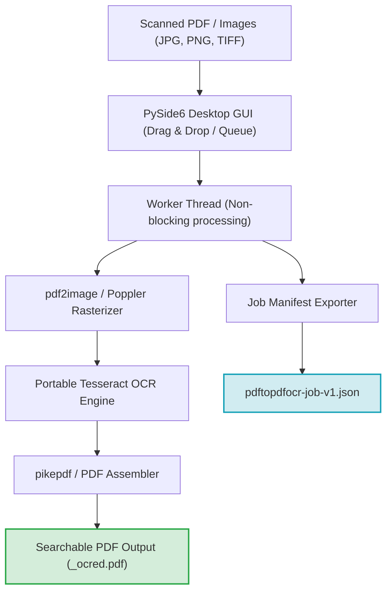
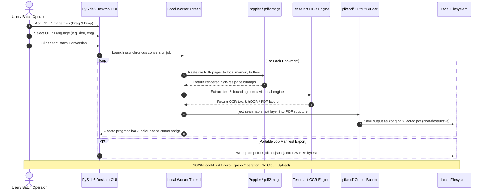

[English](README.md) | [Deutsch](README_de.md)

# PDFtoPDFocr - Local-First PDF OCR Converter

[](https://www.python.org/)
[](pyproject.toml)
[](LICENSE)
[](https://www.qt.io/)
[](#requirements)
[](#privacy--network-access)
[](SECURITY.md)
[](tests/)
[](llms.txt)
[](https://github.com/doc-bricks)
[](https://github.com/open-bricks)

Converts scanned PDF files into searchable PDFs using OCR (optical character recognition) with Tesseract. Batch processing, selectable OCR language, automatic language pack download, non-destructive original file preservation, and portable Tesseract/Poppler integration.

Machine-readable project context: [`llms.txt`](llms.txt) | [Deutsche Dokumentation](README_de.md) | [Security Policy](SECURITY.md)

> [!NOTE]
> **AI & LLM Integration:** This repository contains a structured [`llms.txt`](llms.txt) file providing machine-readable context, architectural details, CLI/GUI interfaces, and test entry points for autonomous agents and developer tooling.

> [!TIP]
> **Privacy & Local-First Processing:** PDF and image files are processed 100% locally on your machine. Documents and OCR texts are never uploaded to any remote server or cloud API.


## System Architecture & Component Workflow



## Local Data Flow & Privacy Isolation



## Quick Start & Core Workflows

| Task | Interface / Command | Output / Result |
|---|---|---|
| **Launch Desktop App** | `python PDFtoPDFocr_2.py` or `START.bat` | PySide6 Desktop GUI with drag & drop file queue |
| **Convert Scanned PDFs** | Add files, select language, click "Start" | Non-destructive `*_ocred.pdf` with full-text search layer |
| **Direct Image OCR** | Drop JPG, PNG, or multi-frame TIFF images | Assembled searchable PDF document |
| **Merge into Single PDF** | Enable "Auto-Merge" in toolbar | Consolidated multi-document searchable PDF |
| **Export Job Manifest** | Click "Job-Export" | Portable `pdftopdfocr-job-v1.json` manifest |
| **Run Verification Suite** | `python -m pytest` | 60 verified unit, regression, and metadata tests |
| **Portable Build** | `python build_release.py --clean` | Self-contained executable in `dist/PDFtoPDFocr/` |

## Features

- **Batch Processing** — Convert multiple PDFs and images simultaneously via file picker or drag & drop.
- **Direct Image Import** — Convert JPG, PNG, and multi-frame TIFF scans directly into searchable PDFs without extra tooling.
- **Selectable OCR Language** — Quick selection for German, English, French, Spanish, and dozens of other languages.
- **Auto-Download** — Missing Tesseract language packs (`.traineddata`) are downloaded automatically on-demand from official GitHub repositories.
- **Auto-Merge & Stacking** — Merge multiple processed OCR results into a single consolidated PDF document.
- **Portable Tesseract & Poppler** — Tesseract OCR is bundled locally; no global system installation required.
- **Original File Preserved** — Results are saved with the `_ocred.pdf` suffix or in a configured output folder; source files remain untouched.
- **Job Manifest Export** — Save portable `pdftopdfocr-job-v1.json` manifests containing job settings, execution status, and file metadata.
- **Color-Coded Progress** — Clear progress indication per file with accessible UI controls and responsive worker threads.

## Requirements

- Python 3.10+
- Windows 10/11 (Primary release target)
- macOS / Linux (Source & smoke-test targets)

## Installation

```bash
pip install -r requirements.txt
```

Poppler must be available for `pdf2image` (configured via PATH or portable inside the project directory).

## Usage

```bash
python PDFtoPDFocr_2.py
```

On Windows, `START.bat` also serves as a double-click desktop launcher.

1. Add PDFs or images via file picker or drag & drop.
2. Select OCR language (missing language packs are downloaded automatically).
3. Click "Start" — done.
4. Optionally use `Job-Export` to save a portable `pdftopdfocr-job-v1.json` manifest.

## Tests & Quality Verification

```bash
python -m pip install -r requirements-dev.txt
python -m pytest
```

The test suite covers:
- **Tesseract Configuration** (`tests/test_tesseract_config.py`)
- **Job Export Format & Manifest Schema** (`tests/test_export_format.py`)
- **Language Switching & Multi-Language Support** (`tests/test_language_switch.py`)
- **Bug Regressions & Resource Lifecycle** (`tests/test_bug_regressions.py`)
- **App Icons & Visual Asset Verification** (`tests/test_app_assets.py`)
- **Platform Packaging & Release Validation** (`tests/test_build_release.py`, `tests/test_platform_package_gate.py`)
- **Metadata, Security & Parity Governance** (`tests/test_metadata.py`)

## Sibling Tools & Ecosystem

PDFtoPDFocr is part of the **doc-bricks** document utilities family and the wider **open-bricks** open-source desktop ecosystem:

| Tool | Ecosystem | Purpose | Repository |
|---|---|---|---|
| **DokuReader** | `doc-bricks` | Local document library, reading workspace & cross-format viewer | [doc-bricks/DokuReader](https://github.com/doc-bricks/DokuReader) |
| **MediaBrain** | `doc-bricks` | Local media metadata inspector, EXIF analyzer & batch classifier | [doc-bricks/MediaBrain](https://github.com/doc-bricks/MediaBrain) |
| **UniversalDocsGrabber** | `doc-bricks` | Automated email document extractor & OCR batch ingestion pipeline | [doc-bricks/UniversalDocsGrabber](https://github.com/doc-bricks/UniversalDocsGrabber) |
| **UniversalInvoiceMail** | `doc-bricks` | Intelligent invoice extraction, date/amount parsing & DATEV export | [doc-bricks/UniversalInvoiceMail](https://github.com/doc-bricks/UniversalInvoiceMail) |
| **UniversalMailCleaner** | `doc-bricks` | Privacy-first mailbox cleaner, newsletter unsubscriber & safe pruner | [doc-bricks/UniversalMailCleaner](https://github.com/doc-bricks/UniversalMailCleaner) |
| **CleanMarkdown** | `doc-bricks` | Markdown sanitization, table formatting & documentation linter | [doc-bricks/CleanMarkdown](https://github.com/doc-bricks/CleanMarkdown) |
| **LitZentrum** | `doc-bricks` | Academic literature manager, BibTeX citation binder & research workspace | [doc-bricks/LitZentrum](https://github.com/doc-bricks/LitZentrum) |
| **MailProcessor** | `doc-bricks` | Rule-based local email archiving, attachment filtering & sorting engine | [doc-bricks/MailProcessor](https://github.com/doc-bricks/MailProcessor) |
| **ProFiler** | `file-bricks` | Fast multi-criteria file search, regex filtering & batch renaming | [file-bricks/ProFiler](https://github.com/file-bricks/ProFiler) |
| **ExplorerPro** | `file-bricks` | Dual-pane desktop file manager with tabs, bookmarks & hex preview | [file-bricks/ExplorerPro](https://github.com/file-bricks/ExplorerPro) |
| **DevCenter** | `dev-bricks` | Developer environment manager, toolchain orchestrator & project launcher | [dev-bricks/DevCenter](https://github.com/dev-bricks/DevCenter) |
| **CodeBox** | `dev-bricks` | Offline multi-language code playground, snippet organizer & sandbox | [dev-bricks/CodeBox](https://github.com/dev-bricks/CodeBox) |
| **open-bricks** | `open-bricks` | Umbrella organization & curated catalog of privacy-first desktop tools | [open-bricks](https://github.com/open-bricks) |

## Dependencies

| Package | License | Purpose |
|---|---|---|
| PySide6 | LGPL v3 | Desktop GUI framework |
| pytesseract | Apache 2.0 | Tesseract OCR wrapper |
| Pillow | HPND | Image processing & TIFF frame extraction |
| pdf2image | MIT | PDF to image rasterization |
| pikepdf | MPL 2.0 | PDF page merging & output assembly |
| requests | Apache 2.0 | Tesseract language pack download |

Can use a local portable **Tesseract OCR** (Apache 2.0) and Poppler setup. Local runtime assets such as `tesseract_portable/`, `tessdata/`, `poppler/`, `dist/`, `build/`, and `releases/` stay out of Git via `.gitignore`.

## Privacy & Network Access

PDF files and images are processed locally and are never uploaded. Network access is strictly limited to downloading missing public Tesseract language data from GitHub upon user request. See [`SECURITY.md`](SECURITY.md) for full security and privacy invariants.

## EXE & Portable Build

```bash
python build_release.py --clean

# or on Windows via double-click / terminal:
build_exe.bat

# or directly via PyInstaller with dependencies installed:
python -m PyInstaller --noconfirm --clean PDFtoPDFocr.spec
```

The packaged build is written to `dist/PDFtoPDFocr/`. When present, `tesseract_portable/` and `poppler/` are bundled automatically.

## License

This project is licensed under the [MIT License](LICENSE).
