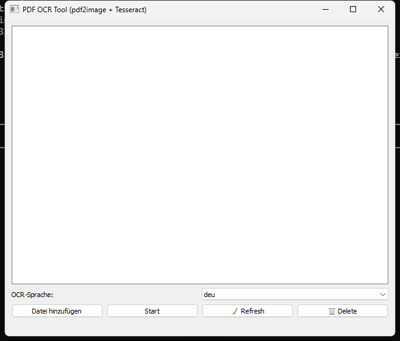
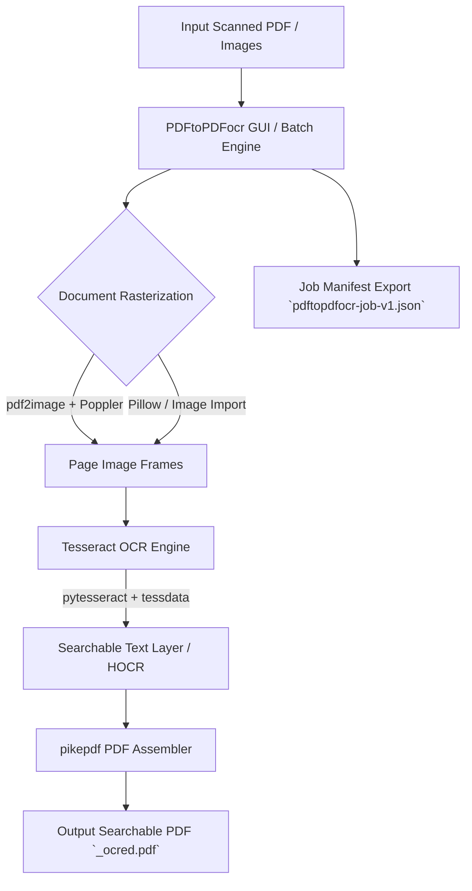

# PDFtoPDFocr - PDF OCR Converter

[](https://www.python.org/)
[](https://github.com/doc-bricks/PDFtoPDFocr)
[](LICENSE)
[](https://github.com/doc-bricks/PDFtoPDFocr)
[](https://github.com/tesseract-ocr/tesseract)
[](llms.txt)

Converts scanned PDF files and images into searchable PDFs using OCR (text recognition) with Tesseract. Features batch processing, selectable OCR languages, automatic language pack downloads, image imports, auto-merging, and portable Tesseract/Poppler integration.

Machine-readable project context: [`llms.txt`](llms.txt) | [Deutsche Dokumentation](README_de.md)

> [!NOTE]
> **For AI Agents & Automation Workflows**: Machine-readable project context and capability specs are available in [`llms.txt`](llms.txt). PDFtoPDFocr supports batch OCR processing, selectable language packs, and structured local job manifest exports (`pdftopdfocr-job-v1.json`) for offline document pipelines.



## System Architecture & Data Flow



## Features

- **Batch Processing** — Convert multiple PDFs and images at once (file picker or drag & drop)
- **Direct Image Import** — Convert JPG, PNG, and multi-frame TIFF images directly into searchable PDFs
- **Selectable OCR Language** — Quick selection for German, English, French, Spanish, and dozens of others
- **Auto-Download** — Missing Tesseract language packs are downloaded automatically from GitHub
- **Auto-Merge & Stacking** — Merge multiple processed OCR results into a single consolidated PDF document
- **Portable Tesseract** — Tesseract OCR is bundled locally; no global installation required
- **Original File Preserved** — Result saved as a new file with `_ocred.pdf` suffix or in a configured output folder
- **Job Manifest Export** — Save portable `pdftopdfocr-job-v1.json` manifests containing job settings and file metadata
- **Progress Indication** — Color-coded status per file with accessible UI controls

## Requirements

- Python 3.10+
- Windows 10/11

## Installation

```bash
pip install -r requirements.txt
```

Poppler must be available for `pdf2image` (via PATH variable or portable in the project folder).

## Usage

```bash
python PDFtoPDFocr_2.py
```

On Windows, `START.bat` also works as a double-click launcher.

1. Add PDFs or images via file picker or drag & drop
2. Select OCR language (missing packs are downloaded automatically)
3. Click "Start" - done
4. Use `Job-Export` when needed to save a portable `pdftopdfocr-job-v1.json` with settings, file metadata, and result hints.

Note: PDFtoPDFocr does not auto-detect document language. Select the matching OCR language before starting; missing Tesseract language packs are downloaded when needed.

## Tests / Verification

```bash
python -m pip install -r requirements-dev.txt
python -m pytest
```

The test suite covers Tesseract configuration (`tests/test_tesseract_config.py`), job export format (`tests/test_export_format.py`), language switching (`tests/test_language_switch.py`), bug regressions (`tests/test_bug_regressions.py`), and release build validation (`tests/test_build_release.py`).

## Dependencies

| Package | License | Purpose |
|---|---|---|
| PySide6 | LGPL v3 | GUI framework |
| pytesseract | Apache 2.0 | Tesseract OCR wrapper |
| Pillow | HPND | Image processing & TIFF frame extraction |
| pdf2image | MIT | PDF to image rasterization |
| pikepdf | MPL 2.0 | PDF page merging & output assembly |
| requests | Apache 2.0 | Tesseract language pack download |

Can use a local portable **Tesseract OCR** (Apache 2.0) and Poppler setup.
Local runtime assets such as `tesseract_portable/`, `tessdata/`, `poppler/`, `dist/`, `build/`, and `releases/` stay out of Git via `.gitignore`.

## Privacy / Network Access

PDF files and images are processed locally and are not uploaded anywhere. Network access is only used when a missing Tesseract language pack is downloaded from GitHub.

Local runtime folders, build artifacts, releases, internal maintenance notes, and secrets are excluded through `.gitignore`.

## EXE / Portable Build

```bash
python build_release.py --clean

# or on Windows via double-click/terminal
build_exe.bat

# or directly with dependencies already installed
python -m PyInstaller --noconfirm --clean PDFtoPDFocr.spec
```

`build_release.py` creates an isolated `.build_venv`, installs only the runtime/build dependencies, and runs PyInstaller with the versioned spec file.

The packaged build is written to `dist/PDFtoPDFocr/`. When present, `tesseract_portable/` and `poppler/` are bundled automatically.

## Porting / Platform Strategy

The current porting decision is documented in `PORTIERUNGSPLAN.md`: Windows Store remains the primary release channel because the app bundles local batch OCR with Tesseract, Poppler, and PySide6.

macOS and Linux stay source and smoke-test targets from the same desktop codebase. Dedicated desktop packaging should follow only after the Windows Store release path is finalized.

## License

MIT License
