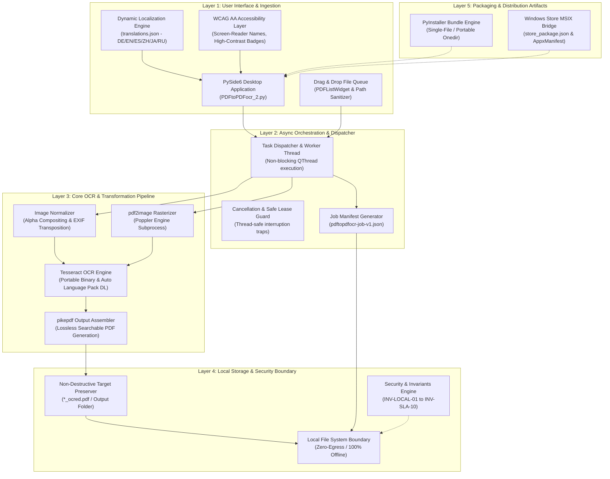
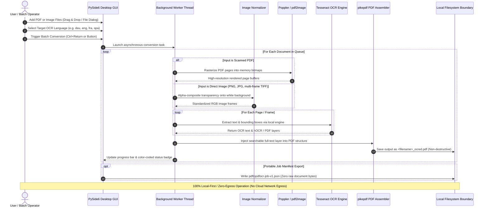

[English](README.md) | [Deutsch](README_de.md)

# PDFtoPDFocr - Local-First PDF OCR Converter

[](https://www.python.org/)
[](pyproject.toml)
[](LICENSE)
[](https://www.qt.io/)
[](#requirements--platform-matrix)
[](#privacy--security-model)
[](SECURITY.md)
[](#core-features)
[](tests/)
[](THIRD_PARTY_LICENSES.md)
[](MARKETING-LOG.txt)
[](llms.txt)
[](https://github.com/doc-bricks)
[](https://github.com/open-bricks)
[](tests/)

Converts scanned PDF files and raw images into searchable PDFs using local OCR (optical character recognition) with Tesseract. Features multi-format batch processing, selectable OCR language with automatic language pack download, non-destructive original file preservation, accessible UI ergonomics, and portable Tesseract/Poppler integration.

Machine-readable project context: [`llms.txt`](llms.txt) | [Deutsche Dokumentation](README_de.md) | [Security Policy](SECURITY.md)

> [!NOTE]
> **AI & LLM Integration:** This repository contains a structured [`llms.txt`](llms.txt) file providing machine-readable context, architectural details, CLI/GUI interfaces, and test entry points for autonomous agents and developer tooling.

> [!TIP]
> **Privacy & Local-First Processing:** PDF and image files are processed 100% locally on your machine. Documents and OCR texts are never uploaded to any remote server or cloud API (`INV-LOCAL-01`).

---

## 🧭 Quick Navigation

1. 📸 [Visual Showcase & Interface Overview](#visual-showcase)
2. 🏛️ [System Architecture & 5-Layer Topology](#system-architecture--component-workflow)
3. 🔄 [Local Data Flow & Document OCR Processing Lifecycle](#local-data-flow--privacy-isolation)
4. 🚀 [Quick Start & Key Operations](#quick-start--key-operations)
5. ✨ [Core Features & Performance Capabilities](#core-features)
6. 🎯 [Target Personas & High-Intent Search Intent](#target-personas--discoverability)
7. ⚖️ [10-Dimension Comparative Matrix vs. 5 Alternatives](#comparative-matrix--alternatives)
8. ⌨️ [Accessibility, WCAG Ergonomics & Keyboard Shortcuts](#accessibility--keyboard-shortcuts)
9. 💻 [Requirements & Platform Matrix](#requirements--platform-matrix)
10. 📦 [Installation & Portable Setup](#installation--portable-setup)
11. 🖥️ [Usage & Execution Guidelines](#usage--execution-guidelines)
12. 🧪 [Automated Testing & Quality Verification](#tests--quality-verification)
13. 🌐 [Sibling Tools & Ecosystem Integration](#sibling-tools--ecosystem)
14. 📜 [Level 1 SBOM & Third-Party Licenses Transparency](#third-party-licenses--transparency)
15. 🔒 [Privacy & Security Model (Invariants INV-LOCAL-01..INV-SLA-10)](#privacy--security-model)
16. 🪟 [EXE & Distribution Packaging (Windows Store MSIX & Portable)](#exe--distribution-packaging)
17. 🤖 [Machine-Readable LLM Context (llms.txt)](#machine-readable-llm-context)
18. ⚖️ [Statutory Notice (§ 521 BGB) & License](#statutory-notice--license)

---

<a id="visual-showcase"></a>
<a id="visuelle-showcase-galerie"></a>
## 📸 Visual Showcase & Interface Overview

| Primary Interface | Visual Assets & App Identity |
|:---:|:---:|
| <br/><sub>**Batch Conversion Queue** — Drag-and-drop file ingestion, dynamic language selection, real-time item status badges, and non-blocking worker progress.</sub> | <br/><sub>**High-Resolution App Identity** — Native Windows Store, MSIX package icon set, and accessible contrast palettes.</sub> |

---

<a id="system-architecture--component-workflow"></a>
<a id="systemarchitektur--komponenten-workflow"></a>
## 🏛️ System Architecture & 5-Layer Topology



---

<a id="local-data-flow--privacy-isolation"></a>
<a id="lokaler-datenfluss--datenschutz-isolation"></a>
## 🔄 Local Data Flow & Document OCR Processing Lifecycle



---

<a id="quick-start--key-operations"></a>
<a id="schnelleinstieg--kernabläufe"></a>
## 🚀 Quick Start & Key Operations

| Task | Interface / Command | Output / Result |
|---|---|---|
| **Launch Desktop App** | `python PDFtoPDFocr_2.py` or `START.bat` | PySide6 Desktop GUI with drag & drop file queue |
| **Convert Scanned PDFs** | Add files, select language, click "Start" (`Ctrl+Return`) | Non-destructive `*_ocred.pdf` with full-text search layer |
| **Direct Image OCR** | Drop JPG, PNG, or multi-frame TIFF images | Assembled searchable PDF document |
| **Merge into Single PDF** | Enable "Auto-Merge" in toolbar | Consolidated multi-document searchable PDF |
| **Export Job Manifest** | Click "Job-Export" (`Ctrl+E`) | Portable `pdftopdfocr-job-v1.json` manifest |
| **Run Verification Suite** | `python -m pytest` | 120+ verified unit, regression, accessibility, and metadata tests |
| **Portable Build** | `python build_release.py --clean` | Self-contained executable in `dist/PDFtoPDFocr/` |

---

<a id="core-features"></a>
<a id="funktionen--features"></a>
## ✨ Core Features & Performance Capabilities

- **Batch Processing** — Convert multiple PDFs and images simultaneously via file picker or drag & drop.
- **Direct Image Import** — Convert JPG, PNG, and multi-frame TIFF scans directly into searchable PDFs without extra tooling.
- **Selectable OCR Language** — Quick selection for German, English, French, Spanish, and dozens of other languages.
- **Auto-Download** — Missing Tesseract language packs (`.traineddata`) are downloaded automatically on-demand from official GitHub repositories.
- **Auto-Merge & Stacking** — Merge multiple processed OCR results into a single consolidated PDF document.
- **Portable Tesseract & Poppler** — Tesseract OCR is bundled locally; no global system installation required.
- **Original File Preserved** — Results are saved with the `_ocred.pdf` suffix or in a configured output folder; source files remain untouched.
- **Job Manifest Export** — Save portable `pdftopdfocr-job-v1.json` manifests containing job settings, execution status, and file metadata.
- **Full Accessibility (A11y) & Ergonomics** — Screen-reader accessible names and descriptions across all controls, informative tooltips in active language, and complete keyboard shortcuts (`Ctrl+O`, `Ctrl+Return`, `Ctrl+E`, `F5`, `Ctrl+Shift+O`, `Del`/`Backspace`).
- **High-Contrast Progress** — WCAG-compliant color coding (`#0b6e4f` / `#b45309`) and per-item hover tooltips with real-time status.

---

<a id="target-personas--discoverability"></a>
<a id="zielgruppen--auffindbarkeit"></a>
## 🎯 Target Personas & High-Intent Search Intent

### Target Personas

- **[PERSONA-01] Legal, Healthcare & Regulatory Compliance Officers:**
  - *Context:* Managing confidential contracts, medical patient files, tax records, or court filings subject to strict GDPR / HIPAA mandates.
  - *Pain Point:* Uploading confidential documents to cloud OCR providers (e.g. Adobe Cloud, Google Cloud Vision, Smallpdf) violates zero-egress data privacy mandates and exposes sensitive personal data to third parties.
  - *How PDFtoPDFocr Solves It:* 100% local, air-gapped OCR processing on-device (`INV-LOCAL-01`). Unprivileged user-mode operation (`INV-UNPRIV-02`). Source files remain strictly untouched (`INV-NONDEST-03`).

- **[PERSONA-02] Archivists, Historians & Academic Researchers:**
  - *Context:* Digitizing large historical collections of scanned books, multi-frame TIFF manuscripts, and multilingual archives.
  - *Pain Point:* Cloud-based OCR services incur prohibitive per-page SaaS subscription fees and fail on multi-gigabyte batch queues or multi-frame TIFF scans.
  - *How PDFtoPDFocr Solves It:* Unlimited local batch conversion for PDFs and raw image queues (JPG, PNG, multi-page TIFF), selectable language models with automated GitHub download of official `.traineddata`, and optional single-PDF consolidation.

- **[PERSONA-03] Privacy-Conscious Knowledge Workers & Desktop Enthusiasts:**
  - *Context:* Professionals processing receipts, invoices, and study materials on Windows workstations or portable laptops.
  - *Pain Point:* Commercial desktop suites (Adobe Acrobat Pro, ABBYY FineReader) demand expensive recurring subscriptions, online logins, intrusive background updater daemons, and administrative rights.
  - *How PDFtoPDFocr Solves It:* Free and open-source MIT desktop tool with zero telemetry, unprivileged standard user execution, portable zero-install directory options (`INV-PORTABLE-06`), and accessible keyboard shortcuts (`INV-A11Y-08`).

- **[PERSONA-04] Automated Pipeline Integrators & Document Workflow Engineers:**
  - *Context:* Engineers integrating OCR steps into local document ingestion systems, backup archives, or desktop automation pipelines.
  - *Pain Point:* Most consumer GUI tools lack structured introspection, making it difficult to verify batch processing outcomes or integrate results with downstream automation.
  - *How PDFtoPDFocr Solves It:* Structured job manifest export (`pdftopdfocr-job-v1.json` / `INV-MANIFEST-07`), fail-closed per-page error recovery (`INV-FAILCLOSED-09`), and comprehensive AI-context indexing via `llms.txt`.

### High-Intent Search Intent Queries

| Locale | Core Search Query | Target Intent & Persona |
|---|---|---|
| **EN** | `local pdf ocr converter windows 10 11` | Local-first, offline searchable PDF creation without cloud accounts ([PERSONA-01], [PERSONA-03]) |
| **EN** | `tesseract ocr batch desktop gui python pyside6` | Developer & power-user desktop workflow with queue processing ([PERSONA-02], [PERSONA-04]) |
| **EN** | `offline searchable pdf creator zero egress gdpr` | Air-gapped privacy-preserving document compliance ([PERSONA-01]) |
| **EN** | `convert scanned tiff to searchable pdf desktop free` | Archival scan ingestion from multi-frame TIFF to searchable PDF ([PERSONA-02]) |
| **EN** | `portable pdf ocr tesseract without cloud` | Zero-install portable workflow on managed workstations ([PERSONA-03], [PERSONA-04]) |
| **DE** | `gescannte pdf durchsuchbar machen lokal kostenlos` | Kostenlose lokale Texterkennung für gescannte Rechnungen und Dokumente ([PERSONA-03]) |
| **DE** | `offline pdf ocr texterkennung windows tesseract` | Lokales Tesseract-Desktop-Tool mit deutscher Benutzeroberfläche ([PERSONA-02], [PERSONA-03]) |
| **DE** | `datenschutzkonforme ocr software ohne cloud dsgvo` | 100% DSGVO-konforme Texterkennung für Kanzleien und Arztpraxen ([PERSONA-01]) |
| **DE** | `tiff mehrseitig in durchsuchbare pdf umwandeln` | Stapelverarbeitung für historische Scan-Archive ([PERSONA-02]) |
| **DE** | `portable ocr software ohne installation windows` | Portable Ausführung ohne Administratorrechte ([PERSONA-03], [PERSONA-04]) |

---

<a id="comparative-matrix--alternatives"></a>
<a id="vergleichsmatrix--alternativen"></a>
## ⚖️ 10-Dimension Comparative Matrix vs. 5 Alternatives

| Evaluation Dimension | Governance Invariant | PDFtoPDFocr (doc-bricks) | Adobe Acrobat Pro | ABBYY FineReader PDF | OCRmyPDF (CLI) | Cloud SaaS (Smallpdf/iLovePDF) |
|---|---|:---:|:---:|:---:|:---:|:---:|
| **Zero-Egress Privacy** | `INV-LOCAL-01` | **100% Offline (Local)** | Cloud sync default | Cloud options | **100% Offline (Local)** | No (Cloud Upload Mandatory) |
| **Privilege Non-Elevation** | `INV-UNPRIV-02` | **Standard User Mode** | Admin daemon / Services | Admin daemon / Services | Depends on host/Docker | Remote Cloud Host |
| **Non-Destructive Safety** | `INV-NONDEST-03` | **Strict `_ocred.pdf`** | Overwrites / Prompts | Overwrites / Prompts | In-place or new file | Creates cloud object |
| **Process & Copyleft Isolation**| `INV-ISOLATION-04`| **Subprocess Boundary** | Closed-source proprietary | Closed-source proprietary | MPL-2.0 / Subprocesses | Closed SaaS backend |
| **Memory Boundedness** | `INV-BOUNDED-05` | **Bounded Page Stream** | Heavy background cache | Heavy background cache | Large PDF memory spikes | Server-side allocation |
| **Portability / Zero-Install** | `INV-PORTABLE-06` | **Portable folder / exe**| Heavy system installer | Heavy system installer | Requires package manager | Browser client |
| **Verifiable Job Manifests** | `INV-MANIFEST-07` | **`pdftopdfocr-job-v1.json`**| Proprietary app logs | Proprietary app logs | Terminal stdout/stderr | JSON REST response |
| **Screen-Reader & Keyboard A11y**| `INV-A11Y-08` | **Full WCAG AA & Hotkeys**| Standard accessibility | Standard accessibility | CLI terminal a11y only | Web UI varies |
| **Fail-Closed Error Trapping** | `INV-FAILCLOSED-09` | **Per-Page Error Skip** | Modal dialog interruptions| Modal dialog interruptions| CLI non-zero exit code | HTTP 5xx error responses |
| **Security Response SLA** | `INV-SLA-10` | **48h Response / 5d Triage**| Standard enterprise | Standard enterprise | Best-effort GitHub | Ticket queue |

---

<a id="accessibility--keyboard-shortcuts"></a>
<a id="barrierefreiheit--tastenkürzel"></a>
## ⌨️ Accessibility, WCAG Ergonomics & Keyboard Shortcuts

| Action | Shortcut | Description |
|---|---|---|
| **Add Files** | `Ctrl+O` | Open file selector dialog |
| **Start OCR** | `Ctrl+Return` | Start batch OCR processing |
| **Export Job Manifest** | `Ctrl+E` | Export job state as JSON manifest |
| **Clear List & Reset** | `F5` | Reset file list and status display |
| **Select Output Folder** | `Ctrl+Shift+O` | Choose custom output directory |
| **Remove Selected File** | `Del` or `Backspace` | Remove selected item from queue |

---

<a id="requirements--platform-matrix"></a>
<a id="voraussetzungen--plattformmatrix"></a>
## 💻 Requirements & Platform Matrix

- Python 3.10+
- Windows 10/11 (Primary release target)
- macOS / Linux (Source & smoke-test targets)

---

<a id="installation--portable-setup"></a>
<a id="installation--portables-setup"></a>
## 📦 Installation & Portable Setup

```bash
pip install -r requirements.txt
```

Poppler must be available for `pdf2image` (configured via PATH or portable inside the project directory).

---

<a id="usage--execution-guidelines"></a>
<a id="nutzung--ausführungsrichtlinien"></a>
## 🖥️ Usage & Execution Guidelines

```bash
python PDFtoPDFocr_2.py
```

On Windows, `START.bat` also serves as a double-click desktop launcher.

1. Add PDFs or images via file picker or drag & drop.
2. Select OCR language (missing language packs are downloaded automatically).
3. Click "Start" — done.
4. Optionally use `Job-Export` to save a portable `pdftopdfocr-job-v1.json` manifest.

---

<a id="tests--quality-verification"></a>
<a id="tests--qualitätsprüfung"></a>
## 🧪 Automated Testing & Quality Verification

```bash
python -m pip install -r requirements-dev.txt
python -m pytest
```

The test suite covers:
- **UI Accessibility & Shortcuts** (`tests/test_ui_accessibility.py`)
- **Tesseract Configuration** (`tests/test_tesseract_config.py`)
- **Job Export Format & Manifest Schema** (`tests/test_export_format.py`)
- **Language Switching & Multi-Language Support** (`tests/test_language_switch.py`)
- **Bug Regressions & Resource Lifecycle** (`tests/test_bug_regressions.py`)
- **App Icons & Visual Asset Verification** (`tests/test_app_assets.py`)
- **Platform Packaging & Release Validation** (`tests/test_build_release.py`, `tests/test_platform_package_gate.py`)
- **Metadata, Security & Parity Governance** (`tests/test_metadata.py`, `tests/test_security_license_contract.py`)

---

<a id="sibling-tools--ecosystem"></a>
<a id="geschwister-tools--ökosystem"></a>
## 🌐 Sibling Tools & Ecosystem Integration

PDFtoPDFocr is part of the **doc-bricks** document utilities family and the wider **open-bricks** open-source desktop ecosystem:

| Tool | Ecosystem | Purpose | Repository |
|---|---|---|---|
| **DokuReader** | `doc-bricks` | Local document library, reading workspace & cross-format viewer | [doc-bricks/DokuReader](https://github.com/doc-bricks/DokuReader) |
| **MediaBrain** | `doc-bricks` | Local media metadata inspector, EXIF analyzer & batch classifier | [doc-bricks/MediaBrain](https://github.com/doc-bricks/MediaBrain) |
| **UniversalDocsGrabber** | `doc-bricks` | Automated email document extractor & OCR batch ingestion pipeline | [doc-bricks/UniversalDocsGrabber](https://github.com/doc-bricks/UniversalDocsGrabber) |
| **UniversalInvoiceMail** | `doc-bricks` | Intelligent invoice extraction, date/amount parsing & DATEV export | [doc-bricks/UniversalInvoiceMail](https://github.com/doc-bricks/UniversalInvoiceMail) |
| **UniversalMailCleaner** | `doc-bricks` | Privacy-first mailbox cleaner, newsletter unsubscriber & safe pruner | [doc-bricks/UniversalMailCleaner](https://github.com/doc-bricks/UniversalMailCleaner) |
| **CleanMarkdown** | `doc-bricks` | Markdown sanitization, table formatting & documentation linter | [doc-bricks/CleanMarkdown](https://github.com/doc-bricks/CleanMarkdown) |
| **LitZentrum** | `doc-bricks` | Academic literature manager, BibTeX citation binder & research workspace | [doc-bricks/LitZentrum](https://github.com/doc-bricks/LitZentrum) |
| **MailProcessor** | `doc-bricks` | Rule-based local email archiving, attachment filtering & sorting engine | [doc-bricks/MailProcessor](https://github.com/doc-bricks/MailProcessor) |
| **ProFiler** | `file-bricks` | Fast multi-criteria file search, regex filtering & batch renaming | [file-bricks/ProFiler](https://github.com/file-bricks/ProFiler) |
| **ExplorerPro** | `file-bricks` | Dual-pane desktop file manager with tabs, bookmarks & hex preview | [file-bricks/ExplorerPro](https://github.com/file-bricks/ExplorerPro) |
| **DevCenter** | `dev-bricks` | Developer environment manager, toolchain orchestrator & project launcher | [dev-bricks/DevCenter](https://github.com/dev-bricks/DevCenter) |
| **CodeBox** | `dev-bricks` | Offline multi-language code playground, snippet organizer & sandbox | [dev-bricks/CodeBox](https://github.com/dev-bricks/CodeBox) |
| **open-bricks** | `open-bricks` | Umbrella organization & curated catalog of privacy-first desktop tools | [open-bricks](https://github.com/open-bricks) |

---

<a id="third-party-licenses--transparency"></a>
<a id="drittanbieter-lizenzen--transparenz"></a>
## 📜 Level 1 SBOM & Third-Party Licenses Transparency

PDFtoPDFocr enforces 100% open-source transparency, verified supply-chain hygiene, and strict copyleft boundary isolation:
- **Zero AGPL / SSPL Contamination:** The application is free from network copyleft or restrictive commercial dual-licensing.
- **Dynamic Linking LGPL-3.0 Compliance:** `PySide6` (Qt for Python) is dynamically linked in accordance with LGPLv3 Section 4; users may substitute their own Qt builds.
- **Strict Process Boundaries for Subprocess Tools:** External tools (`Poppler` utilities like `pdftoppm` and `pdfinfo`) run exclusively via isolated OS subprocesses with bounded arguments and sanitization, keeping GPL code strictly segregated (`INV-ISOLATION-04`).
- **Permissive Core Runtime:** `pytesseract` (Apache-2.0), `Pillow` (HPND), `pdf2image` (MIT), `pikepdf` (MPL-2.0), and `requests` (Apache-2.0) are fully compatible with the primary **MIT License**.

For the complete software inventory, dependency version floors, and governance invariants, see [`THIRD_PARTY_LICENSES.md`](THIRD_PARTY_LICENSES.md) and [`MARKETING-LOG.txt`](MARKETING-LOG.txt).

---

<a id="privacy--security-model"></a>
<a id="datenschutz--sicherheitsmodell"></a>
## 🔒 Privacy & Security Model (Invariants INV-LOCAL-01..INV-SLA-10)

PDF files and images are processed locally and are never uploaded. Network access is strictly limited to downloading missing public Tesseract language data from GitHub upon user request. See [`SECURITY.md`](SECURITY.md) for full security and privacy invariants.

---

<a id="exe--distribution-packaging"></a>
<a id="exe--distributions-packaging"></a>
## 🪟 EXE & Distribution Packaging (Windows Store MSIX & Portable)

```bash
python build_release.py --clean

# or on Windows via double-click / terminal:
build_exe.bat

# or directly via PyInstaller with dependencies installed:
python -m PyInstaller --noconfirm --clean PDFtoPDFocr.spec
```

The packaged build is written to `dist/PDFtoPDFocr/`. When present, `tesseract_portable/` and `poppler/` are bundled automatically.

---

<a id="machine-readable-llm-context"></a>
<a id="maschinenlesbarer-llm-kontext"></a>
## 🤖 Machine-Readable LLM Context (llms.txt)

For autonomous AI coding agents, pair programmers, and automated CI pipelines, this repository provides a dedicated [`llms.txt`](llms.txt) index following modern LLM context conventions. It includes:
- Architecture summary and component roles
- Testsuite commands and verification gates
- Security and runtime invariants (`INV-LOCAL-01` through `INV-SLA-10`)
- Key files map and dependency matrices

---

<a id="statutory-notice--license"></a>
<a id="contributing--license"></a>
<a id="gesetzlicher-hinweis--lizenz"></a>
<a id="mitwirken--lizenz"></a>
## ⚖️ Statutory Notice (§ 521 BGB) & License

> [!IMPORTANT]
> **Limitation of Liability for Gratuitous Software Provision (§ 521 BGB):**
> As this software is provided free of charge as open-source software, the authors and contributors are liable only for intent and gross negligence pursuant to § 521 of the German Civil Code (Bürgerliches Gesetzbuch - BGB). The software is provided "as is", without warranty of any kind, express or implied.

Contributions, bug reports, and pull requests are welcome! Please ensure all pull requests pass `pytest` and `ruff check .` before submission.

This project is licensed under the [MIT License](LICENSE).
