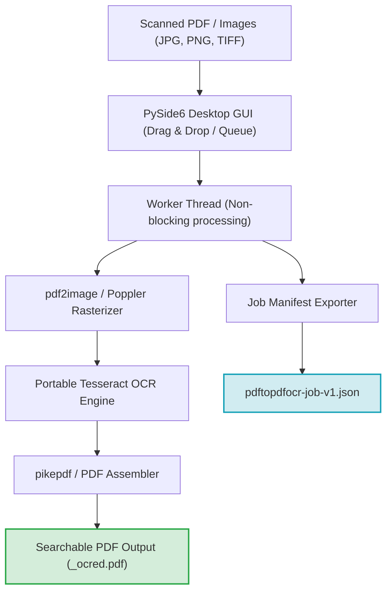
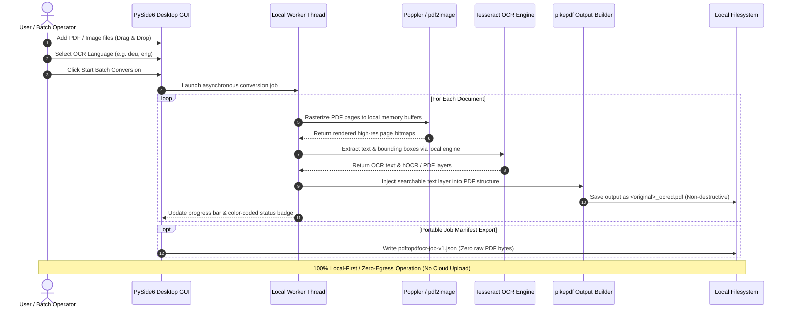

[English](README.md) | [Deutsch](README_de.md)

# PDFtoPDFocr - Local-First PDF OCR Converter

[](https://www.python.org/)
[](pyproject.toml)
[](LICENSE)
[](https://www.qt.io/)
[](#requirements--platform-matrix)
[](#privacy--security-model)
[](SECURITY.md)
[](#core-features)
[](tests/)
[](THIRD_PARTY_LICENSES.md)
[](MARKETING-LOG.txt)
[](llms.txt)
[](https://github.com/doc-bricks)
[](https://github.com/open-bricks)
[](tests/)

Converts scanned PDF files into searchable PDFs using OCR (optical character recognition) with Tesseract. Batch processing, selectable OCR language, automatic language pack download, non-destructive original file preservation, accessible UI ergonomics, and portable Tesseract/Poppler integration.

Machine-readable project context: [`llms.txt`](llms.txt) | [Deutsche Dokumentation](README_de.md) | [Security Policy](SECURITY.md)

> [!NOTE]
> **AI & LLM Integration:** This repository contains a structured [`llms.txt`](llms.txt) file providing machine-readable context, architectural details, CLI/GUI interfaces, and test entry points for autonomous agents and developer tooling.

> [!TIP]
> **Privacy & Local-First Processing:** PDF and image files are processed 100% locally on your machine. Documents and OCR texts are never uploaded to any remote server or cloud API.


## Quick Navigation

1. [System Architecture & Component Workflow](#system-architecture--component-workflow)
2. [Local Data Flow & Privacy Isolation](#local-data-flow--privacy-isolation)
3. [Quick Start & Key Operations](#quick-start--key-operations)
4. [Core Features](#core-features)
5. [Target Personas & Discoverability](#target-personas--discoverability)
6. [Accessibility & Keyboard Shortcuts](#accessibility--keyboard-shortcuts)
7. [Requirements & Platform Matrix](#requirements--platform-matrix)
8. [Installation & Portable Setup](#installation--portable-setup)
9. [Usage & Execution Guidelines](#usage--execution-guidelines)
10. [Tests & Quality Verification](#tests--quality-verification)
11. [Sibling Tools & Ecosystem](#sibling-tools--ecosystem)
12. [Third-Party Licenses & Transparency](#third-party-licenses--transparency)
13. [Privacy & Security Model](#privacy--security-model)
14. [EXE & Distribution Packaging](#exe--distribution-packaging)
15. [Machine-Readable LLM Context](#machine-readable-llm-context)
16. [Contributing & License](#contributing--license)

## System Architecture & Component Workflow



## Local Data Flow & Privacy Isolation



## Quick Start & Key Operations

| Task | Interface / Command | Output / Result |
|---|---|---|
| **Launch Desktop App** | `python PDFtoPDFocr_2.py` or `START.bat` | PySide6 Desktop GUI with drag & drop file queue |
| **Convert Scanned PDFs** | Add files, select language, click "Start" (`Ctrl+Return`) | Non-destructive `*_ocred.pdf` with full-text search layer |
| **Direct Image OCR** | Drop JPG, PNG, or multi-frame TIFF images | Assembled searchable PDF document |
| **Merge into Single PDF** | Enable "Auto-Merge" in toolbar | Consolidated multi-document searchable PDF |
| **Export Job Manifest** | Click "Job-Export" (`Ctrl+E`) | Portable `pdftopdfocr-job-v1.json` manifest |
| **Run Verification Suite** | `python -m pytest` | 110 verified unit, regression, accessibility, and metadata tests |
| **Portable Build** | `python build_release.py --clean` | Self-contained executable in `dist/PDFtoPDFocr/` |

## Core Features

- **Batch Processing** — Convert multiple PDFs and images simultaneously via file picker or drag & drop.
- **Direct Image Import** — Convert JPG, PNG, and multi-frame TIFF scans directly into searchable PDFs without extra tooling.
- **Selectable OCR Language** — Quick selection for German, English, French, Spanish, and dozens of other languages.
- **Auto-Download** — Missing Tesseract language packs (`.traineddata`) are downloaded automatically on-demand from official GitHub repositories.
- **Auto-Merge & Stacking** — Merge multiple processed OCR results into a single consolidated PDF document.
- **Portable Tesseract & Poppler** — Tesseract OCR is bundled locally; no global system installation required.
- **Original File Preserved** — Results are saved with the `_ocred.pdf` suffix or in a configured output folder; source files remain untouched.
- **Job Manifest Export** — Save portable `pdftopdfocr-job-v1.json` manifests containing job settings, execution status, and file metadata.
- **Full Accessibility (A11y) & Ergonomics** — Screen-reader accessible names and descriptions across all controls, informative tooltips in active language, and complete keyboard shortcuts (`Ctrl+O`, `Ctrl+Return`, `Ctrl+E`, `F5`, `Ctrl+Shift+O`, `Del`/`Backspace`).
- **High-Contrast Progress** — WCAG-compliant color coding (`#0b6e4f` / `#b45309`) and per-item hover tooltips with real-time status.

## Target Personas & Discoverability

| Persona | Core Pain Point | How PDFtoPDFocr Solves It |
|---|---|---|
| **Legal, Healthcare & Compliance** | Cloud OCR services violate HIPAA/GDPR zero-egress boundaries; risk of document data leaks. | 100% local, air-gapped OCR processing on-device. Source files remain unmodified (`_ocred.pdf`). |
| **Archivists & Academic Researchers** | Converting large collections of scans and multi-page TIFFs incurs prohibitive per-page SaaS fees. | High-throughput batch conversion, multi-format image queues, multi-language Tesseract models, auto-merge. |
| **Privacy-Conscious Knowledge Workers** | Commercial tools (Adobe Acrobat, ABBYY) require subscription bloat, cloud logins, and elevation. | Free MIT software, unprivileged user-mode execution, zero telemetry, portable zero-install option. |
| **Tooling & Pipeline Integrators** | GUI tools lack verifiable execution records or clear integration artifacts. | Structured job manifest export (`pdftopdfocr-job-v1.json`), predictable exit states, and machine-readable `llms.txt`. |

## Accessibility & Keyboard Shortcuts

| Action | Shortcut | Description |
|---|---|---|
| **Add Files** | `Ctrl+O` | Open file selector dialog |
| **Start OCR** | `Ctrl+Return` | Start batch OCR processing |
| **Export Job Manifest** | `Ctrl+E` | Export job state as JSON manifest |
| **Clear List & Reset** | `F5` | Reset file list and status display |
| **Select Output Folder** | `Ctrl+Shift+O` | Choose custom output directory |
| **Remove Selected File** | `Del` or `Backspace` | Remove selected item from queue |

## Requirements & Platform Matrix

- Python 3.10+
- Windows 10/11 (Primary release target)
- macOS / Linux (Source & smoke-test targets)

## Installation & Portable Setup

```bash
pip install -r requirements.txt
```

Poppler must be available for `pdf2image` (configured via PATH or portable inside the project directory).

## Usage & Execution Guidelines

```bash
python PDFtoPDFocr_2.py
```

On Windows, `START.bat` also serves as a double-click desktop launcher.

1. Add PDFs or images via file picker or drag & drop.
2. Select OCR language (missing language packs are downloaded automatically).
3. Click "Start" — done.
4. Optionally use `Job-Export` to save a portable `pdftopdfocr-job-v1.json` manifest.

## Tests & Quality Verification

```bash
python -m pip install -r requirements-dev.txt
python -m pytest
```

The test suite covers:
- **UI Accessibility & Shortcuts** (`tests/test_ui_accessibility.py`)
- **Tesseract Configuration** (`tests/test_tesseract_config.py`)
- **Job Export Format & Manifest Schema** (`tests/test_export_format.py`)
- **Language Switching & Multi-Language Support** (`tests/test_language_switch.py`)
- **Bug Regressions & Resource Lifecycle** (`tests/test_bug_regressions.py`)
- **App Icons & Visual Asset Verification** (`tests/test_app_assets.py`)
- **Platform Packaging & Release Validation** (`tests/test_build_release.py`, `tests/test_platform_package_gate.py`)
- **Metadata, Security & Parity Governance** (`tests/test_metadata.py`, `tests/test_security_license_contract.py`)

## Sibling Tools & Ecosystem

PDFtoPDFocr is part of the **doc-bricks** document utilities family and the wider **open-bricks** open-source desktop ecosystem:

| Tool | Ecosystem | Purpose | Repository |
|---|---|---|---|
| **DokuReader** | `doc-bricks` | Local document library, reading workspace & cross-format viewer | [doc-bricks/DokuReader](https://github.com/doc-bricks/DokuReader) |
| **MediaBrain** | `doc-bricks` | Local media metadata inspector, EXIF analyzer & batch classifier | [doc-bricks/MediaBrain](https://github.com/doc-bricks/MediaBrain) |
| **UniversalDocsGrabber** | `doc-bricks` | Automated email document extractor & OCR batch ingestion pipeline | [doc-bricks/UniversalDocsGrabber](https://github.com/doc-bricks/UniversalDocsGrabber) |
| **UniversalInvoiceMail** | `doc-bricks` | Intelligent invoice extraction, date/amount parsing & DATEV export | [doc-bricks/UniversalInvoiceMail](https://github.com/doc-bricks/UniversalInvoiceMail) |
| **UniversalMailCleaner** | `doc-bricks` | Privacy-first mailbox cleaner, newsletter unsubscriber & safe pruner | [doc-bricks/UniversalMailCleaner](https://github.com/doc-bricks/UniversalMailCleaner) |
| **CleanMarkdown** | `doc-bricks` | Markdown sanitization, table formatting & documentation linter | [doc-bricks/CleanMarkdown](https://github.com/doc-bricks/CleanMarkdown) |
| **LitZentrum** | `doc-bricks` | Academic literature manager, BibTeX citation binder & research workspace | [doc-bricks/LitZentrum](https://github.com/doc-bricks/LitZentrum) |
| **MailProcessor** | `doc-bricks` | Rule-based local email archiving, attachment filtering & sorting engine | [doc-bricks/MailProcessor](https://github.com/doc-bricks/MailProcessor) |
| **ProFiler** | `file-bricks` | Fast multi-criteria file search, regex filtering & batch renaming | [file-bricks/ProFiler](https://github.com/file-bricks/ProFiler) |
| **ExplorerPro** | `file-bricks` | Dual-pane desktop file manager with tabs, bookmarks & hex preview | [file-bricks/ExplorerPro](https://github.com/file-bricks/ExplorerPro) |
| **DevCenter** | `dev-bricks` | Developer environment manager, toolchain orchestrator & project launcher | [dev-bricks/DevCenter](https://github.com/dev-bricks/DevCenter) |
| **CodeBox** | `dev-bricks` | Offline multi-language code playground, snippet organizer & sandbox | [dev-bricks/CodeBox](https://github.com/dev-bricks/CodeBox) |
| **open-bricks** | `open-bricks` | Umbrella organization & curated catalog of privacy-first desktop tools | [open-bricks](https://github.com/open-bricks) |

## Third-Party Licenses & Transparency

PDFtoPDFocr enforces 100% open-source transparency and verified supply-chain hygiene:
- **Zero AGPL / SSPL Contamination:** The application is free from network copyleft or restrictive commercial dual-licensing.
- **Dynamic Linking LGPL-3.0 Compliance:** `PySide6` (Qt for Python) is dynamically linked in accordance with LGPLv3; users may substitute their own Qt builds.
- **Strict Process Boundaries for Subprocess Tools:** External tools (`Poppler` utilities like `pdftoppm` and `pdfinfo`) run exclusively via isolated OS subprocesses with bounded arguments and sanitization, keeping GPL code strictly segregated.
- **Permissive Core Runtime:** `pytesseract` (Apache-2.0), `Pillow` (HPND), `pdf2image` (MIT), `pikepdf` (MPL-2.0), and `requests` (Apache-2.0) are fully compatible with the primary **MIT License**.

For the complete software inventory, dependency version floors, and governance invariants, see [`THIRD_PARTY_LICENSES.md`](THIRD_PARTY_LICENSES.md) and [`MARKETING-LOG.txt`](MARKETING-LOG.txt).

## Privacy & Security Model

PDF files and images are processed locally and are never uploaded. Network access is strictly limited to downloading missing public Tesseract language data from GitHub upon user request. See [`SECURITY.md`](SECURITY.md) for full security and privacy invariants.

## EXE & Distribution Packaging

```bash
python build_release.py --clean

# or on Windows via double-click / terminal:
build_exe.bat

# or directly via PyInstaller with dependencies installed:
python -m PyInstaller --noconfirm --clean PDFtoPDFocr.spec
```

The packaged build is written to `dist/PDFtoPDFocr/`. When present, `tesseract_portable/` and `poppler/` are bundled automatically.

## Machine-Readable LLM Context

For autonomous AI coding agents, pair programmers, and automated CI pipelines, this repository provides a dedicated [`llms.txt`](llms.txt) index following modern LLM context conventions. It includes:
- Architecture summary and component roles
- Testsuite commands and verification gates
- Security and runtime invariants (`INV-LOCAL-01` through `INV-SLA-10`)
- Key files map and dependency matrices

## Contributing & License

Contributions, bug reports, and pull requests are welcome! Please ensure all pull requests pass `pytest` and `ruff check .` before submission.

This project is licensed under the [MIT License](LICENSE).
