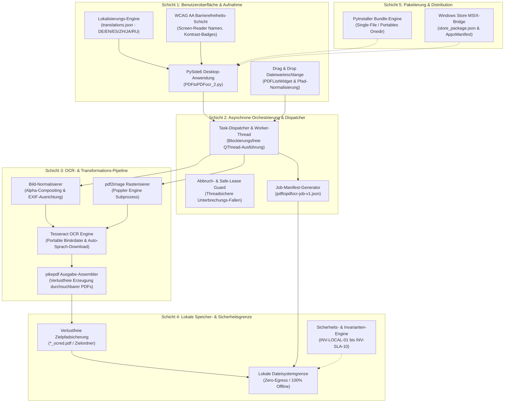
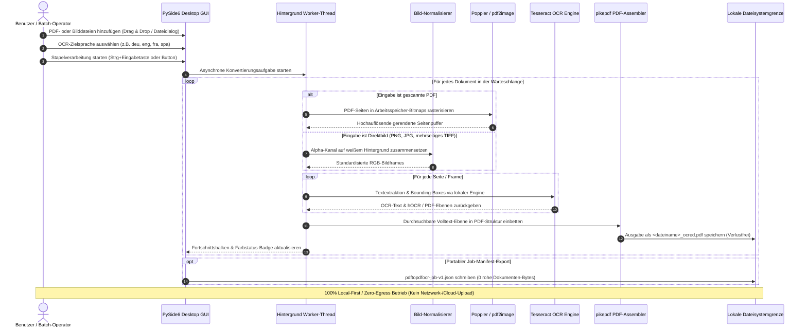

[English](README.md) | [Deutsch](README_de.md)

# PDFtoPDFocr - Lokaler PDF OCR Konverter

[](https://www.python.org/)
[](pyproject.toml)
[](LICENSE)
[](https://www.qt.io/)
[](#voraussetzungen--plattformmatrix)
[](#datenschutz--sicherheitsmodell)
[](SECURITY.md)
[](#funktionen--features)
[](tests/)
[](THIRD_PARTY_LICENSES.md)
[](MARKETING-LOG.txt)
[](llms.txt)
[](https://github.com/doc-bricks)
[](https://github.com/open-bricks)
[](tests/)

Wandelt gescannte PDF-Dateien und Bilddokumente in durchsuchbare PDFs um: per lokaler OCR (optische Zeichenerkennung) mit Tesseract. Bietet Mehrformat-Stapelverarbeitung, auswählbare OCR-Sprache mit automatischem Sprachpaket-Download, verlustfreien Erhalt der Originaldateien, barrierefreie Benutzeroberfläche und portable Tesseract/Poppler-Integration.

Maschinenlesbarer Projektkontext: [`llms.txt`](llms.txt) | [English Documentation](README.md) | [Sicherheitsrichtlinie](SECURITY.md)

> [!NOTE]
> **KI & LLM-Integration:** Dieses Repository enthält eine strukturierte [`llms.txt`](llms.txt)-Datei mit maschinenlesbarem Kontext, Architektur-Details, CLI/GUI-Schnittstellen und Test-Einstiegspunkten für autonome KI-Agenten und Entwickler-Workflows.

> [!TIP]
> **Datenschutz & Lokale Verarbeitung:** PDF- und Bilddateien werden zu 100% lokal auf Ihrem Rechner verarbeitet. Dokumente und OCR-Texte werden niemals auf externe Server oder Cloud-APIs übertragen (`INV-LOCAL-01`).

---

## 🧭 Schnellnavigation

1. 📸 [Visuelle Showcase-Galerie & Benutzeroberfläche](#visuelle-showcase-galerie)
2. 🏛️ [Systemarchitektur & 5-Schichten-Topologie](#systemarchitektur--komponenten-workflow)
3. 🔄 [Lokaler Datenfluss & Dokument-OCR-Verarbeitungslebenszyklus](#lokaler-datenfluss--datenschutz-isolation)
4. 🚀 [Schnelleinstieg & Kernabläufe](#schnelleinstieg--kernabläufe)
5. ✨ [Funktionen & Leistungsmerkmale](#funktionen--features)
6. 🎯 [Zielgruppen & Auffindbarkeit](#zielgruppen--auffindbarkeit)
7. ⚖️ [10-Dimensionen-Vergleichsmatrix vs. 5 Alternativen](#vergleichsmatrix--alternativen)
8. ⌨️ [Barrierefreiheit, WCAG-Ergonomie & Tastenkürzel](#barrierefreiheit--tastenkürzel)
9. 💻 [Voraussetzungen & Plattformmatrix](#voraussetzungen--plattformmatrix)
10. 📦 [Installation & Portables Setup](#installation--portables-setup)
11. 🖥️ [Nutzung & Ausführungsrichtlinien](#nutzung--ausführungsrichtlinien)
12. 🧪 [Automatisierte Tests & Qualitätsprüfung](#tests--qualitätsprüfung)
13. 🌐 [Geschwister-Tools & Ökosystem-Integration](#geschwister-tools--ökosystem)
14. 📜 [Level 1 SBOM & Drittanbieter-Lizenzen-Transparenz](#drittanbieter-lizenzen--transparenz)
15. 🔒 [Datenschutz- & Sicherheitsmodell (Invarianten INV-LOCAL-01..INV-SLA-10)](#datenschutz--sicherheitsmodell)
16. 🪟 [EXE & Distributions-Packaging (Windows Store MSIX & Portable)](#exe--distributions-packaging)
17. 🤖 [Maschinenlesbarer LLM-Kontext (llms.txt)](#maschinenlesbarer-llm-kontext)
18. ⚖️ [Gesetzlicher Hinweis (§ 521 BGB) & Lizenz](#gesetzlicher-hinweis--lizenz)

---

<a id="visuelle-showcase-galerie"></a>
<a id="visual-showcase"></a>
## 📸 Visuelle Showcase-Galerie & Benutzeroberfläche

| Hauptansicht | App-Identität & Assets |
|:---:|:---:|
| <br/><sub>**Batch-Warteschlange** – Drag-and-Drop Dateiaufnahme, dynamische Sprachauswahl, farbcodierte Status-Badges und asynchroner Arbeitsfortschritt.</sub> | <br/><sub>**App-Identität** – Windows Store und MSIX-Paket-Asset-Set mit barrierefreien Farbpaletten.</sub> |

---

<a id="systemarchitektur--komponenten-workflow"></a>
<a id="system-architecture--component-workflow"></a>
## 🏛️ Systemarchitektur & 5-Schichten-Topologie



---

<a id="lokaler-datenfluss--datenschutz-isolation"></a>
<a id="local-data-flow--privacy-isolation"></a>
## 🔄 Lokaler Datenfluss & Dokument-OCR-Verarbeitungslebenszyklus



---

<a id="schnelleinstieg--kernabläufe"></a>
<a id="quick-start--key-operations"></a>
## 🚀 Schnelleinstieg & Kernabläufe

| Aufgabe | Schnittstelle / Befehl | Ausgabe / Ergebnis |
|---|---|---|
| **Desktop-App starten** | `python PDFtoPDFocr_2.py` oder `START.bat` | PySide6 Desktop-GUI mit Drag & Drop Warteschlange |
| **Gescannte PDFs umwandeln** | Dateien hinzufügen, Sprache wählen, "Start" (`Strg+Eingabetaste`) | Verlustfreie `*_ocred.pdf` mit Volltext-Suchlayer |
| **Direkte Bild-OCR** | JPG, PNG oder mehrseitige TIFF-Dateien hineinziehen | Zusammengefügtes durchsuchbares PDF-Dokument |
| **In Sammel-PDF vereinen** | "Auto-Merge" in Menüleiste aktivieren | Konsolidierte mehrseitige durchsuchbare Sammel-PDF |
| **Job-Manifest exportieren** | Klick auf "Job-Export" (`Strg+E`) | Portables `pdftopdfocr-job-v1.json` Manifest |
| **Testsuite ausführen** | `python -m pytest` | 120+ verifizierte Unit-, Regressions-, Barrierefreiheits- und Metadaten-Tests |
| **Portablen Build erzeugen** | `python build_release.py --clean` | Eigenständige ausführbare Datei in `dist/PDFtoPDFocr/` |

---

<a id="funktionen--features"></a>
<a id="core-features"></a>
## ✨ Funktionen & Leistungsmerkmale

- **Batch-Verarbeitung** – Mehrere PDFs und Bilder gleichzeitig konvertieren (Dateiauswahl oder Drag & Drop).
- **Direkter Bild-Import** – JPG, PNG und mehrseitige TIFF-Dateien direkt ohne Zwischenschritte per OCR in durchsuchbare PDFs umwandeln.
- **Auswählbare OCR-Sprache** – Schnellwahl für Deutsch, Englisch, Französisch, Spanisch und dutzende weitere Sprachen.
- **Auto-Download** – Fehlende Tesseract-Sprachpakete (`.traineddata`) werden bei Bedarf automatisch von offiziellen GitHub-Repositories geladen.
- **Auto-Merge & Stapeln** – Mehrere verarbeitete OCR-Ergebnisse zu einer konsolidierten Sammel-PDF zusammenfassen.
- **Portable Tesseract & Poppler** – Tesseract OCR ist lokal gebündelt; keine systemweite Installation erforderlich.
- **Verlustfreier Originaldateischutz** – Ergebnisse werden standardmäßig mit dem Suffix `_ocred.pdf` oder im Zielordner abgelegt; Originale bleiben unberührt.
- **Job-Manifest-Export** – Speichert portable `pdftopdfocr-job-v1.json`-Dateien mit Einstellungen, Status und Metadaten.
- **Vollständige Barrierefreiheit (A11y)** – Screen-Reader-gerechte Bezeichnungen aller Steuerelemente, Tooltips in aktiver Sprache und vollständige Tastaturkürzel (`Strg+O`, `Strg+Eingabetaste`, `Strg+E`, `F5`, `Strg+Umschalt+O`, `Entf`/`Rücktaste`).
- **Kontrastreicher Fortschritt** – WCAG-konforme Farbkodierung (`#0b6e4f` / `#b45309`) und Einzeldateistatus per Mouseover.

---

<a id="zielgruppen--auffindbarkeit"></a>
<a id="target-personas--discoverability"></a>
## 🎯 Zielgruppen & Auffindbarkeit

### Zielgruppen-Profile

- **[PERSONA-01] Rechtswesen, Gesundheitswesen & Compliance-Beauftragte:**
  - *Kontext:* Verwaltung vertraulicher Patientenakten, Mandantenverträge, Gerichtsakten und Steuerunterlagen unter strengen DSGVO- und Berufsgeheimnis-Vorgaben.
  - *Kernproblem:* Das Hochladen von Dokumenten zu Cloud-OCR-Diensten (z.B. Adobe Cloud, Smallpdf, Google Vision) verletzt Zero-Egress-Vorschriften und birgt erhebliche Datenschutzrisiken.
  - *Lösung durch PDFtoPDFocr:* 100% lokale, abgeschottete OCR-Verarbeitung direkt auf dem Endgerät (`INV-LOCAL-01`). Unprivilegierte Ausführung (`INV-UNPRIV-02`). Quelldokumente bleiben strikt unverändert (`INV-NONDEST-03`).

- **[PERSONA-02] Archivare, Historiker & Akademische Forscher:**
  - *Kontext:* Digitalisierung umfangreicher historischer Buchbestände, mehrseitiger TIFF-Manuskripte und mehrsprachiger Archivbestände.
  - *Kernproblem:* Kommerzielle Cloud-OCR verlangt prohibitive Seitenpreise und scheitert an großen Stapelverarbeitungen oder mehrseitigen TIFF-Scans.
  - *Lösung durch PDFtoPDFocr:* Unbegrenzte lokale Stapelverarbeitung für PDFs und Bildformate (JPG, PNG, TIFF), freie Sprachmodellauswahl mit automatischem Download offizieller `.traineddata`-Modelle und optionaler Sammel-PDF-Zusammenführung.

- **[PERSONA-03] Datenschutzbewusste Wissensarbeiter & Desktop-Anwender:**
  - *Kontext:* Fachanwender, die Rechnungen, Quittungen und Unterlagen auf Windows-Arbeitsplätzen oder mobilen Laptops im Volltext durchsuchbar machen wollen.
  - *Kernproblem:* Kommerzielle Desktop-Suiten (Adobe Acrobat, ABBYY) erzwingen teure Abonnements, Cloud-Logins, aufdringliche Hintergrund-Dienste und Administratorrechte.
  - *Lösung durch PDFtoPDFocr:* Kostenloses, quelloffenes MIT-Desktop-Tool ohne Telemetrie, Ausführung im Standard-Benutzerkonto, portable Zero-Install-Ordner (`INV-PORTABLE-06`) und barrierefreie Tastaturbedienung (`INV-A11Y-08`).

- **[PERSONA-04] Automatisierungs-Entwickler & Pipeline-Integratoren:**
  - *Kontext:* Entwickler, die OCR-Schritte in lokale Archivierungs-, Ingest- oder Sicherungs-Pipelines einbetten wollen.
  - *Kernproblem:* Den meisten Desktop-Tools fehlen maschinenlesbare Protokolle, nachvollziehbare Fehlerbehandlung und standardisierte Schnittstellen.
  - *Lösung durch PDFtoPDFocr:* Strukturierter Job-Manifest-Export (`pdftopdfocr-job-v1.json` / `INV-MANIFEST-07`), Fail-Closed Einzelfehler-Abfangung (`INV-FAILCLOSED-09`) und maschinenlesbare Dokumentation via `llms.txt`.

### Zweisprachige Suchbegriffe & Suchintentionen

| Sprache | Primärer Suchbegriff | Zielintention & Persona |
|---|---|---|
| **DE** | `gescannte pdf durchsuchbar machen lokal kostenlos` | Kostenlose lokale Texterkennung für Rechnungen und Dokumente ([PERSONA-03]) |
| **DE** | `offline pdf ocr texterkennung windows tesseract` | Lokales Tesseract-Desktop-Tool mit deutscher Benutzeroberfläche ([PERSONA-02], [PERSONA-03]) |
| **DE** | `datenschutzkonforme ocr software ohne cloud dsgvo` | 100% DSGVO-konforme Texterkennung für Kanzleien und Praxen ([PERSONA-01]) |
| **DE** | `tiff mehrseitig in durchsuchbare pdf umwandeln` | Stapelverarbeitung für historische Scan-Archive ([PERSONA-02]) |
| **DE** | `portable ocr software ohne installation windows` | Portable Ausführung ohne Administratorrechte ([PERSONA-03], [PERSONA-04]) |
| **EN** | `local pdf ocr converter windows 10 11` | Local-First, offline Erstellung durchsuchbarer PDFs ([PERSONA-01], [PERSONA-03]) |
| **EN** | `tesseract ocr batch desktop gui python pyside6` | Python/PySide6 Desktop-Lösung für Stapel-OCR ([PERSONA-02], [PERSONA-04]) |
| **EN** | `offline searchable pdf creator zero egress gdpr` | DSGVO- und Zero-Egress-konforme Dokumentenverarbeitung ([PERSONA-01]) |

---

<a id="vergleichsmatrix--alternativen"></a>
<a id="comparative-matrix--alternatives"></a>
## ⚖️ 10-Dimensionen-Vergleichsmatrix vs. 5 Alternativen

| Bewertungsdimension | Governance-Invariante | PDFtoPDFocr (doc-bricks) | Adobe Acrobat Pro | ABBYY FineReader PDF | OCRmyPDF (CLI) | Cloud SaaS (Smallpdf/iLovePDF) |
|---|---|:---:|:---:|:---:|:---:|:---:|
| **Zero-Egress Datenschutz** | `INV-LOCAL-01` | **100% Offline (Lokal)** | Cloud-Sync Standard | Cloud-Optionen | **100% Offline (Lokal)** | Nein (Cloud-Upload Pflicht) |
| **Keine Privilegien-Erhöhung**| `INV-UNPRIV-02` | **Standard-Benutzermodus**| Admin-Dienst / Daemon | Admin-Dienst / Daemon | Abhängig von Host/Docker | Remote Cloud Host |
| **Verlustfreie Sicherheit** | `INV-NONDEST-03` | **Strikte `_ocred.pdf`** | Überschreibt / Fragt | Überschreibt / Fragt | In-Place oder neue Datei | Erzeugt Cloud-Objekt |
| **Prozess- & Copyleft-Schutz**| `INV-ISOLATION-04`| **Subprozess-Grenze** | Proprietär (Closed) | Proprietär (Closed) | MPL-2.0 / Subprozesse | Proprietäres Backend |
| **Begrenzter Speicherbedarf** | `INV-BOUNDED-05` | **Seitenweises Streaming** | Hoher Cache-Bedarf | Hoher Cache-Bedarf | Speicherlastig bei Groß-PDFs| Server-Allokation |
| **Portabilität / Zero-Install**| `INV-PORTABLE-06` | **Portabler Ordner / EXE**| Schwerer Installer | Schwerer Installer | Paketmanager erforderlich | Web-Client im Browser |
| **Prüfbare Job-Manifeste** | `INV-MANIFEST-07` | **`pdftopdfocr-job-v1.json`**| Proprietäre Logs | Proprietäre Logs | Terminal stdout/stderr | JSON REST-Antwort |
| **Screen-Reader & Tastatur** | `INV-A11Y-08` | **Vollständiges WCAG AA** | Standard | Standard | Nur Terminal-Bedienung | Web-UI variiert |
| **Fail-Closed Fehlerbehandlung**| `INV-FAILCLOSED-09`| **Seitenweiser Skip** | Modale Dialogblocker | Modale Dialogblocker | CLI Fehlercode | HTTP 5xx Fehlercode |
| **Sicherheits-Reaktions-SLA** | `INV-SLA-10` | **48h Antwort / 5d Triage**| Enterprise-Support | Enterprise-Support | Best-Effort GitHub | Ticket-Warteschlange |

---

<a id="barrierefreiheit--tastenkürzel"></a>
<a id="accessibility--keyboard-shortcuts"></a>
## ⌨️ Barrierefreiheit, WCAG-Ergonomie & Tastenkürzel

| Aktion | Tastenkürzel | Beschreibung |
|---|---|---|
| **Dateien hinzufügen** | `Strg+O` | Dateiauswahldialog öffnen |
| **OCR starten** | `Strg+Eingabetaste` | Stapel-OCR-Verarbeitung beginnen |
| **Job-Manifest exportieren** | `Strg+E` | Auftragszustand als JSON-Manifest speichern |
| **Liste zurücksetzen** | `F5` | Dateiliste leeren und Statusanzeige zurücksetzen |
| **Ausgabeordner wählen** | `Strg+Umschalt+O` | Benutzerdefinierten Zielordner festlegen |
| **Ausgewählte Datei entfernen**| `Entf` oder `Rücktaste` | Gewählte Datei aus der Warteschlange entfernen |

---

<a id="voraussetzungen--plattformmatrix"></a>
<a id="requirements--platform-matrix"></a>
## 💻 Voraussetzungen & Plattformmatrix

- Python 3.10+
- Windows 10/11 (Primäre Distributions-Plattform)
- macOS / Linux (Ausführung aus Quellcode)

---

<a id="installation--portables-setup"></a>
<a id="installation--portable-setup"></a>
## 📦 Installation & Portables Setup

```bash
pip install -r requirements.txt
```

Poppler muss für `pdf2image` verfügbar sein (entweder im System-PATH oder portabel im Projektverzeichnis hinterlegt).

---

<a id="nutzung--ausführungsrichtlinien"></a>
<a id="usage--execution-guidelines"></a>
## 🖥️ Nutzung & Ausführungsrichtlinien

```bash
python PDFtoPDFocr_2.py
```

Unter Windows kann `START.bat` per Doppelklick als Direktstarter genutzt werden.

1. PDFs oder Bilder per Dateiauswahl oder Drag & Drop hinzufügen.
2. OCR-Sprache wählen (fehlende Sprachpakete werden automatisch geladen).
3. Auf "Start" klicken – fertig.
4. Optional per "Job-Export" ein portables `pdftopdfocr-job-v1.json`-Manifest sichern.

---

<a id="tests--qualitätsprüfung"></a>
<a id="tests--quality-verification"></a>
## 🧪 Automatisierte Tests & Qualitätsprüfung

```bash
python -m pip install -r requirements-dev.txt
python -m pytest
```

Die Testsuite deckt ab:
- **UI-Barrierefreiheit & Tastenkürzel** (`tests/test_ui_accessibility.py`)
- **Tesseract-Konfiguration** (`tests/test_tesseract_config.py`)
- **Job-Exportformat & Manifest-Schema** (`tests/test_export_format.py`)
- **Sprachumschaltung & Mehrsprachigkeit** (`tests/test_language_switch.py`)
- **Fehler-Regressionen & Ressourcen-Lebenszyklus** (`tests/test_bug_regressions.py`)
- **App-Icons & Bild-Assets** (`tests/test_app_assets.py`)
- **Plattform-Paketierung & Release-Validierung** (`tests/test_build_release.py`, `tests/test_platform_package_gate.py`)
- **Metadaten, Sicherheit & Paritäts-Governance** (`tests/test_metadata.py`, `tests/test_security_license_contract.py`)

---

<a id="geschwister-tools--ökosystem"></a>
<a id="sibling-tools--ecosystem"></a>
## 🌐 Geschwister-Tools & Ökosystem-Integration

PDFtoPDFocr ist Teil der **doc-bricks** Dokumenten-Werkzeugfamilie und des **open-bricks** Open-Source-Ökosystems:

| Werkzeug | Ökosystem | Zweck | Repository |
|---|---|---|---|
| **DokuReader** | `doc-bricks` | Lokale Dokumentenbibliothek, Lese-Arbeitsplatz & Viewer | [doc-bricks/DokuReader](https://github.com/doc-bricks/DokuReader) |
| **MediaBrain** | `doc-bricks` | Medien-Metadaten-Inspektor, EXIF-Analyzer & Batch-Klassifizierer | [doc-bricks/MediaBrain](https://github.com/doc-bricks/MediaBrain) |
| **UniversalDocsGrabber** | `doc-bricks` | Automatisierte E-Mail-Dokumentenextraktion & Batch-Ingest | [doc-bricks/UniversalDocsGrabber](https://github.com/doc-bricks/UniversalDocsGrabber) |
| **UniversalInvoiceMail** | `doc-bricks` | Intelligente Rechnungsextraktion & DATEV-Export | [doc-bricks/UniversalInvoiceMail](https://github.com/doc-bricks/UniversalInvoiceMail) |
| **UniversalMailCleaner** | `doc-bricks` | Datenschutzorientierter Postfach-Cleaner & Newsletter-Abbesteller | [doc-bricks/UniversalMailCleaner](https://github.com/doc-bricks/UniversalMailCleaner) |
| **CleanMarkdown** | `doc-bricks` | Markdown-Bereinigung, Tabellenformatierung & Dokumenten-Linter | [doc-bricks/CleanMarkdown](https://github.com/doc-bricks/CleanMarkdown) |
| **LitZentrum** | `doc-bricks` | Literaturverwaltung, BibTeX-Zitationsmanager & Forschungs-Workspace | [doc-bricks/LitZentrum](https://github.com/doc-bricks/LitZentrum) |
| **MailProcessor** | `doc-bricks` | Regelbasierte E-Mail-Archivierung & Anhang-Sortierung | [doc-bricks/MailProcessor](https://github.com/doc-bricks/MailProcessor) |
| **ProFiler** | `file-bricks` | Schnelle Dateisuche nach Kriterien, Regex & Batch-Umbenennung | [file-bricks/ProFiler](https://github.com/file-bricks/ProFiler) |
| **ExplorerPro** | `file-bricks` | Zweifenster-Dateimanager mit Tabs, Lesezeichen & Hex-Vorschau | [file-bricks/ExplorerPro](https://github.com/file-bricks/ExplorerPro) |
| **DevCenter** | `dev-bricks` | Entwicklungsumgebungs-Manager, Toolchain-Orchestrierer & Starter | [dev-bricks/DevCenter](https://github.com/dev-bricks/DevCenter) |
| **CodeBox** | `dev-bricks` | Offline Code-Playground, Snippet-Sammlung & Sandbox | [dev-bricks/CodeBox](https://github.com/dev-bricks/CodeBox) |
| **open-bricks** | `open-bricks` | Dachorganisation für datenschutzkonforme Desktop-Software | [open-bricks](https://github.com/open-bricks) |

---

<a id="drittanbieter-lizenzen--transparenz"></a>
<a id="third-party-licenses--transparency"></a>
## 📜 Level 1 SBOM & Drittanbieter-Lizenzen-Transparenz

PDFtoPDFocr erzwingt 100% Open-Source-Transparenz, verifizierte Lieferkettenhygiene und strikte Copyleft-Isolationsgrenzen:
- **Keine AGPL / SSPL Belastung:** Die Anwendung ist frei von Netzwerk-Copyleft oder restriktiven dualen Lizenzen.
- **LGPL-3.0 Dynamische Verlinkung:** `PySide6` (Qt für Python) ist dynamisch gemäß LGPLv3 Abschnitt 4 angebunden; Austausch der Bibliotheken ist unterstützt.
- **Strikte Subprozess-Grenzen für Hilfswerkzeuge:** Externe Werkzeuge (`Poppler`-Utilities wie `pdftoppm` und `pdfinfo`) laufen strikt in isolierten Betriebssystem-Subprozessen mit begrenzten Parametern, wodurch GPL-Code sauber isoliert bleibt (`INV-ISOLATION-04`).
- **Freizügige Kern-Laufzeit:** `pytesseract` (Apache-2.0), `Pillow` (HPND), `pdf2image` (MIT), `pikepdf` (MPL-2.0) und `requests` (Apache-2.0) sind 100% kompatibel mit der übergeordneten **MIT-Lizenz**.

Das vollständige Software-Inventar und die Governance-Invarianten sind in [`THIRD_PARTY_LICENSES.md`](THIRD_PARTY_LICENSES.md) und [`MARKETING-LOG.txt`](MARKETING-LOG.txt) dokumentiert.

---

<a id="datenschutz--sicherheitsmodell"></a>
<a id="privacy--security-model"></a>
## 🔒 Datenschutz- & Sicherheitsmodell (Invarianten INV-LOCAL-01..INV-SLA-10)

PDF-Dateien und Bilder werden ausschließlich lokal verarbeitet und niemals hochgeladen. Netzwerkzugriff beschränkt sich strikt auf den manuell ausgelösten Download öffentlicher Tesseract-Sprachpakete von GitHub. Vollständige Sicherheitsprinzipien finden sich in [`SECURITY.md`](SECURITY.md).

---

<a id="exe--distributions-packaging"></a>
<a id="exe--distribution-packaging"></a>
## 🪟 EXE & Distributions-Packaging (Windows Store MSIX & Portable)

```bash
python build_release.py --clean

# oder unter Windows per Doppelklick / Konsole:
build_exe.bat

# oder direkt per PyInstaller:
python -m PyInstaller --noconfirm --clean PDFtoPDFocr.spec
```

Das fertige Paket wird in `dist/PDFtoPDFocr/` erzeugt. Falls vorhanden, werden `tesseract_portable/` und `poppler/` automatisch eingebunden.

---

<a id="maschinenlesbarer-llm-kontext"></a>
<a id="machine-readable-llm-context"></a>
## 🤖 Maschinenlesbarer LLM-Kontext (llms.txt)

Für autonome KI-Programmierassistenten und automatisierte CI-Pipelines stellt dieses Repository eine dedizierte [`llms.txt`](llms.txt)-Datei nach modernen Konventionen bereit. Sie enthält:
- Architektur-Zusammenfassung und Komponenten-Rollen
- Testbefehle und Verifikations-Gates
- Sicherheits- und Laufzeit-Invarianten (`INV-LOCAL-01` bis `INV-SLA-10`)
- Dateisystem-Übersicht und Abhängigkeits-Matrizen

---

<a id="gesetzlicher-hinweis--lizenz"></a>
<a id="mitwirken--lizenz"></a>
<a id="statutory-notice--license"></a>
<a id="contributing--license"></a>
## ⚖️ Gesetzlicher Hinweis (§ 521 BGB) & Lizenz

> [!IMPORTANT]
> **Haftungsbeschränkung bei unentgeltlicher Softwareüberlassung (§ 521 BGB):**
> Da diese Software unentgeltlich als Open-Source-Software zur Verfügung gestellt wird, haften die Autoren und Beitragenden gemäß § 521 BGB (Schenkungsrecht/Gefälligkeitsrecht) nur für Vorsatz und grobe Fahrlässigkeit. Die Software wird ohne ausdrückliche oder stillschweigende Gewährleistung in der vorliegenden Form ("as is") bereitgestellt.

Beiträge, Fehlermeldungen und Pull Requests sind willkommen! Bitte stellen Sie sicher, dass alle Pull Requests vor dem Einreichen die Testsuite (`pytest`) und den Linter (`ruff check .`) erfolgreich durchlaufen.

Dieses Projekt steht unter der [MIT-Lizenz](LICENSE).
