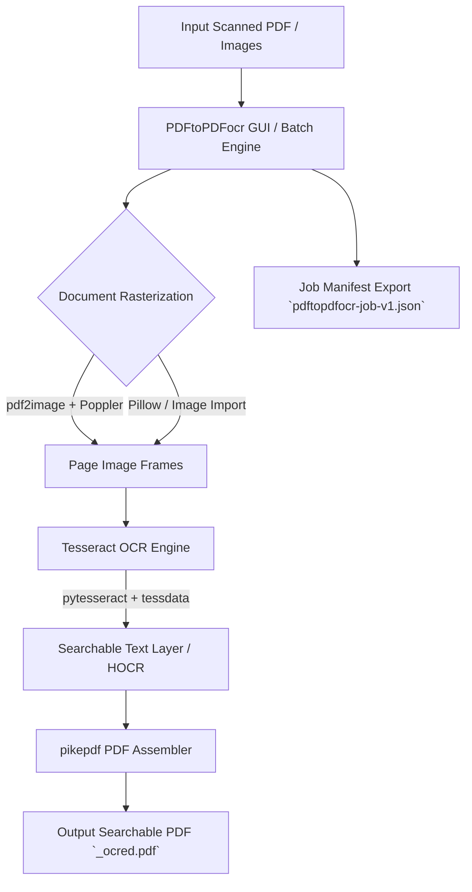

# PDFtoPDFocr - PDF OCR Converter

[](https://www.python.org/)
[](https://github.com/doc-bricks/PDFtoPDFocr)
[](LICENSE)
[](https://github.com/doc-bricks/PDFtoPDFocr)
[](https://github.com/tesseract-ocr/tesseract)
[](llms.txt)

Wandelt gescannte PDF-Dateien und Bilder in durchsuchbare PDFs um: per OCR (Texterkennung) mit Tesseract. Batch-Verarbeitung, auswählbare OCR-Sprachen, automatischer Sprachpaket-Download, Direkt-Bildimport, Auto-Merge und portable Tesseract/Poppler-Integration.

Maschinenlesbarer Projektkontext: [`llms.txt`](llms.txt) | [English Documentation](README.md)

> [!NOTE]
> **Für KI-Agenten & Automatisierungsworkflows**: Maschinenlesbare Projektkontexte und Funktionsspezifikationen stehen in [`llms.txt`](llms.txt) bereit. PDFtoPDFocr unterstützt Batch-OCR, auswählbare Sprachpakete und strukturierte lokale Job-Manifest-Exporte (`pdftopdfocr-job-v1.json`) für offline Dokumenten-Pipelines.


## Systemarchitektur & Datenfluss



## Features

- **Batch-Verarbeitung** – Mehrere PDFs und Bilder auf einmal konvertieren (Dateiauswahl oder Drag & Drop)
- **Direkter Bild-Import** – JPG, PNG und mehrseitige TIFF-Dateien direkt ohne PDF-Umweg per OCR in durchsuchbare PDFs umwandeln
- **Auswählbare OCR-Sprache** – Schnellwahl für Deutsch, Englisch, Französisch, Spanisch und dutzende weitere Sprachen
- **Auto-Download** – Fehlende Tesseract-Sprachpakete werden automatisch von GitHub geladen
- **Auto-Merge & Stapeln** – Mehrere verarbeitete OCR-Ergebnisse zu einer Sammel-PDF zusammenfassen
- **Portable Tesseract** – Tesseract OCR ist integriert; keine globale Installation nötig
- **Originaldatei erhalten** – Ergebnis als neue Datei mit Suffix `_ocred.pdf` oder im konfigurierten Ausgabeverzeichnis
- **Job-Manifest-Export** – Über `Job-Export` ein portables `pdftopdfocr-job-v1.json` mit Einstellungen und Dateimetadaten speichern
- **Fortschrittsanzeige** – Farbige Statusanzeige pro Datei mit barrierefreien Kontext-Aktionen

## Voraussetzungen

- Python 3.10+
- Windows 10/11

## Installation

```bash
pip install -r requirements.txt
```

Poppler muss für `pdf2image` verfügbar sein (als PATH-Variable oder portable im Projektordner).

## Verwendung

```bash
python PDFtoPDFocr_2.py
```

Unter Windows funktioniert außerdem `START.bat` als Doppelklick-Einstieg.

1. PDFs oder Bilder per Dateiauswahl oder Drag & Drop hinzufügen
2. OCR-Sprache auswählen (fehlende Pakete werden automatisch geladen)
3. "Start" klicken - fertig
4. Bei Bedarf `Job-Export` nutzen, um ein portables `pdftopdfocr-job-v1.json` mit Einstellungen, Dateimetadaten und Ergebnis-Hinweisen zu speichern.

Hinweis: PDFtoPDFocr erkennt die Dokumentsprache nicht automatisch. Wählen Sie vor dem Start die passende OCR-Sprache aus; fehlende Tesseract-Sprachpakete werden bei Bedarf nachgeladen.

## Tests / Verifikation

```bash
python -m pip install -r requirements-dev.txt
python -m pytest
```

Die Test-Suite deckt Tesseract-Konfiguration (`tests/test_tesseract_config.py`), Job-Export-Format (`tests/test_export_format.py`), Sprachumschaltung (`tests/test_language_switch.py`), Bug-Regressionen (`tests/test_bug_regressions.py`) und Release-Build-Paketierung (`tests/test_build_release.py`) ab.

## Abhängigkeiten

| Paket | Lizenz | Zweck |
|---|---|---|
| PySide6 | LGPL v3 | GUI-Framework |
| pytesseract | Apache 2.0 | Tesseract-OCR-Wrapper |
| Pillow | HPND | Bildverarbeitung & TIFF-Frame-Extraktion |
| pdf2image | MIT | PDF zu Bild-Konvertierung |
| pikepdf | MPL 2.0 | PDF-Zusammenführung & Dokumentenaufbau |
| requests | Apache 2.0 | Sprachpaket-Download |

Optional lokal gebündelt: **Tesseract OCR** (Apache 2.0) und Poppler. Die großen Runtime-Ordner `tesseract_portable/`, `tessdata/`, `poppler/`, `dist/`, `build/` und `releases/` sind bewusst per `.gitignore` ausgeschlossen.

## Datenschutz / Netzwerkzugriff

PDF-Dateien und Bilder werden lokal verarbeitet und nicht hochgeladen. Netzwerkzugriff wird nur genutzt, wenn ein fehlendes Tesseract-Sprachpaket automatisch von GitHub nachgeladen wird.

Lokale Runtime-Ordner, Build-Artefakte, Releases, interne Wartungsnotizen und Secrets werden per `.gitignore` ausgeschlossen.

## EXE / Portable Build

```bash
python build_release.py --clean

# oder unter Windows per Doppelklick/Terminal
build_exe.bat

# oder direkt mit vorhandenen Abhängigkeiten
python -m PyInstaller --noconfirm --clean PDFtoPDFocr.spec
```

`build_release.py` legt dafür ein isoliertes `.build_venv` an, installiert nur die nötigen Runtime-/Build-Abhängigkeiten und startet PyInstaller mit der versionierten Spec-Datei.

Die Ausgabe landet in `dist/PDFtoPDFocr/`. Falls vorhanden, werden `tesseract_portable/` und `poppler/` automatisch mit in den Build aufgenommen.

## Portierung / Plattformstrategie

Die aktuelle Portierungsentscheidung steht in `PORTIERUNGSPLAN.md`: Windows Store bleibt der erste Release-Kanal, weil die App lokale Batch-OCR mit Tesseract, Poppler und PySide6 bündelt.

macOS und Linux bleiben zunächst Source- und Smoke-Test-Ziele aus derselben Desktop-Codebasis. Eine eigene Desktop-Paketierung folgt erst, wenn die Windows-Store-Linie finalisiert ist.

## Lizenz

MIT License
