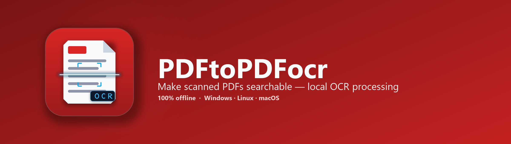
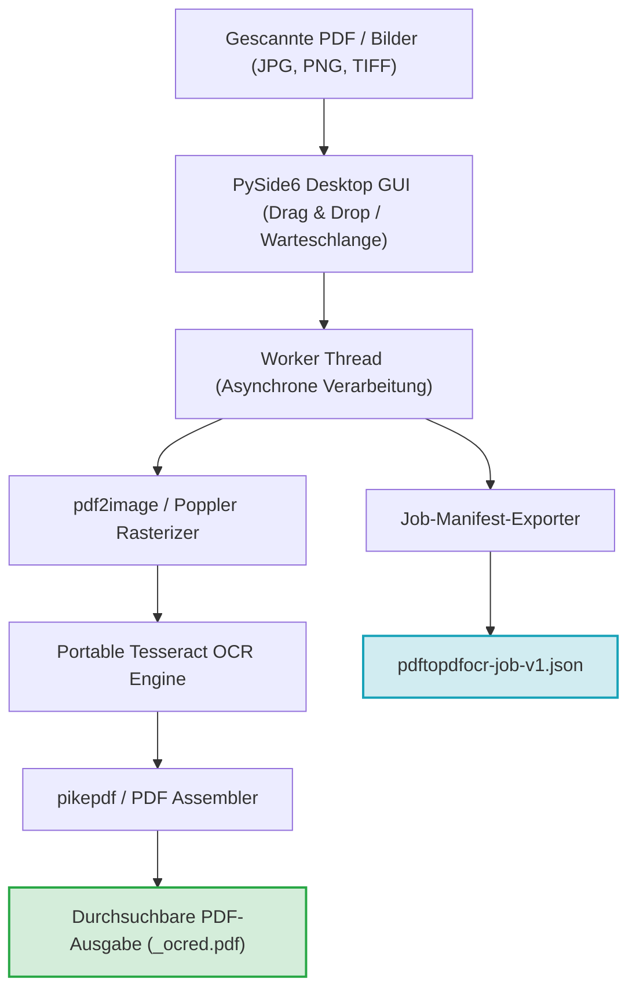
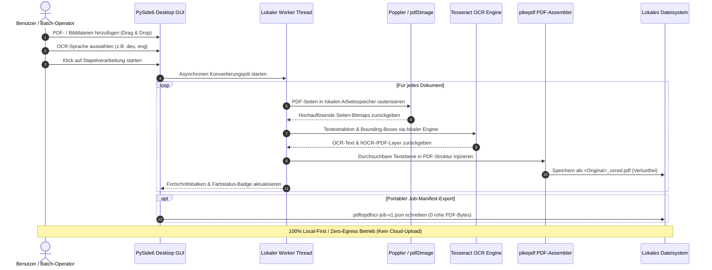

[English](README.md) | [Deutsch](README_de.md)

# PDFtoPDFocr - Lokaler PDF OCR Konverter

[](https://www.python.org/)
[](pyproject.toml)
[](LICENSE)
[](https://www.qt.io/)
[](#voraussetzungen)
[](#datenschutz--netzwerkzugriff)
[](SECURITY.md)
[](tests/)
[](llms.txt)
[](https://github.com/doc-bricks)
[](https://github.com/open-bricks)

Wandelt gescannte PDF-Dateien in durchsuchbare PDFs um: per OCR (optische Zeichenerkennung) mit Tesseract. Batch-Verarbeitung, auswählbare OCR-Sprache, automatischer Sprachpaket-Download, verlustfreier Erhalt der Originaldateien und portable Tesseract/Poppler-Integration.

Maschinenlesbarer Projektkontext: [`llms.txt`](llms.txt) | [English Documentation](README.md) | [Sicherheitsrichtlinie](SECURITY.md)

> [!NOTE]
> **KI & LLM-Integration:** Dieses Repository enthält eine strukturierte [`llms.txt`](llms.txt)-Datei mit maschinenlesbarem Kontext, Architektur-Details, CLI/GUI-Schnittstellen und Test-Einstiegspunkten für autonome KI-Agenten und Entwickler-Workflows.

> [!TIP]
> **Datenschutz & Lokale Verarbeitung:** PDF- und Bilddateien werden zu 100% lokal auf Ihrem System verarbeitet. Dokumente und OCR-Texte werden niemals auf externe Server oder Cloud-APIs hochgeladen.


## Systemarchitektur & Komponenten-Workflow



## Lokaler Datenfluss & Datenschutz-Isolation



## Schnelleinstieg & Kernabläufe

| Aufgabe | Schnittstelle / Befehl | Ausgabe / Ergebnis |
|---|---|---|
| **Desktop-App starten** | `python PDFtoPDFocr_2.py` oder `START.bat` | PySide6 Desktop-GUI mit Drag & Drop Warteschlange |
| **Gescannte PDFs umwandeln** | Dateien hinzufügen, Sprache wählen, "Start" | Verlustfreie `*_ocred.pdf` mit Volltext-Suchlayer |
| **Direkte Bild-OCR** | JPG, PNG oder mehrseitige TIFF-Dateien hineinziehen | Zusammengefügtes durchsuchbares PDF-Dokument |
| **In Sammel-PDF vereinen** | "Auto-Merge" in Menüleiste aktivieren | Konsolidierte mehrseitige durchsuchbare Sammel-PDF |
| **Job-Manifest exportieren** | Klick auf "Job-Export" | Portables `pdftopdfocr-job-v1.json` Manifest |
| **Testsuite ausführen** | `python -m pytest` | 60 verifizierte Unit-, Regressions- und Metadaten-Tests |
| **Portablen Build erzeugen** | `python build_release.py --clean` | Eigenständige ausführbare Datei in `dist/PDFtoPDFocr/` |

## Features

- **Batch-Verarbeitung** – Mehrere PDFs und Bilder gleichzeitig konvertieren (Dateiauswahl oder Drag & Drop).
- **Direkter Bild-Import** – JPG, PNG und mehrseitige TIFF-Dateien direkt ohne Zwischenschritte per OCR in durchsuchbare PDFs umwandeln.
- **Auswählbare OCR-Sprache** – Schnellwahl für Deutsch, Englisch, Französisch, Spanisch und dutzende weitere Sprachen.
- **Auto-Download** – Fehlende Tesseract-Sprachpakete (`.traineddata`) werden bei Bedarf automatisch von offiziellen GitHub-Repositories geladen.
- **Auto-Merge & Stapeln** – Mehrere verarbeitete OCR-Ergebnisse zu einer konsolidierten Sammel-PDF zusammenfassen.
- **Portable Tesseract & Poppler** – Tesseract OCR ist integriert; keine globale Systeminstallation nötig.
- **Originaldatei erhalten** – Ergebnisse werden als neue Datei mit Suffix `_ocred.pdf` oder im konfigurierten Ausgabeverzeichnis gespeichert; Originale bleiben unberührt.
- **Job-Manifest-Export** – Über `Job-Export` ein portables `pdftopdfocr-job-v1.json` mit Einstellungen, Ausführungsstatus und Dateimetadaten speichern.
- **Farbcodierte Fortschrittsanzeige** – Übersichtliche Statusanzeige pro Datei mit barrierefreien Steuerelementen und reaktionsschnellem Worker-Thread.

## Voraussetzungen

- Python 3.10+
- Windows 10/11 (Primäre Release-Plattform)
- macOS / Linux (Quellcode- und Smoke-Test-Ziele)

## Installation

```bash
pip install -r requirements.txt
```

Poppler muss für `pdf2image` verfügbar sein (als PATH-Variable oder portable im Projektordner).

## Verwendung

```bash
python PDFtoPDFocr_2.py
```

Unter Windows funktioniert außerdem `START.bat` als Doppelklick-Einstieg.

1. PDFs oder Bilder per Dateiauswahl oder Drag & Drop hinzufügen.
2. OCR-Sprache auswählen (fehlende Pakete werden automatisch geladen).
3. "Start" klicken – fertig.
4. Bei Bedarf `Job-Export` nutzen, um ein portables `pdftopdfocr-job-v1.json` mit Einstellungen und Dateimetadaten zu sichern.

## Tests & Qualitätsprüfung

```bash
python -m pip install -r requirements-dev.txt
python -m pytest
```

Die Test-Suite deckt folgende Kernbereiche ab:
- **Tesseract-Konfiguration** (`tests/test_tesseract_config.py`)
- **Job-Export-Format & Manifest-Schema** (`tests/test_export_format.py`)
- **Sprachumschaltung & Multi-Language-Support** (`tests/test_language_switch.py`)
- **Bug-Regressionen & Ressourcen-Lifecycle** (`tests/test_bug_regressions.py`)
- **App-Icons & Visuelle Asset-Prüfung** (`tests/test_app_assets.py`)
- **Plattform-Paketierung & Release-Build-Validierung** (`tests/test_build_release.py`, `tests/test_platform_package_gate.py`)
- **Metadaten-, Sicherheits- & Paritäts-Governance** (`tests/test_metadata.py`)

## Geschwisterwerkzeuge & Ökosystem

PDFtoPDFocr ist Teil der **doc-bricks** Dokumentenwerkzeuge-Familie und des übergreifenden **open-bricks** Open-Source-Ökosystems:

| Werkzeug | Ökosystem | Zweck | Repository |
|---|---|---|---|
| **DokuReader** | `doc-bricks` | Lokale Dokumentenbibliothek, Leseumgebung & viewer für diverse Formate | [doc-bricks/DokuReader](https://github.com/doc-bricks/DokuReader) |
| **MediaBrain** | `doc-bricks` | Lokaler Medien-Metadaten-Inspektor, EXIF-Analyzer & Stapelklassifizierer | [doc-bricks/MediaBrain](https://github.com/doc-bricks/MediaBrain) |
| **UniversalDocsGrabber** | `doc-bricks` | Automatisierte E-Mail-Dokumentenextraktion & OCR-Stapelerfassungs-Pipeline | [doc-bricks/UniversalDocsGrabber](https://github.com/doc-bricks/UniversalDocsGrabber) |
| **UniversalInvoiceMail** | `doc-bricks` | Intelligente Rechnungsextraktion, Datums-/Betragsparameter & DATEV-Export | [doc-bricks/UniversalInvoiceMail](https://github.com/doc-bricks/UniversalInvoiceMail) |
| **UniversalMailCleaner** | `doc-bricks` | Datenschutzorientierter Postfach-Bereiniger, Newsletter-Abmelder & Filter | [doc-bricks/UniversalMailCleaner](https://github.com/doc-bricks/UniversalMailCleaner) |
| **CleanMarkdown** | `doc-bricks` | Markdown-Bereinigung, Tabellenformatierung & Dokumentations-Linter | [doc-bricks/CleanMarkdown](https://github.com/doc-bricks/CleanMarkdown) |
| **LitZentrum** | `doc-bricks` | Akademischer Literaturmanager, BibTeX-Zitationsverwaltung & Recherche-Hub | [doc-bricks/LitZentrum](https://github.com/doc-bricks/LitZentrum) |
| **MailProcessor** | `doc-bricks` | Regelbasierte lokale E-Mail-Archivierung, Anhang-Filterung & Sortier-Engine | [doc-bricks/MailProcessor](https://github.com/doc-bricks/MailProcessor) |
| **ProFiler** | `file-bricks` | Schnelle Mehrkriterien-Dateisuche, Regex-Filterung & Stapel-Umbenennung | [file-bricks/ProFiler](https://github.com/file-bricks/ProFiler) |
| **ExplorerPro** | `file-bricks` | Zweifenster-Desktop-Dateimanager mit Tabs, Lesezeichen & Hex-Vorschau | [file-bricks/ExplorerPro](https://github.com/file-bricks/ExplorerPro) |
| **DevCenter** | `dev-bricks` | Entwickler-Umgebungsmanager, Toolchain-Orchestrator & Projekt-Starter | [dev-bricks/DevCenter](https://github.com/dev-bricks/DevCenter) |
| **CodeBox** | `dev-bricks` | Offline Multi-Language Code Playground, Snippet-Sammlung & Sandbox | [dev-bricks/CodeBox](https://github.com/dev-bricks/CodeBox) |
| **open-bricks** | `open-bricks` | Dachorganisation & kuratierter Katalog datenschutzorientierter Desktop-Apps | [open-bricks](https://github.com/open-bricks) |

## Abhängigkeiten

| Paket | Lizenz | Zweck |
|---|---|---|
| PySide6 | LGPL v3 | Desktop-GUI-Framework |
| pytesseract | Apache 2.0 | Tesseract-OCR-Wrapper |
| Pillow | HPND | Bildverarbeitung & TIFF-Frame-Extraktion |
| pdf2image | MIT | PDF zu Bild-Rasterisierung |
| pikepdf | MPL 2.0 | PDF-Zusammenführung & Dokumentenaufbau |
| requests | Apache 2.0 | Sprachpaket-Download |

Optional lokal gebündelt: **Tesseract OCR** (Apache 2.0) und Poppler. Die großen Runtime-Ordner `tesseract_portable/`, `tessdata/`, `poppler/`, `dist/`, `build/` und `releases/` sind per `.gitignore` ausgeschlossen.

## Datenschutz & Netzwerkzugriff

PDF-Dateien und Bilder werden lokal verarbeitet und zu keinem Zeitpunkt hochgeladen. Netzwerkzugriff ist strikt auf das Herunterladen fehlender öffentlicher Tesseract-Sprachdateien von GitHub beschränkt. Siehe [`SECURITY.md`](SECURITY.md) für die vollständige Sicherheits- und Datenschutzrichtlinie.

## EXE & Portabler Build

```bash
python build_release.py --clean

# oder unter Windows via Doppelklick / Terminal:
build_exe.bat

# oder direkt über PyInstaller bei installierten Abhängigkeiten:
python -m PyInstaller --noconfirm --clean PDFtoPDFocr.spec
```

Der fertige Build wird in `dist/PDFtoPDFocr/` erzeugt. Vorhandene Ordner `tesseract_portable/` und `poppler/` werden automatisch gebündelt.

## Lizenz

Dieses Projekt ist unter der [MIT-Lizenz](LICENSE) lizenziert.
