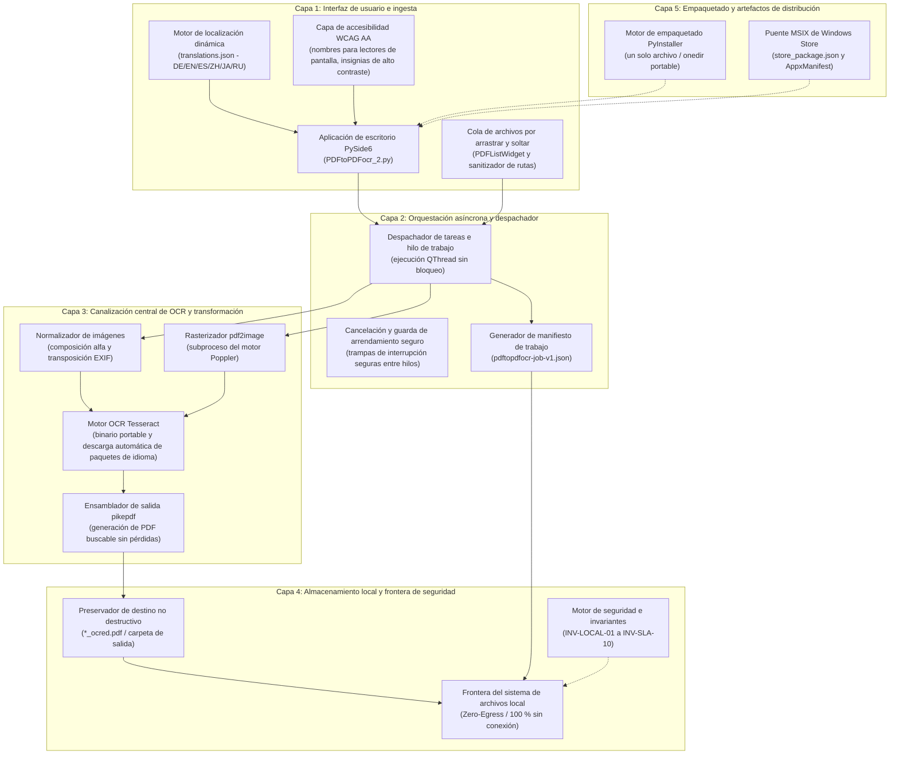
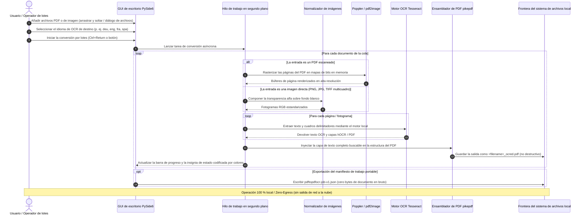

[English](README.md) | [Deutsch](README_de.md) | [Español](README_es.md) | [中文](README_zh.md) | [日本語](README_ja.md) | [Русский](README_ru.md)

*Traducción asistida por máquina; el README en inglés es la versión de referencia.*

# PDFtoPDFocr - Conversor OCR de PDF con enfoque local

[](https://www.python.org/)
[](pyproject.toml)
[](LICENSE)
[](https://www.qt.io/)
[](#requirements--platform-matrix)
[](#privacy--security-model)
[](SECURITY.md)
[](#core-features)
[](tests/)
[](THIRD_PARTY_LICENSES.md)
[](THIRD_PARTY_LICENSES.txt)
[](NOTICE)
[](MARKETING-LOG.txt)
[](llms.txt)
[](https://github.com/doc-bricks)
[](https://github.com/open-bricks)
[](tests/)

Convierte archivos PDF escaneados e imágenes en bruto en PDF con texto buscable mediante OCR local (reconocimiento óptico de caracteres) con Tesseract. Ofrece procesamiento por lotes multiformato, idioma de OCR seleccionable con descarga automática de paquetes de idioma, conservación no destructiva de los archivos originales, una interfaz con ergonomía accesible e integración portable de Tesseract/Poppler.

Contexto del proyecto legible por máquina: [`llms.txt`](llms.txt) | [Documentación en alemán](README_de.md) | [Política de seguridad](SECURITY.md)

> [!NOTE]
> **Integración con IA y LLM:** Este repositorio contiene un archivo [`llms.txt`](llms.txt) estructurado que proporciona contexto legible por máquina, detalles de arquitectura, interfaces CLI/GUI y puntos de entrada de pruebas para agentes autónomos y herramientas de desarrollo.

> [!TIP]
> **Privacidad y procesamiento local:** Los archivos PDF y de imagen se procesan al 100 % de forma local en su equipo. Los documentos y los textos de OCR nunca se envían a ningún servidor remoto ni API en la nube (`INV-LOCAL-01`).

---

## 🧭 Navegación rápida

1. 📸 [Galería visual y resumen de la interfaz](#visual-showcase)
2. 🏛️ [Arquitectura del sistema y topología de 5 capas](#system-architecture--component-workflow)
3. 🔄 [Flujo de datos local y ciclo de vida del procesamiento OCR de documentos](#local-data-flow--privacy-isolation)
4. 🚀 [Inicio rápido y operaciones clave](#quick-start--key-operations)
5. ✨ [Funciones principales y capacidades de rendimiento](#core-features)
6. 🎯 [Perfiles de usuario objetivo e intención de búsqueda de alta intención](#target-personas--discoverability)
7. ⚖️ [Matriz comparativa de 10 dimensiones frente a 5 alternativas](#comparative-matrix--alternatives)
8. ⌨️ [Accesibilidad, ergonomía WCAG y atajos de teclado](#accessibility--keyboard-shortcuts)
9. 💻 [Requisitos y matriz de plataformas](#requirements--platform-matrix)
10. 📦 [Instalación y configuración portable](#installation--portable-setup)
11. 🖥️ [Uso y pautas de ejecución](#usage--execution-guidelines)
12. 🧪 [Pruebas automatizadas y verificación de calidad](#tests--quality-verification)
13. 🌐 [Herramientas hermanas e integración en el ecosistema](#sibling-tools--ecosystem)
14. 📜 [SBOM de nivel 1 y transparencia de licencias de terceros](#third-party-licenses--transparency)
15. 🔒 [Modelo de privacidad y seguridad (invariantes INV-LOCAL-01..INV-SLA-10)](#privacy--security-model)
16. 🪟 [Empaquetado EXE y distribución (MSIX de Windows Store y portable)](#exe--distribution-packaging)
17. 🤖 [Contexto LLM legible por máquina (llms.txt)](#machine-readable-llm-context)
18. ⚖️ [Aviso legal (§ 521 BGB) y licencia](#statutory-notice--license)

---

<a id="visual-showcase"></a>
<a id="visuelle-showcase-galerie"></a>
## 📸 Galería visual y resumen de la interfaz

| Interfaz principal | Recursos visuales e identidad de la aplicación |
|:---:|:---:|
| <br/><sub>**Cola de conversión por lotes** — Incorporación de archivos por arrastrar y soltar, selección dinámica de idioma, insignias de estado por elemento en tiempo real y progreso del trabajador sin bloqueo.</sub> | <br/><sub>**Identidad de la aplicación en alta resolución** — Conjunto de iconos nativos para Windows Store, paquete MSIX y paletas de contraste accesibles.</sub> |

---

<a id="system-architecture--component-workflow"></a>
<a id="systemarchitektur--komponenten-workflow"></a>
## 🏛️ Arquitectura del sistema y topología de 5 capas



<a id="four-view-architectural-topology-projection"></a>
<a id="vier-sichten-architektur-topologie-projektion"></a>
### Proyección de la topología arquitectónica en cuatro vistas

```
+===================================================================================================================+
|                                    PDFtoPDFocr ARCHITECTURAL TOPOLOGY (4 VIEWS)                                   |
+===================================================================================================================+
| [VIEW 1: INGESTION, DRAG-AND-DROP QUEUE & ACCESSIBILITY]                                                          |
|  * PySide6 Desktop GUI (PDFtoPDFocr_2.py) with drag-and-drop batch file queue (PDFListWidget)                      |
|  * WCAG AA Screen-reader accessibility (QAccessibleInterface), high-contrast badges & keyboard hotkeys            |
|  * Dynamic 6-Language Localization Engine (DE / EN / ES / ZH / JA / RU) via translations.json                     |
|  * Unprivileged user-mode execution [INV-UNPRIV-02] -- Strict RunAsInvoker, zero UAC elevation prompts            |
+-------------------------------------------------------------------------------------------------------------------+
                                                          |
                                                          v
+-------------------------------------------------------------------------------------------------------------------+
| [VIEW 2: ASYNC ORCHESTRATION, WORKER THREAD & DISPATCHER ENGINE]                                                  |
|  * Asynchronous non-blocking QThread worker execution for seamless UI responsiveness and batch processing        |
|  * Cancellation & Safe Lease Guard with thread-safe interruption traps & real-time progress reporting             |
|  * Portable Job Manifest Generator producing verifiable pdftopdfocr-job-v1.json [INV-MANIFEST-07]                 |
|  * Fail-Closed per-page error trapping [INV-FAILCLOSED-09] preventing document corruption                         |
+-------------------------------------------------------------------------------------------------------------------+
                                                          |
                                                          v
+-------------------------------------------------------------------------------------------------------------------+
| [VIEW 3: CORE OCR PIPELINE, POPPLER RASTERIZER & TESSERACT ENGINE]                                                |
|  * Poppler / pdf2image multi-page rasterizer with stream memory buffering [INV-BOUNDED-05]                         |
|  * Alpha-compositing image normalizer for multi-frame TIFF, PNG, and JPG scans                                    |
|  * Tesseract OCR engine (portable binary + on-demand official GitHub traineddata auto-download)                    |
|  * pikepdf lossless PDF assembler injecting searchable full-text OCR layer into non-destructive targets [INV-03] |
+-------------------------------------------------------------------------------------------------------------------+
                                                          |
                                                          v
+-------------------------------------------------------------------------------------------------------------------+
| [VIEW 4: AIR-GAP DEFENSE PERIMETER, ZERO-EGRESS & GOVERNANCE BOUNDARY]                                            |
|  * 100% Local-first & Zero-Egress Perimeter [INV-LOCAL-01] -- zero document uploads or telemetry                  |
|  * Strict subprocess isolation [INV-ISOLATION-04] keeping external binaries cleanly separated                     |
|  * Zero-Copyleft & Permissive Runtime (MIT, Apache-2.0, HPND, MPL-2.0, dynamic LGPL-3.0 linking)                   |
|  * Level 1 SBOM text companion (THIRD_PARTY_LICENSES.txt) audited with 10 runtime invariants [INV-LOCAL-01..10]   |
|  * Dual Security Response SLA [INV-SLA-10] -- 48h initial response & 5-day triage commitment                      |
+===================================================================================================================+
```

---

<a id="local-data-flow--privacy-isolation"></a>
<a id="lokaler-datenfluss--datenschutz-isolation"></a>
## 🔄 Flujo de datos local y ciclo de vida del procesamiento OCR de documentos



---

<a id="quick-start--key-operations"></a>
<a id="schnelleinstieg--kernabläufe"></a>
## 🚀 Inicio rápido y operaciones clave

| Tarea | Interfaz / Comando | Salida / Resultado |
|---|---|---|
| **Iniciar la aplicación de escritorio** | `python PDFtoPDFocr_2.py` o `START.bat` | GUI de escritorio PySide6 con cola de archivos por arrastrar y soltar |
| **Convertir PDF escaneados** | Añada archivos, seleccione el idioma, haga clic en "Start" (`Ctrl+Return`) | `*_ocred.pdf` no destructivo con capa de búsqueda de texto completo |
| **OCR directo de imágenes** | Suelte imágenes JPG, PNG o TIFF multicuadro | Documento PDF buscable ensamblado |
| **Combinar en un único PDF** | Active "Auto-Merge" en la barra de herramientas | PDF buscable consolidado de varios documentos |
| **Exportar el manifiesto de trabajo** | Haga clic en "Job-Export" (`Ctrl+E`) | Manifiesto portable `pdftopdfocr-job-v1.json` |
| **Ejecutar la suite de verificación** | `python -m pytest` | Más de 170 pruebas verificadas de unidad, regresión, accesibilidad y metadatos |
| **Compilación portable** | `python build_release.py --clean` | Ejecutable autónomo en `dist/PDFtoPDFocr/` |

---

<a id="core-features"></a>
<a id="funktionen--features"></a>
## ✨ Funciones principales y capacidades de rendimiento

- **Procesamiento por lotes** — Convierta varios PDF e imágenes simultáneamente mediante el selector de archivos o arrastrando y soltando.
- **Importación directa de imágenes** — Convierta escaneos JPG, PNG y TIFF multicuadro directamente en PDF buscables, sin herramientas adicionales.
- **Idioma de OCR seleccionable** — Selección rápida de alemán, inglés, francés, español y decenas de otros idiomas.
- **Descarga automática** — Los paquetes de idioma de Tesseract que faltan (`.traineddata`) se descargan automáticamente bajo demanda desde los repositorios oficiales de GitHub.
- **Combinación y apilado automáticos** — Combine varios resultados de OCR procesados en un único documento PDF consolidado.
- **Tesseract y Poppler portables** — Las compilaciones portables (`python build_release.py`) incluyen Tesseract y Poppler; al ejecutar desde el código fuente, Tesseract y Poppler deben estar instalados o colocados en `tesseract_portable/` y `poppler/` junto a la aplicación.
- **Archivo original conservado** — Los resultados se guardan con el sufijo `_ocred.pdf` o en una carpeta de salida configurada; los archivos de origen permanecen intactos.
- **Exportación del manifiesto de trabajo** — Guarde manifiestos portables `pdftopdfocr-job-v1.json` con los ajustes del trabajo, el estado de ejecución y los metadatos de los archivos.
- **Accesibilidad (A11y) y ergonomía completas** — Nombres y descripciones accesibles para lectores de pantalla en todos los controles, descripciones emergentes informativas en el idioma activo y atajos de teclado completos (`Ctrl+O`, `Ctrl+Return`, `Ctrl+E`, `F5`, `Ctrl+Shift+O`, `Del`/`Backspace`).
- **Progreso de alto contraste** — Codificación de colores conforme a WCAG (`#0b6e4f` / `#b45309`) y descripciones emergentes por elemento con el estado en tiempo real.

---

<a id="target-personas--discoverability"></a>
<a id="zielgruppen--auffindbarkeit"></a>
## 🎯 Perfiles de usuario objetivo e intención de búsqueda de alta intención

### Perfiles de usuario objetivo

- **[PERSONA-01] Responsables de cumplimiento jurídico, sanitario y regulatorio:**
  - *Contexto:* Gestión de contratos confidenciales, historiales médicos de pacientes, registros fiscales o escritos judiciales sujetos a estrictos mandatos del RGPD / HIPAA.
  - *Problema:* Subir documentos confidenciales a proveedores de OCR en la nube (p. ej. Adobe Cloud, Google Cloud Vision, Smallpdf) infringe los mandatos de privacidad de datos de salida cero y expone datos personales sensibles a terceros.
  - *Cómo lo resuelve PDFtoPDFocr:* Procesamiento OCR 100 % local y aislado de la red en el propio dispositivo (`INV-LOCAL-01`). Funcionamiento en modo de usuario sin privilegios (`INV-UNPRIV-02`). Los archivos de origen permanecen estrictamente intactos (`INV-NONDEST-03`).

- **[PERSONA-02] Archiveros, historiadores e investigadores académicos:**
  - *Contexto:* Digitalización de grandes colecciones históricas de libros escaneados, manuscritos en TIFF multicuadro y archivos multilingües.
  - *Problema:* Los servicios de OCR basados en la nube imponen cuotas de suscripción SaaS por página prohibitivas y fallan con colas por lotes de varios gigabytes o con escaneos TIFF multicuadro.
  - *Cómo lo resuelve PDFtoPDFocr:* Conversión local por lotes ilimitada de PDF y colas de imágenes en bruto (JPG, PNG, TIFF multipágina), modelos de idioma seleccionables con descarga automatizada desde GitHub de los `.traineddata` oficiales y consolidación opcional en un único PDF.

- **[PERSONA-03] Trabajadores del conocimiento y aficionados al escritorio atentos a la privacidad:**
  - *Contexto:* Profesionales que procesan recibos, facturas y material de estudio en estaciones de trabajo con Windows o portátiles.
  - *Problema:* Las suites de escritorio comerciales (Adobe Acrobat Pro, ABBYY FineReader) exigen costosas suscripciones recurrentes, inicios de sesión en línea, intrusivos procesos de actualización en segundo plano y derechos de administrador.
  - *Cómo lo resuelve PDFtoPDFocr:* Herramienta de escritorio gratuita y de código abierto bajo licencia MIT, sin telemetría, ejecución como usuario estándar sin privilegios, opciones de directorio portable sin instalación (`INV-PORTABLE-06`) y atajos de teclado accesibles (`INV-A11Y-08`).

- **[PERSONA-04] Integradores de canalizaciones automatizadas e ingenieros de flujos de trabajo documentales:**
  - *Contexto:* Ingenieros que integran pasos de OCR en sistemas locales de ingesta de documentos, archivos de copia de seguridad o canalizaciones de automatización de escritorio.
  - *Problema:* La mayoría de las herramientas GUI para consumidores carecen de introspección estructurada, lo que dificulta verificar los resultados del procesamiento por lotes o integrarlos con la automatización posterior.
  - *Cómo lo resuelve PDFtoPDFocr:* Exportación estructurada del manifiesto de trabajo (`pdftopdfocr-job-v1.json` / `INV-MANIFEST-07`), recuperación de errores por página con cierre seguro (`INV-FAILCLOSED-09`) e indexación integral de contexto para IA mediante `llms.txt`.

### Consultas de búsqueda de alta intención

| Configuración regional | Consulta de búsqueda principal | Intención objetivo y perfil |
|---|---|---|
| **EN** | `local pdf ocr converter windows 10 11` | Creación de PDF buscables local y sin conexión, sin cuentas en la nube ([PERSONA-01], [PERSONA-03]) |
| **EN** | `tesseract ocr batch desktop gui python pyside6` | Flujo de trabajo de escritorio para desarrolladores y usuarios avanzados con procesamiento en cola ([PERSONA-02], [PERSONA-04]) |
| **EN** | `offline searchable pdf creator zero egress gdpr` | Cumplimiento documental con preservación de la privacidad y aislamiento de la red ([PERSONA-01]) |
| **EN** | `convert scanned tiff to searchable pdf desktop free` | Ingesta de escaneos de archivo desde TIFF multicuadro a PDF buscable ([PERSONA-02]) |
| **EN** | `portable pdf ocr tesseract without cloud` | Flujo de trabajo portable sin instalación en estaciones de trabajo gestionadas ([PERSONA-03], [PERSONA-04]) |
| **DE** | `gescannte pdf durchsuchbar machen lokal kostenlos` | Reconocimiento de texto local y gratuito para facturas y documentos escaneados ([PERSONA-03]) |
| **DE** | `offline pdf ocr texterkennung windows tesseract` | Herramienta de escritorio local con Tesseract y interfaz en alemán ([PERSONA-02], [PERSONA-03]) |
| **DE** | `datenschutzkonforme ocr software ohne cloud dsgvo` | Reconocimiento de texto 100 % conforme al RGPD para despachos de abogados y consultas médicas ([PERSONA-01]) |
| **DE** | `tiff mehrseitig in durchsuchbare pdf umwandeln` | Procesamiento por lotes de archivos de escaneos históricos ([PERSONA-02]) |
| **DE** | `portable ocr software ohne installation windows` | Ejecución portable sin derechos de administrador ([PERSONA-03], [PERSONA-04]) |

---

<a id="comparative-matrix--alternatives"></a>
<a id="vergleichsmatrix--alternativen"></a>
## ⚖️ Matriz comparativa de 10 dimensiones frente a 5 alternativas

| Dimensión de evaluación | Invariante de gobernanza | PDFtoPDFocr (doc-bricks) | Adobe Acrobat Pro | ABBYY FineReader PDF | OCRmyPDF (CLI) | SaaS en la nube (Smallpdf/iLovePDF) |
|---|---|:---:|:---:|:---:|:---:|:---:|
| **Privacidad Zero-Egress** | `INV-LOCAL-01` | **100 % sin conexión (local)** | Sincronización en la nube por defecto | Opciones en la nube | **100 % sin conexión (local)** | No (subida a la nube obligatoria) |
| **Sin elevación de privilegios** | `INV-UNPRIV-02` | **Modo de usuario estándar** | Demonio / servicios de administrador | Demonio / servicios de administrador | Depende del host/Docker | Host remoto en la nube |
| **Seguridad no destructiva** | `INV-NONDEST-03` | **Estricto `_ocred.pdf`** | Sobrescribe / pregunta | Sobrescribe / pregunta | In situ o archivo nuevo | Crea un objeto en la nube |
| **Aislamiento de procesos y copyleft**| `INV-ISOLATION-04`| **Frontera de subproceso** | Propietario de código cerrado | Propietario de código cerrado | MPL-2.0 / subprocesos | Backend SaaS cerrado |
| **Acotación de memoria** | `INV-BOUNDED-05` | **Flujo de páginas acotado** | Caché pesada en segundo plano | Caché pesada en segundo plano | Picos de memoria con PDF grandes | Asignación en el servidor |
| **Portabilidad / sin instalación** | `INV-PORTABLE-06` | **Carpeta portable / exe**| Instalador de sistema pesado | Instalador de sistema pesado | Requiere gestor de paquetes | Cliente de navegador |
| **Manifiestos de trabajo verificables** | `INV-MANIFEST-07` | **`pdftopdfocr-job-v1.json`**| Registros propietarios de la aplicación | Registros propietarios de la aplicación | stdout/stderr del terminal | Respuesta JSON REST |
| **Accesibilidad con lector de pantalla y teclado**| `INV-A11Y-08` | **WCAG AA completo y atajos**| Accesibilidad estándar | Accesibilidad estándar | Solo accesibilidad del terminal CLI | La interfaz web varía |
| **Captura de errores con cierre seguro** | `INV-FAILCLOSED-09` | **Omisión de error por página** | Interrupciones con diálogos modales| Interrupciones con diálogos modales| Código de salida CLI distinto de cero | Respuestas de error HTTP 5xx |
| **SLA de respuesta de seguridad** | `INV-SLA-10` | **Respuesta en 48 h / triaje en 5 d**| Empresarial estándar | Empresarial estándar | Mejor esfuerzo en GitHub | Cola de tickets |

---

<a id="accessibility--keyboard-shortcuts"></a>
<a id="barrierefreiheit--tastenkürzel"></a>
## ⌨️ Accesibilidad, ergonomía WCAG y atajos de teclado

| Acción | Atajo | Descripción |
|---|---|---|
| **Añadir archivos** | `Ctrl+O` | Abrir el diálogo de selección de archivos |
| **Iniciar OCR** | `Ctrl+Return` | Iniciar el procesamiento OCR por lotes |
| **Exportar el manifiesto de trabajo** | `Ctrl+E` | Exportar el estado del trabajo como manifiesto JSON |
| **Vaciar la lista y restablecer** | `F5` | Restablecer la lista de archivos y la visualización del estado |
| **Seleccionar la carpeta de salida** | `Ctrl+Shift+O` | Elegir un directorio de salida personalizado |
| **Quitar el archivo seleccionado** | `Del` o `Backspace` | Quitar el elemento seleccionado de la cola |

---

<a id="requirements--platform-matrix"></a>
<a id="voraussetzungen--plattformmatrix"></a>
## 💻 Requisitos y matriz de plataformas

- Python 3.10+
- Windows 10/11 (objetivo principal de la versión)
- macOS / Linux (objetivos de código fuente y pruebas de humo)

---

<a id="installation--portable-setup"></a>
<a id="installation--portables-setup"></a>
## 📦 Instalación y configuración portable

```bash
pip install -r requirements.txt
```

Tesseract OCR y Poppler deben estar disponibles al ejecutar desde el código fuente: en el `PATH` (Tesseract también puede configurarse mediante `TESSERACT_CMD`) o de forma portable dentro del directorio del proyecto (`tesseract_portable/`, `poppler/`). Los paquetes de idioma que faltan se descargan automáticamente.

---

<a id="usage--execution-guidelines"></a>
<a id="nutzung--ausführungsrichtlinien"></a>
## 🖥️ Uso y pautas de ejecución

```bash
python PDFtoPDFocr_2.py
```

En Windows, `START.bat` también sirve como lanzador de escritorio con doble clic.

1. Añada PDF o imágenes mediante el selector de archivos o arrastrando y soltando.
2. Seleccione el idioma de OCR (los paquetes de idioma que faltan se descargan automáticamente).
3. Haga clic en "Start" — listo.
4. Opcionalmente, use `Job-Export` para guardar un manifiesto portable `pdftopdfocr-job-v1.json`.

---

<a id="tests--quality-verification"></a>
<a id="tests--qualitätsprüfung"></a>
## 🧪 Pruebas automatizadas y verificación de calidad

```bash
python -m pip install -r requirements-dev.txt
python -m pytest
```

La suite de pruebas cubre:
- **Accesibilidad de la interfaz y atajos** (`tests/test_ui_accessibility.py`)
- **Configuración de Tesseract** (`tests/test_tesseract_config.py`)
- **Formato de exportación de trabajos y esquema del manifiesto** (`tests/test_export_format.py`)
- **Cambio de idioma y compatibilidad multilingüe** (`tests/test_language_switch.py`)
- **Regresiones de errores y ciclo de vida de recursos** (`tests/test_bug_regressions.py`)
- **Iconos de la aplicación y verificación de recursos visuales** (`tests/test_app_assets.py`)
- **Empaquetado de plataformas y validación de versiones** (`tests/test_build_release.py`, `tests/test_platform_package_gate.py`)
- **Metadatos, seguridad y gobernanza de paridad** (`tests/test_metadata.py`, `tests/test_security_license_contract.py`)

---

<a id="sibling-tools--ecosystem"></a>
<a id="geschwister-tools--ökosystem"></a>
## 🌐 Herramientas hermanas e integración en el ecosistema

PDFtoPDFocr forma parte de la familia de utilidades documentales **doc-bricks** y del ecosistema más amplio de escritorio de código abierto **open-bricks**:

| Herramienta | Ecosistema | Propósito | Repositorio |
|---|---|---|---|
| **DokuReader** | `doc-bricks` | Biblioteca local de documentos, espacio de lectura y visor multiformato | [doc-bricks/DokuReader](https://github.com/doc-bricks/DokuReader) |
| **MediaBrain** | `doc-bricks` | Inspector local de metadatos multimedia, analizador EXIF y clasificador por lotes | [doc-bricks/MediaBrain](https://github.com/doc-bricks/MediaBrain) |
| **UniversalDocsGrabber** | `doc-bricks` | Extractor automatizado de documentos de correo electrónico y canalización de ingesta OCR por lotes | [doc-bricks/UniversalDocsGrabber](https://github.com/doc-bricks/UniversalDocsGrabber) |
| **UniversalInvoiceMail** | `doc-bricks` | Extracción inteligente de facturas, análisis de fechas/importes y exportación DATEV | [doc-bricks/UniversalInvoiceMail](https://github.com/doc-bricks/UniversalInvoiceMail) |
| **UniversalMailCleaner** | `doc-bricks` | Limpiador de buzones centrado en la privacidad, baja de boletines y depurador seguro | [doc-bricks/UniversalMailCleaner](https://github.com/doc-bricks/UniversalMailCleaner) |
| **CleanMarkdown** | `doc-bricks` | Saneamiento de Markdown, formato de tablas y linter de documentación | [doc-bricks/CleanMarkdown](https://github.com/doc-bricks/CleanMarkdown) |
| **LitZentrum** | `doc-bricks` | Gestor de literatura académica, enlazador de citas BibTeX y espacio de investigación | [doc-bricks/LitZentrum](https://github.com/doc-bricks/LitZentrum) |
| **MailProcessor** | `doc-bricks` | Motor local basado en reglas de archivo de correo, filtrado de adjuntos y ordenación | [doc-bricks/MailProcessor](https://github.com/doc-bricks/MailProcessor) |
| **ProFiler** | `file-bricks` | Búsqueda rápida de archivos por múltiples criterios, filtrado con regex y renombrado por lotes | [file-bricks/ProFiler](https://github.com/file-bricks/ProFiler) |
| **ExplorerPro** | `file-bricks` | Gestor de archivos de escritorio de doble panel con pestañas, marcadores y vista previa hexadecimal | [file-bricks/ExplorerPro](https://github.com/file-bricks/ExplorerPro) |
| **DevCenter** | `dev-bricks` | Gestor del entorno de desarrollo, orquestador de cadenas de herramientas y lanzador de proyectos | [dev-bricks/DevCenter](https://github.com/dev-bricks/DevCenter) |
| **CodeBox** | `dev-bricks` | Área de pruebas de código multilenguaje sin conexión, organizador de fragmentos y sandbox | [dev-bricks/CodeBox](https://github.com/dev-bricks/CodeBox) |
| **open-bricks** | `open-bricks` | Organización paraguas y catálogo curado de herramientas de escritorio centradas en la privacidad | [open-bricks](https://github.com/open-bricks) |

---

<a id="third-party-licenses--transparency"></a>
<a id="drittanbieter-lizenzen--transparenz"></a>
## 📜 SBOM de nivel 1 y transparencia de licencias de terceros

PDFtoPDFocr aplica una transparencia de código abierto del 100 %, una higiene verificada de la cadena de suministro y un estricto aislamiento de las fronteras de copyleft:
- **Sin contaminación AGPL / SSPL:** La aplicación está libre de copyleft de red y de licencias comerciales duales restrictivas.
- **Cumplimiento de LGPL-3.0 mediante enlace dinámico:** `PySide6` (Qt for Python) se enlaza dinámicamente conforme a la sección 4 de LGPLv3; los usuarios pueden sustituirlo por sus propias compilaciones de Qt.
- **Fronteras de proceso estrictas para las herramientas de subproceso:** Las herramientas externas (utilidades de `Poppler` como `pdftoppm` y `pdfinfo`) se ejecutan exclusivamente mediante subprocesos aislados del sistema operativo con argumentos acotados y saneamiento, manteniendo el código GPL estrictamente segregado (`INV-ISOLATION-04`).
- **Entorno de ejecución central permisivo:** `pytesseract` (Apache-2.0), `Pillow` (HPND), `pdf2image` (MIT), `pikepdf` (MPL-2.0) y `requests` (Apache-2.0) son totalmente compatibles con la **licencia MIT** principal.

Para consultar el inventario completo de software, los mínimos de versión de las dependencias y las invariantes de gobernanza, véanse [`THIRD_PARTY_LICENSES.md`](THIRD_PARTY_LICENSES.md) y [`MARKETING-LOG.txt`](MARKETING-LOG.txt).

---

<a id="privacy--security-model"></a>
<a id="datenschutz--sicherheitsmodell"></a>
## 🔒 Modelo de privacidad y seguridad (invariantes INV-LOCAL-01..INV-SLA-10)

Los archivos PDF y las imágenes se procesan localmente y nunca se suben. El acceso a la red se limita estrictamente a la descarga de los datos públicos de idioma de Tesseract que falten desde GitHub, a petición del usuario. Consulte [`SECURITY.md`](SECURITY.md) para ver las invariantes completas de seguridad y privacidad.

---

<a id="exe--distribution-packaging"></a>
<a id="exe--distributions-packaging"></a>
## 🪟 Empaquetado EXE y distribución (MSIX de Windows Store y portable)

```bash
python build_release.py --clean

# or on Windows via double-click / terminal:
build_exe.bat

# or directly via PyInstaller with dependencies installed:
python -m PyInstaller --noconfirm --clean PDFtoPDFocr.spec
```

La compilación empaquetada se escribe en `dist/PDFtoPDFocr/`. Si existen, `tesseract_portable/` y `poppler/` se incluyen automáticamente.

---

<a id="machine-readable-llm-context"></a>
<a id="maschinenlesbarer-llm-kontext"></a>
## 🤖 Contexto LLM legible por máquina (llms.txt)

Para agentes de programación autónomos con IA, programadores en pareja y canalizaciones de CI automatizadas, este repositorio ofrece un índice [`llms.txt`](llms.txt) dedicado que sigue las convenciones modernas de contexto para LLM. Incluye:
- Resumen de la arquitectura y funciones de los componentes
- Comandos de la suite de pruebas y puertas de verificación
- Invariantes de seguridad y de ejecución (`INV-LOCAL-01` a `INV-SLA-10`)
- Mapa de archivos clave y matrices de dependencias

---

<a id="statutory-notice--license"></a>
<a id="contributing--license"></a>
<a id="gesetzlicher-hinweis--lizenz"></a>
<a id="mitwirken--lizenz"></a>
## ⚖️ Aviso legal (§ 521 BGB) y licencia

> [!IMPORTANT]
> **Limitación de responsabilidad por la cesión gratuita de software (§ 521 BGB):**
> Dado que este software se ofrece gratuitamente como software de código abierto, los autores y colaboradores responden únicamente por dolo y negligencia grave conforme al § 521 del Código Civil alemán (Bürgerliches Gesetzbuch - BGB). El software se proporciona "tal cual", sin garantía de ningún tipo, expresa o implícita.

¡Las contribuciones, los informes de errores y las solicitudes de incorporación de cambios (pull requests) son bienvenidos! Asegúrese de que todas las pull requests superen `pytest` y `ruff check .` antes de enviarlas.

Este proyecto está licenciado bajo la [Licencia MIT](LICENSE).
