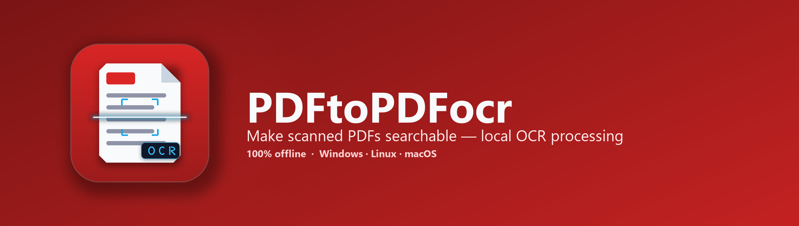
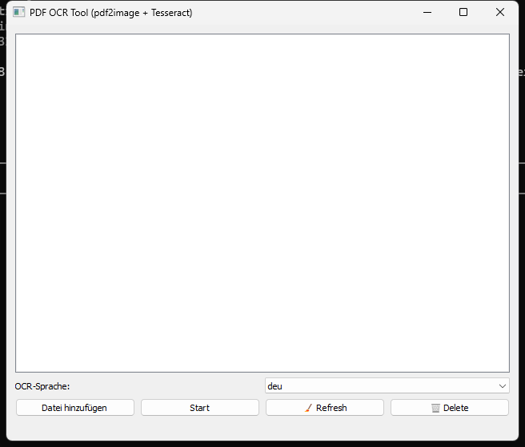
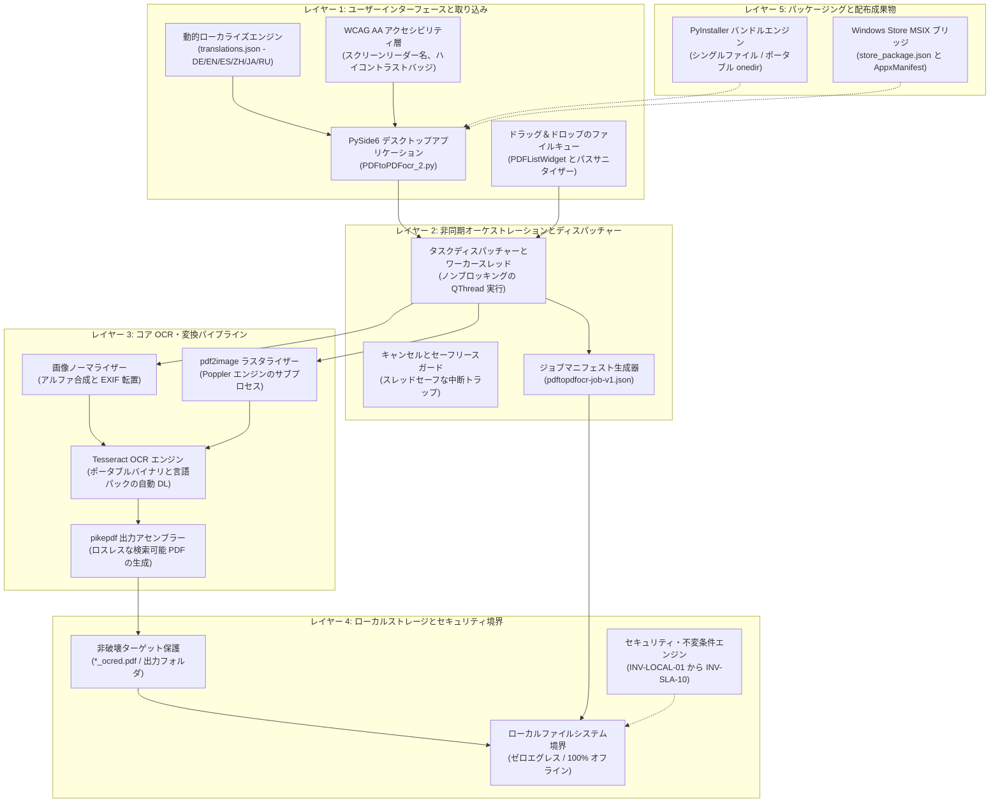
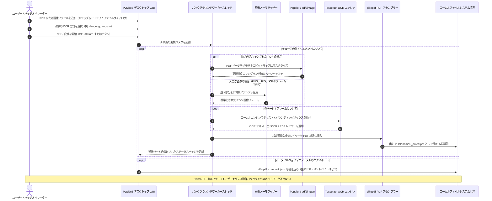

[English](README.md) | [Deutsch](README_de.md) | [Español](README_es.md) | [中文](README_zh.md) | [日本語](README_ja.md) | [Русский](README_ru.md)

# PDFtoPDFocr - ローカルファーストの PDF OCR 変換ツール

[](https://www.python.org/)
[](pyproject.toml)
[](LICENSE)
[](https://www.qt.io/)
[](#requirements--platform-matrix)
[](#privacy--security-model)
[](SECURITY.md)
[](#core-features)
[](tests/)
[](THIRD_PARTY_LICENSES.md)
[](THIRD_PARTY_LICENSES.txt)
[](NOTICE)
[](MARKETING-LOG.txt)
[](llms.txt)
[](https://github.com/doc-bricks)
[](https://github.com/open-bricks)
[](tests/)

Tesseract によるローカル OCR（光学文字認識）を用いて、スキャンされた PDF ファイルや画像ファイルを検索可能な PDF に変換します。複数形式のバッチ処理、言語パックの自動ダウンロードに対応した OCR 言語の選択、元ファイルを破壊しない保存、アクセシブルな UI の操作性、そしてポータブルな Tesseract/Poppler の統合を備えています。

機械可読なプロジェクトコンテキスト: [`llms.txt`](llms.txt) | [ドイツ語ドキュメント](README_de.md) | [セキュリティポリシー](SECURITY.md)

> [!NOTE]
> **AI・LLM 連携:** このリポジトリには構造化された [`llms.txt`](llms.txt) ファイルが含まれており、自律型エージェントや開発者向けツールのために、機械可読なコンテキスト、アーキテクチャの詳細、CLI/GUI インターフェース、テストのエントリポイントを提供します。

> [!TIP]
> **プライバシーとローカルファースト処理:** PDF ファイルと画像ファイルは、お使いのマシン上で 100% ローカルに処理されます。ドキュメントや OCR テキストがリモートサーバーやクラウド API にアップロードされることは決してありません（`INV-LOCAL-01`）。

---

## 🧭 クイックナビゲーション

1. 📸 [ビジュアルショーケースとインターフェース概要](#visual-showcase)
2. 🏛️ [システムアーキテクチャと 5 層トポロジー](#system-architecture--component-workflow)
3. 🔄 [ローカルデータフローとドキュメント OCR 処理ライフサイクル](#local-data-flow--privacy-isolation)
4. 🚀 [クイックスタートと主な操作](#quick-start--key-operations)
5. ✨ [主な機能とパフォーマンス性能](#core-features)
6. 🎯 [対象ペルソナと高意図の検索インテント](#target-personas--discoverability)
7. ⚖️ [5 つの代替製品との 10 項目比較マトリクス](#comparative-matrix--alternatives)
8. ⌨️ [アクセシビリティ、WCAG 人間工学、キーボードショートカット](#accessibility--keyboard-shortcuts)
9. 💻 [要件とプラットフォームマトリクス](#requirements--platform-matrix)
10. 📦 [インストールとポータブルセットアップ](#installation--portable-setup)
11. 🖥️ [使い方と実行ガイドライン](#usage--execution-guidelines)
12. 🧪 [自動テストと品質検証](#tests--quality-verification)
13. 🌐 [姉妹ツールとエコシステム統合](#sibling-tools--ecosystem)
14. 📜 [Level 1 SBOM とサードパーティライセンスの透明性](#third-party-licenses--transparency)
15. 🔒 [プライバシーとセキュリティモデル（不変条件 INV-LOCAL-01..INV-SLA-10）](#privacy--security-model)
16. 🪟 [EXE と配布パッケージング（Windows Store MSIX とポータブル）](#exe--distribution-packaging)
17. 🤖 [機械可読な LLM コンテキスト（llms.txt）](#machine-readable-llm-context)
18. ⚖️ [法的通知（§ 521 BGB）とライセンス](#statutory-notice--license)

---

<a id="visual-showcase"></a>
<a id="visuelle-showcase-galerie"></a>
## 📸 ビジュアルショーケースとインターフェース概要

| メインインターフェース | ビジュアルアセットとアプリのアイデンティティ |
|:---:|:---:|
| <br/><sub>**バッチ変換キュー** — ドラッグ＆ドロップによるファイル取り込み、動的な言語選択、リアルタイムの項目ステータスバッジ、ノンブロッキングのワーカー進捗表示。</sub> | <br/><sub>**高解像度のアプリアイデンティティ** — ネイティブ Windows Store 用の MSIX パッケージアイコンセットと、アクセシブルなコントラストパレット。</sub> |

---

<a id="system-architecture--component-workflow"></a>
<a id="systemarchitektur--komponenten-workflow"></a>
## 🏛️ システムアーキテクチャと 5 層トポロジー



<a id="four-view-architectural-topology-projection"></a>
<a id="vier-sichten-architektur-topologie-projektion"></a>
### 4 ビューによるアーキテクチャトポロジーの投影

```
+===================================================================================================================+
|                                    PDFtoPDFocr ARCHITECTURAL TOPOLOGY (4 VIEWS)                                   |
+===================================================================================================================+
| [VIEW 1: INGESTION, DRAG-AND-DROP QUEUE & ACCESSIBILITY]                                                          |
|  * PySide6 Desktop GUI (PDFtoPDFocr_2.py) with drag-and-drop batch file queue (PDFListWidget)                      |
|  * WCAG AA Screen-reader accessibility (QAccessibleInterface), high-contrast badges & keyboard hotkeys            |
|  * Dynamic 6-Language Localization Engine (DE / EN / ES / ZH / JA / RU) via translations.json                     |
|  * Unprivileged user-mode execution [INV-UNPRIV-02] -- Strict RunAsInvoker, zero UAC elevation prompts            |
+-------------------------------------------------------------------------------------------------------------------+
                                                          |
                                                          v
+-------------------------------------------------------------------------------------------------------------------+
| [VIEW 2: ASYNC ORCHESTRATION, WORKER THREAD & DISPATCHER ENGINE]                                                  |
|  * Asynchronous non-blocking QThread worker execution for seamless UI responsiveness and batch processing        |
|  * Cancellation & Safe Lease Guard with thread-safe interruption traps & real-time progress reporting             |
|  * Portable Job Manifest Generator producing verifiable pdftopdfocr-job-v1.json [INV-MANIFEST-07]                 |
|  * Fail-Closed per-page error trapping [INV-FAILCLOSED-09] preventing document corruption                         |
+-------------------------------------------------------------------------------------------------------------------+
                                                          |
                                                          v
+-------------------------------------------------------------------------------------------------------------------+
| [VIEW 3: CORE OCR PIPELINE, POPPLER RASTERIZER & TESSERACT ENGINE]                                                |
|  * Poppler / pdf2image multi-page rasterizer with stream memory buffering [INV-BOUNDED-05]                         |
|  * Alpha-compositing image normalizer for multi-frame TIFF, PNG, and JPG scans                                    |
|  * Tesseract OCR engine (portable binary + on-demand official GitHub traineddata auto-download)                    |
|  * pikepdf lossless PDF assembler injecting searchable full-text OCR layer into non-destructive targets [INV-03] |
+-------------------------------------------------------------------------------------------------------------------+
                                                          |
                                                          v
+-------------------------------------------------------------------------------------------------------------------+
| [VIEW 4: AIR-GAP DEFENSE PERIMETER, ZERO-EGRESS & GOVERNANCE BOUNDARY]                                            |
|  * 100% Local-first & Zero-Egress Perimeter [INV-LOCAL-01] -- zero document uploads or telemetry                  |
|  * Strict subprocess isolation [INV-ISOLATION-04] keeping external binaries cleanly separated                     |
|  * Zero-Copyleft & Permissive Runtime (MIT, Apache-2.0, HPND, MPL-2.0, dynamic LGPL-3.0 linking)                   |
|  * Level 1 SBOM text companion (THIRD_PARTY_LICENSES.txt) audited with 10 runtime invariants [INV-LOCAL-01..10]   |
|  * Dual Security Response SLA [INV-SLA-10] -- 48h initial response & 5-day triage commitment                      |
+===================================================================================================================+
```

---

<a id="local-data-flow--privacy-isolation"></a>
<a id="lokaler-datenfluss--datenschutz-isolation"></a>
## 🔄 ローカルデータフローとドキュメント OCR 処理ライフサイクル



---

<a id="quick-start--key-operations"></a>
<a id="schnelleinstieg--kernabläufe"></a>
## 🚀 クイックスタートと主な操作

| タスク | インターフェース / コマンド | 出力 / 結果 |
|---|---|---|
| **デスクトップアプリの起動** | `python PDFtoPDFocr_2.py` または `START.bat` | ドラッグ＆ドロップ対応のファイルキューを備えた PySide6 デスクトップ GUI |
| **スキャン PDF の変換** | ファイルを追加し、言語を選択して「Start」をクリック（`Ctrl+Return`） | 全文検索レイヤー付きの非破壊 `*_ocred.pdf` |
| **画像の直接 OCR** | JPG、PNG、またはマルチフレーム TIFF 画像をドロップ | 組み立てられた検索可能な PDF ドキュメント |
| **単一 PDF への結合** | ツールバーで「Auto-Merge」を有効にする | 統合された複数ドキュメントの検索可能 PDF |
| **ジョブマニフェストのエクスポート** | 「Job-Export」をクリック（`Ctrl+E`） | ポータブルな `pdftopdfocr-job-v1.json` マニフェスト |
| **検証スイートの実行** | `python -m pytest` | 検証済みのユニット・回帰・アクセシビリティ・メタデータテスト 170 件以上 |
| **ポータブルビルド** | `python build_release.py --clean` | `dist/PDFtoPDFocr/` 内の自己完結型実行ファイル |

---

<a id="core-features"></a>
<a id="funktionen--features"></a>
## ✨ 主な機能とパフォーマンス性能

- **バッチ処理** — ファイルピッカーまたはドラッグ＆ドロップで、複数の PDF と画像を同時に変換します。
- **画像の直接インポート** — JPG、PNG、マルチフレーム TIFF のスキャンを、追加ツールなしで検索可能な PDF に直接変換します。
- **選択可能な OCR 言語** — ドイツ語、英語、フランス語、スペイン語をはじめ、数十の言語をすばやく選択できます。
- **自動ダウンロード** — 不足している Tesseract 言語パック（`.traineddata`）は、公式 GitHub リポジトリから必要に応じて自動的にダウンロードされます。
- **自動結合とスタッキング** — 処理された複数の OCR 結果を、1 つの統合された PDF ドキュメントにまとめます。
- **ポータブルな Tesseract と Poppler** — ポータブルビルド（`python build_release.py`）には Tesseract と Poppler が同梱されます。ソースから実行する場合は、Tesseract と Poppler をインストールするか、アプリの隣にある `tesseract_portable/` と `poppler/` に配置する必要があります。
- **元ファイルの保持** — 結果は `_ocred.pdf` サフィックス付き、または設定した出力フォルダに保存され、元ファイルには一切手が加えられません。
- **ジョブマニフェストのエクスポート** — ジョブ設定、実行ステータス、ファイルメタデータを含むポータブルな `pdftopdfocr-job-v1.json` マニフェストを保存します。
- **完全なアクセシビリティ（A11y）と人間工学** — すべてのコントロールにスクリーンリーダー向けのアクセシブルな名前と説明、アクティブな言語での有益なツールチップ、そして完全なキーボードショートカット（`Ctrl+O`、`Ctrl+Return`、`Ctrl+E`、`F5`、`Ctrl+Shift+O`、`Del`/`Backspace`）を備えています。
- **ハイコントラストな進捗表示** — WCAG 準拠の色分け（`#0b6e4f` / `#b45309`）と、リアルタイムのステータスを表示する項目ごとのホバーツールチップ。

---

<a id="target-personas--discoverability"></a>
<a id="zielgruppen--auffindbarkeit"></a>
## 🎯 対象ペルソナと高意図の検索インテント

### 対象ペルソナ

- **[PERSONA-01] 法務・医療・規制コンプライアンス担当者:**
  - *状況:* 厳格な GDPR / HIPAA の義務が課される、機密契約書、医療患者ファイル、税務記録、裁判所への提出書類を扱っている。
  - *課題:* 機密文書をクラウド OCR プロバイダー（例: Adobe Cloud、Google Cloud Vision、Smallpdf）にアップロードすることは、ゼロエグレスのデータプライバシー義務に違反し、機微な個人データを第三者に晒すことになる。
  - *PDFtoPDFocr による解決:* デバイス上での 100% ローカルでエアギャップされた OCR 処理（`INV-LOCAL-01`）。特権昇格を伴わないユーザーモード動作（`INV-UNPRIV-02`）。元ファイルは厳密に手つかずのまま保持される（`INV-NONDEST-03`）。

- **[PERSONA-02] アーキビスト、歴史家、学術研究者:**
  - *状況:* スキャンされた書籍、マルチフレーム TIFF の手稿、多言語アーカイブからなる大規模な歴史的コレクションをデジタル化している。
  - *課題:* クラウドベースの OCR サービスは、ページ単位の SaaS 利用料が法外であり、数ギガバイト規模のバッチキューやマルチフレーム TIFF スキャンでは失敗する。
  - *PDFtoPDFocr による解決:* PDF と生の画像キュー（JPG、PNG、複数ページ TIFF）に対する無制限のローカルバッチ変換、公式 `.traineddata` を GitHub から自動ダウンロードする選択可能な言語モデル、そしてオプションの単一 PDF への統合。

- **[PERSONA-03] プライバシー意識の高いナレッジワーカーとデスクトップ愛好家:**
  - *状況:* Windows ワークステーションやポータブルノート PC で、領収書、請求書、学習資料を処理する専門職。
  - *課題:* 商用デスクトップスイート（Adobe Acrobat Pro、ABBYY FineReader）は、高額な継続サブスクリプション、オンラインログイン、煩わしいバックグラウンドの更新デーモン、そして管理者権限を要求する。
  - *PDFtoPDFocr による解決:* テレメトリーゼロ、特権昇格のない標準ユーザー実行、ポータブルでインストール不要のディレクトリオプション（`INV-PORTABLE-06`）、アクセシブルなキーボードショートカット（`INV-A11Y-08`）を備えた、無料でオープンソースの MIT デスクトップツール。

- **[PERSONA-04] 自動化パイプラインのインテグレーターとドキュメントワークフローエンジニア:**
  - *状況:* ローカルのドキュメント取り込みシステム、バックアップアーカイブ、デスクトップ自動化パイプラインに OCR ステップを組み込むエンジニア。
  - *課題:* 多くのコンシューマー向け GUI ツールには構造化されたイントロスペクションがなく、バッチ処理結果の検証や、下流の自動化との統合が困難である。
  - *PDFtoPDFocr による解決:* 構造化されたジョブマニフェストのエクスポート（`pdftopdfocr-job-v1.json` / `INV-MANIFEST-07`）、フェイルクローズドなページ単位のエラー回復（`INV-FAILCLOSED-09`）、そして `llms.txt` による包括的な AI コンテキストのインデックス化。

### 高意図の検索インテントクエリ

| ロケール | コア検索クエリ | 対象インテントとペルソナ |
|---|---|---|
| **EN** | `local pdf ocr converter windows 10 11` | クラウドアカウント不要の、ローカルファーストでオフラインの検索可能 PDF 作成（[PERSONA-01]、[PERSONA-03]） |
| **EN** | `tesseract ocr batch desktop gui python pyside6` | キュー処理を備えた、開発者・パワーユーザー向けのデスクトップワークフロー（[PERSONA-02]、[PERSONA-04]） |
| **EN** | `offline searchable pdf creator zero egress gdpr` | エアギャップされたプライバシー保護型のドキュメントコンプライアンス（[PERSONA-01]） |
| **EN** | `convert scanned tiff to searchable pdf desktop free` | マルチフレーム TIFF から検索可能 PDF への、アーカイブスキャンの取り込み（[PERSONA-02]） |
| **EN** | `portable pdf ocr tesseract without cloud` | 管理されたワークステーションでの、インストール不要のポータブルワークフロー（[PERSONA-03]、[PERSONA-04]） |
| **DE** | `gescannte pdf durchsuchbar machen lokal kostenlos` | スキャンされた請求書や書類のための、無料のローカルテキスト認識（[PERSONA-03]） |
| **DE** | `offline pdf ocr texterkennung windows tesseract` | ドイツ語のユーザーインターフェースを備えたローカル Tesseract デスクトップツール（[PERSONA-02]、[PERSONA-03]） |
| **DE** | `datenschutzkonforme ocr software ohne cloud dsgvo` | 法律事務所や診療所向けの、100% GDPR 準拠のテキスト認識（[PERSONA-01]） |
| **DE** | `tiff mehrseitig in durchsuchbare pdf umwandeln` | 歴史的スキャンアーカイブ向けのバッチ処理（[PERSONA-02]） |
| **DE** | `portable ocr software ohne installation windows` | 管理者権限不要のポータブル実行（[PERSONA-03]、[PERSONA-04]） |

---

<a id="comparative-matrix--alternatives"></a>
<a id="vergleichsmatrix--alternativen"></a>
## ⚖️ 5 つの代替製品との 10 項目比較マトリクス

| 評価項目 | ガバナンス不変条件 | PDFtoPDFocr (doc-bricks) | Adobe Acrobat Pro | ABBYY FineReader PDF | OCRmyPDF (CLI) | クラウド SaaS (Smallpdf/iLovePDF) |
|---|---|:---:|:---:|:---:|:---:|:---:|
| **ゼロエグレスのプライバシー** | `INV-LOCAL-01` | **100% オフライン（ローカル）** | クラウド同期がデフォルト | クラウドオプションあり | **100% オフライン（ローカル）** | 不可（クラウドへのアップロードが必須） |
| **特権の非昇格** | `INV-UNPRIV-02` | **標準ユーザーモード** | 管理者デーモン / サービス | 管理者デーモン / サービス | ホスト/Docker に依存 | リモートのクラウドホスト |
| **非破壊の安全性** | `INV-NONDEST-03` | **厳格な `_ocred.pdf`** | 上書き / プロンプト | 上書き / プロンプト | 上書き、または新規ファイル | クラウドオブジェクトを作成 |
| **プロセスとコピーレフトの分離**| `INV-ISOLATION-04`| **サブプロセス境界** | クローズドソースのプロプライエタリ | クローズドソースのプロプライエタリ | MPL-2.0 / サブプロセス | クローズドな SaaS バックエンド |
| **メモリの有界性** | `INV-BOUNDED-05` | **有界のページストリーム** | 重いバックグラウンドキャッシュ | 重いバックグラウンドキャッシュ | 大きな PDF でメモリが急増 | サーバー側での割り当て |
| **ポータビリティ / インストール不要** | `INV-PORTABLE-06` | **ポータブルフォルダ / exe**| 重いシステムインストーラー | 重いシステムインストーラー | パッケージマネージャーが必要 | ブラウザークライアント |
| **検証可能なジョブマニフェスト** | `INV-MANIFEST-07` | **`pdftopdfocr-job-v1.json`**| プロプライエタリなアプリログ | プロプライエタリなアプリログ | ターミナルの stdout/stderr | JSON REST レスポンス |
| **スクリーンリーダーとキーボードの A11y**| `INV-A11Y-08` | **完全な WCAG AA とホットキー**| 標準的なアクセシビリティ | 標準的なアクセシビリティ | CLI ターミナルの a11y のみ | Web UI により異なる |
| **フェイルクローズドなエラー捕捉** | `INV-FAILCLOSED-09` | **ページ単位のエラースキップ** | モーダルダイアログによる中断| モーダルダイアログによる中断| CLI の非ゼロ終了コード | HTTP 5xx エラーレスポンス |
| **セキュリティ対応 SLA** | `INV-SLA-10` | **48 時間以内の応答 / 5 日でトリアージ**| 標準的なエンタープライズ | 標準的なエンタープライズ | GitHub でのベストエフォート | チケットキュー |

---

<a id="accessibility--keyboard-shortcuts"></a>
<a id="barrierefreiheit--tastenkürzel"></a>
## ⌨️ アクセシビリティ、WCAG 人間工学、キーボードショートカット

| 操作 | ショートカット | 説明 |
|---|---|---|
| **ファイルを追加** | `Ctrl+O` | ファイル選択ダイアログを開く |
| **OCR を開始** | `Ctrl+Return` | バッチ OCR 処理を開始する |
| **ジョブマニフェストをエクスポート** | `Ctrl+E` | ジョブの状態を JSON マニフェストとしてエクスポートする |
| **リストをクリアしてリセット** | `F5` | ファイルリストとステータス表示をリセットする |
| **出力フォルダを選択** | `Ctrl+Shift+O` | カスタムの出力ディレクトリを選択する |
| **選択したファイルを削除** | `Del` または `Backspace` | 選択した項目をキューから削除する |

---

<a id="requirements--platform-matrix"></a>
<a id="voraussetzungen--plattformmatrix"></a>
## 💻 要件とプラットフォームマトリクス

- Python 3.10+
- Windows 10/11（主要なリリース対象）
- macOS / Linux（ソースおよびスモークテストの対象）

---

<a id="installation--portable-setup"></a>
<a id="installation--portables-setup"></a>
## 📦 インストールとポータブルセットアップ

```bash
pip install -r requirements.txt
```

ソースから実行する場合は、Tesseract OCR と Poppler が利用可能である必要があります。`PATH` 上に置く（Tesseract は `TESSERACT_CMD` でも指定可能）か、プロジェクトディレクトリ内にポータブルとして配置します（`tesseract_portable/`、`poppler/`）。不足している言語パックは自動的にダウンロードされます。

---

<a id="usage--execution-guidelines"></a>
<a id="nutzung--ausführungsrichtlinien"></a>
## 🖥️ 使い方と実行ガイドライン

```bash
python PDFtoPDFocr_2.py
```

Windows では、`START.bat` をダブルクリック用のデスクトップランチャーとしても使用できます。

1. ファイルピッカーまたはドラッグ＆ドロップで PDF や画像を追加します。
2. OCR 言語を選択します（不足している言語パックは自動的にダウンロードされます）。
3. 「Start」をクリックします — 完了です。
4. 必要に応じて `Job-Export` を使用し、ポータブルな `pdftopdfocr-job-v1.json` マニフェストを保存します。

---

<a id="tests--quality-verification"></a>
<a id="tests--qualitätsprüfung"></a>
## 🧪 自動テストと品質検証

```bash
python -m pip install -r requirements-dev.txt
python -m pytest
```

テストスイートがカバーする範囲:
- **UI アクセシビリティとショートカット**（`tests/test_ui_accessibility.py`）
- **Tesseract 設定**（`tests/test_tesseract_config.py`）
- **ジョブエクスポート形式とマニフェストスキーマ**（`tests/test_export_format.py`）
- **言語切り替えと多言語サポート**（`tests/test_language_switch.py`）
- **バグ回帰とリソースライフサイクル**（`tests/test_bug_regressions.py`）
- **アプリアイコンとビジュアルアセットの検証**（`tests/test_app_assets.py`）
- **プラットフォームパッケージングとリリース検証**（`tests/test_build_release.py`、`tests/test_platform_package_gate.py`）
- **メタデータ、セキュリティ、パリティガバナンス**（`tests/test_metadata.py`、`tests/test_security_license_contract.py`）

---

<a id="sibling-tools--ecosystem"></a>
<a id="geschwister-tools--ökosystem"></a>
## 🌐 姉妹ツールとエコシステム統合

PDFtoPDFocr は、**doc-bricks** ドキュメントユーティリティファミリーの一員であり、より広範な **open-bricks** オープンソースデスクトップエコシステムの一部です:

| ツール | エコシステム | 目的 | リポジトリ |
|---|---|---|---|
| **DokuReader** | `doc-bricks` | ローカルドキュメントライブラリ、閲覧ワークスペース、クロスフォーマットビューア | [doc-bricks/DokuReader](https://github.com/doc-bricks/DokuReader) |
| **MediaBrain** | `doc-bricks` | ローカルメディアのメタデータインスペクター、EXIF アナライザー、バッチ分類器 | [doc-bricks/MediaBrain](https://github.com/doc-bricks/MediaBrain) |
| **UniversalDocsGrabber** | `doc-bricks` | 自動化されたメール文書抽出器と OCR バッチ取り込みパイプライン | [doc-bricks/UniversalDocsGrabber](https://github.com/doc-bricks/UniversalDocsGrabber) |
| **UniversalInvoiceMail** | `doc-bricks` | インテリジェントな請求書抽出、日付・金額のパース、DATEV エクスポート | [doc-bricks/UniversalInvoiceMail](https://github.com/doc-bricks/UniversalInvoiceMail) |
| **UniversalMailCleaner** | `doc-bricks` | プライバシーファーストのメールボックスクリーナー、ニュースレター配信停止ツール、安全なプルーナー | [doc-bricks/UniversalMailCleaner](https://github.com/doc-bricks/UniversalMailCleaner) |
| **CleanMarkdown** | `doc-bricks` | Markdown のサニタイズ、テーブル整形、ドキュメントリンター | [doc-bricks/CleanMarkdown](https://github.com/doc-bricks/CleanMarkdown) |
| **LitZentrum** | `doc-bricks` | 学術文献マネージャー、BibTeX 引用バインダー、研究ワークスペース | [doc-bricks/LitZentrum](https://github.com/doc-bricks/LitZentrum) |
| **MailProcessor** | `doc-bricks` | ルールベースのローカルメールアーカイブ、添付ファイルのフィルタリング・仕分けエンジン | [doc-bricks/MailProcessor](https://github.com/doc-bricks/MailProcessor) |
| **ProFiler** | `file-bricks` | 高速なマルチ条件ファイル検索、正規表現フィルタリング、一括リネーム | [file-bricks/ProFiler](https://github.com/file-bricks/ProFiler) |
| **ExplorerPro** | `file-bricks` | タブ、ブックマーク、16 進プレビューを備えたデュアルペインのデスクトップファイルマネージャー | [file-bricks/ExplorerPro](https://github.com/file-bricks/ExplorerPro) |
| **DevCenter** | `dev-bricks` | 開発環境マネージャー、ツールチェーンオーケストレーター、プロジェクトランチャー | [dev-bricks/DevCenter](https://github.com/dev-bricks/DevCenter) |
| **CodeBox** | `dev-bricks` | オフラインの多言語コードプレイグラウンド、スニペット整理ツール、サンドボックス | [dev-bricks/CodeBox](https://github.com/dev-bricks/CodeBox) |
| **open-bricks** | `open-bricks` | プライバシーファーストのデスクトップツールを集めた、統括組織兼キュレーションカタログ | [open-bricks](https://github.com/open-bricks) |

---

<a id="third-party-licenses--transparency"></a>
<a id="drittanbieter-lizenzen--transparenz"></a>
## 📜 Level 1 SBOM とサードパーティライセンスの透明性

PDFtoPDFocr は、100% のオープンソースの透明性、検証済みのサプライチェーン衛生、そして厳格なコピーレフト境界の分離を徹底しています:
- **AGPL / SSPL による汚染ゼロ:** このアプリケーションには、ネットワーク型コピーレフトや制限的な商用デュアルライセンスは含まれていません。
- **動的リンクによる LGPL-3.0 準拠:** `PySide6`（Qt for Python）は LGPLv3 第 4 条に従って動的にリンクされており、ユーザーは独自の Qt ビルドに置き換えることができます。
- **サブプロセスツールに対する厳格なプロセス境界:** 外部ツール（`pdftoppm` や `pdfinfo` などの `Poppler` ユーティリティ）は、引数の制限とサニタイズを施した、分離された OS サブプロセスとしてのみ実行され、GPL コードは厳密に隔離されます（`INV-ISOLATION-04`）。
- **寛容なコアランタイム:** `pytesseract`（Apache-2.0）、`Pillow`（HPND）、`pdf2image`（MIT）、`pikepdf`（MPL-2.0）、`requests`（Apache-2.0）は、主たる **MIT ライセンス**と完全に互換性があります。

ソフトウェアの完全なインベントリ、依存関係のバージョン下限、ガバナンス不変条件については、[`THIRD_PARTY_LICENSES.md`](THIRD_PARTY_LICENSES.md) および [`MARKETING-LOG.txt`](MARKETING-LOG.txt) を参照してください。

---

<a id="privacy--security-model"></a>
<a id="datenschutz--sicherheitsmodell"></a>
## 🔒 プライバシーとセキュリティモデル（不変条件 INV-LOCAL-01..INV-SLA-10）

PDF ファイルと画像はローカルで処理され、アップロードされることはありません。ネットワークアクセスは、ユーザーの要求に応じて GitHub から不足している公開の Tesseract 言語データをダウンロードする場合のみに厳密に限定されています。セキュリティとプライバシーの不変条件の詳細については、[`SECURITY.md`](SECURITY.md) を参照してください。

---

<a id="exe--distribution-packaging"></a>
<a id="exe--distributions-packaging"></a>
## 🪟 EXE と配布パッケージング（Windows Store MSIX とポータブル）

```bash
python build_release.py --clean

# or on Windows via double-click / terminal:
build_exe.bat

# or directly via PyInstaller with dependencies installed:
python -m PyInstaller --noconfirm --clean PDFtoPDFocr.spec
```

パッケージ化されたビルドは `dist/PDFtoPDFocr/` に出力されます。`tesseract_portable/` と `poppler/` が存在する場合は、自動的に同梱されます。

---

<a id="machine-readable-llm-context"></a>
<a id="maschinenlesbarer-llm-kontext"></a>
## 🤖 機械可読な LLM コンテキスト（llms.txt）

自律型 AI コーディングエージェント、ペアプログラマー、自動化された CI パイプライン向けに、このリポジトリは最新の LLM コンテキスト規約に従った専用の [`llms.txt`](llms.txt) インデックスを提供しています。次の内容が含まれます:
- アーキテクチャの概要とコンポーネントの役割
- テストスイートのコマンドと検証ゲート
- セキュリティおよびランタイムの不変条件（`INV-LOCAL-01` から `INV-SLA-10` まで）
- 主要ファイルのマップと依存関係マトリクス

---

<a id="statutory-notice--license"></a>
<a id="contributing--license"></a>
<a id="gesetzlicher-hinweis--lizenz"></a>
<a id="mitwirken--lizenz"></a>
## ⚖️ 法的通知（§ 521 BGB）とライセンス

> [!IMPORTANT]
> **無償でのソフトウェア提供に関する責任制限（§ 521 BGB）:**
> 本ソフトウェアはオープンソースソフトウェアとして無償で提供されているため、作者および貢献者は、ドイツ民法典（Bürgerliches Gesetzbuch - BGB）第 521 条に基づき、故意および重過失についてのみ責任を負います。本ソフトウェアは「現状有姿」で提供され、明示的か黙示的かを問わず、いかなる種類の保証も付されません。

コントリビューション、バグ報告、プルリクエストを歓迎します！提出前に、すべてのプルリクエストが `pytest` と `ruff check .` に合格することを確認してください。

このプロジェクトは [MIT License](LICENSE) の下でライセンスされています。
