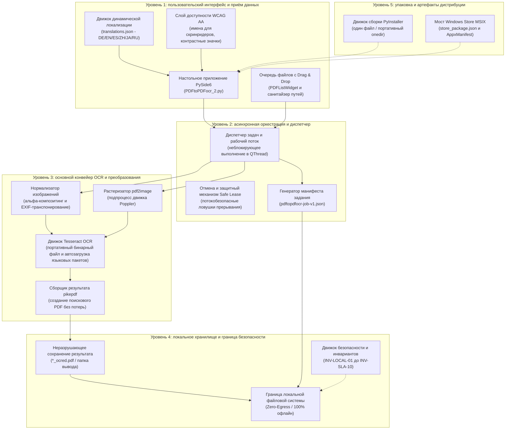
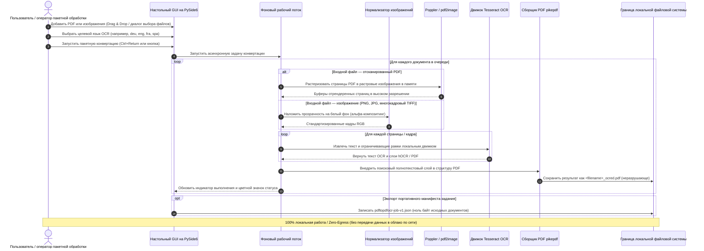

[English](README.md) | [Deutsch](README_de.md) | [Español](README_es.md) | [中文](README_zh.md) | [日本語](README_ja.md) | [Русский](README_ru.md)

*Перевод выполнен с помощью машинного перевода; приоритетной является английская версия README.*

# PDFtoPDFocr - локальный конвертер PDF с OCR (Local-First)

[](https://www.python.org/)
[](pyproject.toml)
[](LICENSE)
[](https://www.qt.io/)
[](#requirements--platform-matrix)
[](#privacy--security-model)
[](SECURITY.md)
[](#core-features)
[](tests/)
[](THIRD_PARTY_LICENSES.md)
[](THIRD_PARTY_LICENSES.txt)
[](NOTICE)
[](MARKETING-LOG.txt)
[](llms.txt)
[](https://github.com/doc-bricks)
[](https://github.com/open-bricks)
[](tests/)

Преобразует отсканированные PDF-файлы и растровые изображения в PDF с возможностью поиска, используя локальное OCR (оптическое распознавание символов) на базе Tesseract. Поддерживает пакетную обработку файлов разных форматов, выбор языка OCR с автоматической загрузкой языковых пакетов, неразрушающее сохранение исходных файлов, доступные эргономичные элементы интерфейса и интеграцию портативных версий Tesseract/Poppler.

Машиночитаемый контекст проекта: [`llms.txt`](llms.txt) | [Документация на немецком языке](README_de.md) | [Политика безопасности](SECURITY.md)

> [!NOTE]
> **Интеграция с ИИ и LLM:** В этом репозитории есть структурированный файл [`llms.txt`](llms.txt), содержащий машиночитаемый контекст, сведения об архитектуре, интерфейсы CLI/GUI и точки входа для тестов — для автономных агентов и инструментов разработчика.

> [!TIP]
> **Конфиденциальность и локальная обработка:** PDF-файлы и изображения обрабатываются на 100% локально на вашем компьютере. Документы и тексты OCR никогда не загружаются на удалённые серверы или в облачные API (`INV-LOCAL-01`).

---

## 🧭 Быстрая навигация

1. 📸 [Визуальная витрина и обзор интерфейса](#visual-showcase)
2. 🏛️ [Архитектура системы и 5-уровневая топология](#system-architecture--component-workflow)
3. 🔄 [Локальный поток данных и жизненный цикл OCR-обработки документов](#local-data-flow--privacy-isolation)
4. 🚀 [Быстрый старт и основные операции](#quick-start--key-operations)
5. ✨ [Основные возможности и производительность](#core-features)
6. 🎯 [Целевые персоны и поисковые запросы с высоким намерением](#target-personas--discoverability)
7. ⚖️ [Сравнительная матрица по 10 критериям с 5 альтернативами](#comparative-matrix--alternatives)
8. ⌨️ [Доступность, эргономика WCAG и сочетания клавиш](#accessibility--keyboard-shortcuts)
9. 💻 [Требования и матрица платформ](#requirements--platform-matrix)
10. 📦 [Установка и портативная настройка](#installation--portable-setup)
11. 🖥️ [Использование и руководство по запуску](#usage--execution-guidelines)
12. 🧪 [Автоматическое тестирование и проверка качества](#tests--quality-verification)
13. 🌐 [Родственные инструменты и интеграция с экосистемой](#sibling-tools--ecosystem)
14. 📜 [Level 1 SBOM и прозрачность лицензий сторонних компонентов](#third-party-licenses--transparency)
15. 🔒 [Модель конфиденциальности и безопасности (инварианты INV-LOCAL-01..INV-SLA-10)](#privacy--security-model)
16. 🪟 [Упаковка EXE и дистрибутивов (Windows Store MSIX и портативная версия)](#exe--distribution-packaging)
17. 🤖 [Машиночитаемый контекст для LLM (llms.txt)](#machine-readable-llm-context)
18. ⚖️ [Правовое уведомление (§ 521 BGB) и лицензия](#statutory-notice--license)

---

<a id="visual-showcase"></a>
<a id="visuelle-showcase-galerie"></a>
## 📸 Визуальная витрина и обзор интерфейса

| Основной интерфейс | Визуальные ресурсы и фирменный стиль приложения |
|:---:|:---:|
| <br/><sub>**Очередь пакетной конвертации** — приём файлов перетаскиванием, динамический выбор языка, значки статуса элементов в реальном времени и неблокирующий индикатор выполнения рабочего потока.</sub> | <br/><sub>**Фирменный стиль приложения в высоком разрешении** — набор значков пакета MSIX для нативного Windows Store и доступные контрастные палитры.</sub> |

---

<a id="system-architecture--component-workflow"></a>
<a id="systemarchitektur--komponenten-workflow"></a>
## 🏛️ Архитектура системы и 5-уровневая топология



<a id="four-view-architectural-topology-projection"></a>
<a id="vier-sichten-architektur-topologie-projektion"></a>
### Проекция архитектурной топологии в четырёх представлениях

```
+===================================================================================================================+
|                                    PDFtoPDFocr ARCHITECTURAL TOPOLOGY (4 VIEWS)                                   |
+===================================================================================================================+
| [VIEW 1: INGESTION, DRAG-AND-DROP QUEUE & ACCESSIBILITY]                                                          |
|  * PySide6 Desktop GUI (PDFtoPDFocr_2.py) with drag-and-drop batch file queue (PDFListWidget)                      |
|  * WCAG AA Screen-reader accessibility (QAccessibleInterface), high-contrast badges & keyboard hotkeys            |
|  * Dynamic 6-Language Localization Engine (DE / EN / ES / ZH / JA / RU) via translations.json                     |
|  * Unprivileged user-mode execution [INV-UNPRIV-02] -- Strict RunAsInvoker, zero UAC elevation prompts            |
+-------------------------------------------------------------------------------------------------------------------+
                                                          |
                                                          v
+-------------------------------------------------------------------------------------------------------------------+
| [VIEW 2: ASYNC ORCHESTRATION, WORKER THREAD & DISPATCHER ENGINE]                                                  |
|  * Asynchronous non-blocking QThread worker execution for seamless UI responsiveness and batch processing        |
|  * Cancellation & Safe Lease Guard with thread-safe interruption traps & real-time progress reporting             |
|  * Portable Job Manifest Generator producing verifiable pdftopdfocr-job-v1.json [INV-MANIFEST-07]                 |
|  * Fail-Closed per-page error trapping [INV-FAILCLOSED-09] preventing document corruption                         |
+-------------------------------------------------------------------------------------------------------------------+
                                                          |
                                                          v
+-------------------------------------------------------------------------------------------------------------------+
| [VIEW 3: CORE OCR PIPELINE, POPPLER RASTERIZER & TESSERACT ENGINE]                                                |
|  * Poppler / pdf2image multi-page rasterizer with stream memory buffering [INV-BOUNDED-05]                         |
|  * Alpha-compositing image normalizer for multi-frame TIFF, PNG, and JPG scans                                    |
|  * Tesseract OCR engine (portable binary + on-demand official GitHub traineddata auto-download)                    |
|  * pikepdf lossless PDF assembler injecting searchable full-text OCR layer into non-destructive targets [INV-03] |
+-------------------------------------------------------------------------------------------------------------------+
                                                          |
                                                          v
+-------------------------------------------------------------------------------------------------------------------+
| [VIEW 4: AIR-GAP DEFENSE PERIMETER, ZERO-EGRESS & GOVERNANCE BOUNDARY]                                            |
|  * 100% Local-first & Zero-Egress Perimeter [INV-LOCAL-01] -- zero document uploads or telemetry                  |
|  * Strict subprocess isolation [INV-ISOLATION-04] keeping external binaries cleanly separated                     |
|  * Zero-Copyleft & Permissive Runtime (MIT, Apache-2.0, HPND, MPL-2.0, dynamic LGPL-3.0 linking)                   |
|  * Level 1 SBOM text companion (THIRD_PARTY_LICENSES.txt) audited with 10 runtime invariants [INV-LOCAL-01..10]   |
|  * Dual Security Response SLA [INV-SLA-10] -- 48h initial response & 5-day triage commitment                      |
+===================================================================================================================+
```

---

<a id="local-data-flow--privacy-isolation"></a>
<a id="lokaler-datenfluss--datenschutz-isolation"></a>
## 🔄 Локальный поток данных и жизненный цикл OCR-обработки документов



---

<a id="quick-start--key-operations"></a>
<a id="schnelleinstieg--kernabläufe"></a>
## 🚀 Быстрый старт и основные операции

| Задача | Интерфейс / команда | Вывод / результат |
|---|---|---|
| **Запуск настольного приложения** | `python PDFtoPDFocr_2.py` или `START.bat` | Настольный GUI на PySide6 с очередью файлов и поддержкой Drag & Drop |
| **Конвертация отсканированных PDF** | Добавьте файлы, выберите язык, нажмите «Start» (`Ctrl+Return`) | Неразрушающий `*_ocred.pdf` с полнотекстовым поисковым слоем |
| **Прямое OCR изображений** | Перетащите изображения JPG, PNG или многокадровые TIFF | Собранный PDF-документ с возможностью поиска |
| **Объединение в один PDF** | Включите «Auto-Merge» на панели инструментов | Объединённый многодокументный PDF с возможностью поиска |
| **Экспорт манифеста задания** | Нажмите «Job-Export» (`Ctrl+E`) | Портативный манифест `pdftopdfocr-job-v1.json` |
| **Запуск набора проверок** | `python -m pytest` | Более 170 проверенных модульных, регрессионных тестов, тестов доступности и метаданных |
| **Портативная сборка** | `python build_release.py --clean` | Автономный исполняемый файл в `dist/PDFtoPDFocr/` |

---

<a id="core-features"></a>
<a id="funktionen--features"></a>
## ✨ Основные возможности и производительность

- **Пакетная обработка** — одновременная конвертация нескольких PDF и изображений через диалог выбора файлов или Drag & Drop.
- **Прямой импорт изображений** — сканы JPG, PNG и многокадровые TIFF напрямую преобразуются в PDF с возможностью поиска без дополнительных инструментов.
- **Выбор языка OCR** — быстрый выбор немецкого, английского, французского, испанского и многих десятков других языков.
- **Автоматическая загрузка** — недостающие языковые пакеты Tesseract (`.traineddata`) автоматически загружаются по требованию из официальных репозиториев GitHub.
- **Автообъединение и наложение** — объединение нескольких обработанных результатов OCR в один сводный PDF-документ.
- **Портативные Tesseract и Poppler** — портативные сборки (`python build_release.py`) включают Tesseract и Poppler; при запуске из исходного кода Tesseract и Poppler должны быть установлены или размещены в `tesseract_portable/` и `poppler/` рядом с приложением.
- **Исходный файл сохраняется** — результаты сохраняются с суффиксом `_ocred.pdf` или в настроенной папке вывода; исходные файлы остаются нетронутыми.
- **Экспорт манифеста задания** — сохранение портативных манифестов `pdftopdfocr-job-v1.json` с настройками задания, статусом выполнения и метаданными файлов.
- **Полная доступность (A11y) и эргономика** — доступные имена и описания для скринридеров у всех элементов управления, информативные подсказки на активном языке и полный набор сочетаний клавиш (`Ctrl+O`, `Ctrl+Return`, `Ctrl+E`, `F5`, `Ctrl+Shift+O`, `Del`/`Backspace`).
- **Контрастная индикация выполнения** — цветовое кодирование, соответствующее WCAG (`#0b6e4f` / `#b45309`), и всплывающие подсказки для каждого элемента с состоянием в реальном времени.

---

<a id="target-personas--discoverability"></a>
<a id="zielgruppen--auffindbarkeit"></a>
## 🎯 Целевые персоны и поисковые запросы с высоким намерением

### Целевые персоны

- **[PERSONA-01] Специалисты по юридическому соответствию, в сфере здравоохранения и регуляторных требований:**
  - *Контекст:* Работа с конфиденциальными договорами, медицинскими картами пациентов, налоговой документацией или судебными материалами, подпадающими под строгие требования GDPR / HIPAA.
  - *Проблема:* Загрузка конфиденциальных документов облачным OCR-провайдерам (например, Adobe Cloud, Google Cloud Vision, Smallpdf) нарушает требования к конфиденциальности данных по принципу Zero-Egress и подвергает чувствительные персональные данные риску раскрытия третьим лицам.
  - *Как это решает PDFtoPDFocr:* Полностью локальная, изолированная от сети (air-gapped) OCR-обработка на устройстве (`INV-LOCAL-01`). Работа в пользовательском режиме без повышения привилегий (`INV-UNPRIV-02`). Исходные файлы остаются строго нетронутыми (`INV-NONDEST-03`).

- **[PERSONA-02] Архивисты, историки и академические исследователи:**
  - *Контекст:* Оцифровка больших исторических коллекций отсканированных книг, рукописей в многокадровом TIFF и многоязычных архивов.
  - *Проблема:* Облачные OCR-сервисы взимают непомерную плату за страницу по SaaS-подписке и не справляются с очередями пакетов в несколько гигабайт или со сканами в многокадровом TIFF.
  - *Как это решает PDFtoPDFocr:* Неограниченная локальная пакетная конвертация PDF и очередей необработанных изображений (JPG, PNG, многостраничный TIFF), выбираемые языковые модели с автоматической загрузкой официальных `.traineddata` с GitHub и необязательное объединение в один PDF.

- **[PERSONA-03] Сотрудники умственного труда и энтузиасты настольных приложений, заботящиеся о конфиденциальности:**
  - *Контекст:* Специалисты, обрабатывающие чеки, счета и учебные материалы на рабочих станциях Windows или портативных ноутбуках.
  - *Проблема:* Коммерческие настольные пакеты (Adobe Acrobat Pro, ABBYY FineReader) требуют дорогих периодических подписок, онлайн-входа, навязчивых фоновых служб обновления и прав администратора.
  - *Как это решает PDFtoPDFocr:* Бесплатный настольный инструмент с открытым исходным кодом под лицензией MIT: без телеметрии, с запуском от имени обычного пользователя без повышения привилегий, с вариантами портативного каталога без установки (`INV-PORTABLE-06`) и доступными сочетаниями клавиш (`INV-A11Y-08`).

- **[PERSONA-04] Интеграторы автоматизированных конвейеров и инженеры документооборота:**
  - *Контекст:* Инженеры, встраивающие этапы OCR в локальные системы приёма документов, резервные архивы или конвейеры автоматизации рабочего стола.
  - *Проблема:* Большинству потребительских GUI-инструментов не хватает структурированной интроспекции, что затрудняет проверку результатов пакетной обработки и интеграцию результатов со следующими звеньями автоматизации.
  - *Как это решает PDFtoPDFocr:* Структурированный экспорт манифеста задания (`pdftopdfocr-job-v1.json` / `INV-MANIFEST-07`), отказобезопасное (fail-closed) восстановление после ошибок на уровне страниц (`INV-FAILCLOSED-09`) и всестороннее индексирование контекста для ИИ через `llms.txt`.

### Поисковые запросы с высоким намерением

| Локаль | Основной поисковый запрос | Целевое намерение и персона |
|---|---|---|
| **EN** | `local pdf ocr converter windows 10 11` | Локальное офлайн-создание PDF с возможностью поиска без облачных учётных записей ([PERSONA-01], [PERSONA-03]) |
| **EN** | `tesseract ocr batch desktop gui python pyside6` | Настольный рабочий процесс для разработчиков и опытных пользователей с обработкой очереди ([PERSONA-02], [PERSONA-04]) |
| **EN** | `offline searchable pdf creator zero egress gdpr` | Соблюдение требований к документам в изолированной среде с защитой конфиденциальности ([PERSONA-01]) |
| **EN** | `convert scanned tiff to searchable pdf desktop free` | Приём архивных сканов: из многокадрового TIFF в PDF с возможностью поиска ([PERSONA-02]) |
| **EN** | `portable pdf ocr tesseract without cloud` | Портативный процесс без установки на управляемых рабочих станциях ([PERSONA-03], [PERSONA-04]) |
| **DE** | `gescannte pdf durchsuchbar machen lokal kostenlos` | Бесплатное локальное распознавание текста для отсканированных счетов и документов ([PERSONA-03]) |
| **DE** | `offline pdf ocr texterkennung windows tesseract` | Локальный настольный инструмент на базе Tesseract с интерфейсом на немецком языке ([PERSONA-02], [PERSONA-03]) |
| **DE** | `datenschutzkonforme ocr software ohne cloud dsgvo` | Распознавание текста, на 100% соответствующее GDPR, для юридических контор и врачебных практик ([PERSONA-01]) |
| **DE** | `tiff mehrseitig in durchsuchbare pdf umwandeln` | Пакетная обработка исторических архивов сканов ([PERSONA-02]) |
| **DE** | `portable ocr software ohne installation windows` | Портативный запуск без прав администратора ([PERSONA-03], [PERSONA-04]) |

---

<a id="comparative-matrix--alternatives"></a>
<a id="vergleichsmatrix--alternativen"></a>
## ⚖️ Сравнительная матрица по 10 критериям с 5 альтернативами

| Критерий оценки | Инвариант управления | PDFtoPDFocr (doc-bricks) | Adobe Acrobat Pro | ABBYY FineReader PDF | OCRmyPDF (CLI) | Облачные SaaS (Smallpdf/iLovePDF) |
|---|---|:---:|:---:|:---:|:---:|:---:|
| **Конфиденциальность Zero-Egress** | `INV-LOCAL-01` | **100% офлайн (локально)** | Облачная синхронизация по умолчанию | Облачные опции | **100% офлайн (локально)** | Нет (обязательна загрузка в облако) |
| **Отсутствие повышения привилегий** | `INV-UNPRIV-02` | **Режим обычного пользователя** | Демон / службы администратора | Демон / службы администратора | Зависит от хоста/Docker | Удалённый облачный хост |
| **Неразрушающая безопасность** | `INV-NONDEST-03` | **Строгий `_ocred.pdf`** | Перезапись / запросы | Перезапись / запросы | На месте или новый файл | Создаёт объект в облаке |
| **Изоляция процессов и copyleft**| `INV-ISOLATION-04`| **Граница подпроцесса** | Закрытый проприетарный код | Закрытый проприетарный код | MPL-2.0 / подпроцессы | Закрытый SaaS-бэкенд |
| **Ограниченность памяти** | `INV-BOUNDED-05` | **Ограниченный потоковый режим страниц** | Тяжёлый фоновый кэш | Тяжёлый фоновый кэш | Скачки памяти на больших PDF | Выделение ресурсов на стороне сервера |
| **Портативность / без установки** | `INV-PORTABLE-06` | **Портативная папка / exe**| Тяжёлый системный установщик | Тяжёлый системный установщик | Требуется менеджер пакетов | Браузерный клиент |
| **Проверяемые манифесты заданий** | `INV-MANIFEST-07` | **`pdftopdfocr-job-v1.json`**| Проприетарные журналы приложения | Проприетарные журналы приложения | stdout/stderr терминала | Ответ JSON REST |
| **A11y для скринридеров и клавиатуры**| `INV-A11Y-08` | **Полный WCAG AA и горячие клавиши**| Стандартная доступность | Стандартная доступность | Только a11y терминала CLI | Зависит от веб-интерфейса |
| **Отказобезопасный перехват ошибок** | `INV-FAILCLOSED-09` | **Пропуск ошибочных страниц** | Прерывания модальными диалогами| Прерывания модальными диалогами| Ненулевой код возврата CLI | Ответы HTTP 5xx с ошибкой |
| **SLA реагирования на проблемы безопасности** | `INV-SLA-10` | **Ответ за 48 ч / триаж за 5 дн.**| Стандартный корпоративный | Стандартный корпоративный | Best-effort на GitHub | Очередь тикетов |

---

<a id="accessibility--keyboard-shortcuts"></a>
<a id="barrierefreiheit--tastenkürzel"></a>
## ⌨️ Доступность, эргономика WCAG и сочетания клавиш

| Действие | Сочетание клавиш | Описание |
|---|---|---|
| **Добавить файлы** | `Ctrl+O` | Открыть диалог выбора файлов |
| **Запустить OCR** | `Ctrl+Return` | Запустить пакетную OCR-обработку |
| **Экспортировать манифест задания** | `Ctrl+E` | Экспортировать состояние задания как манифест JSON |
| **Очистить список и сбросить** | `F5` | Сбросить список файлов и отображение статуса |
| **Выбрать папку вывода** | `Ctrl+Shift+O` | Выбрать пользовательский каталог вывода |
| **Удалить выбранный файл** | `Del` или `Backspace` | Удалить выбранный элемент из очереди |

---

<a id="requirements--platform-matrix"></a>
<a id="voraussetzungen--plattformmatrix"></a>
## 💻 Требования и матрица платформ

- Python 3.10+
- Windows 10/11 (основная целевая платформа выпуска)
- macOS / Linux (цели для исходного кода и дымового тестирования)

---

<a id="installation--portable-setup"></a>
<a id="installation--portables-setup"></a>
## 📦 Установка и портативная настройка

```bash
pip install -r requirements.txt
```

При запуске из исходного кода Tesseract OCR и Poppler должны быть доступны: либо в `PATH` (путь к Tesseract можно также задать через `TESSERACT_CMD`), либо в портативном виде внутри каталога проекта (`tesseract_portable/`, `poppler/`). Недостающие языковые пакеты загружаются автоматически.

---

<a id="usage--execution-guidelines"></a>
<a id="nutzung--ausführungsrichtlinien"></a>
## 🖥️ Использование и руководство по запуску

```bash
python PDFtoPDFocr_2.py
```

В Windows `START.bat` также служит ярлыком запуска приложения двойным щелчком.

1. Добавьте PDF или изображения через диалог выбора файлов или Drag & Drop.
2. Выберите язык OCR (недостающие языковые пакеты загружаются автоматически).
3. Нажмите «Start» — готово.
4. При необходимости воспользуйтесь `Job-Export`, чтобы сохранить портативный манифест `pdftopdfocr-job-v1.json`.

---

<a id="tests--quality-verification"></a>
<a id="tests--qualitätsprüfung"></a>
## 🧪 Автоматическое тестирование и проверка качества

```bash
python -m pip install -r requirements-dev.txt
python -m pytest
```

Набор тестов охватывает:
- **Доступность UI и сочетания клавиш** (`tests/test_ui_accessibility.py`)
- **Конфигурацию Tesseract** (`tests/test_tesseract_config.py`)
- **Формат экспорта задания и схему манифеста** (`tests/test_export_format.py`)
- **Переключение языков и поддержку нескольких языков** (`tests/test_language_switch.py`)
- **Регрессии ошибок и жизненный цикл ресурсов** (`tests/test_bug_regressions.py`)
- **Значки приложения и проверку визуальных ресурсов** (`tests/test_app_assets.py`)
- **Платформенную упаковку и проверку выпуска** (`tests/test_build_release.py`, `tests/test_platform_package_gate.py`)
- **Метаданные, безопасность и управление паритетом** (`tests/test_metadata.py`, `tests/test_security_license_contract.py`)

---

<a id="sibling-tools--ecosystem"></a>
<a id="geschwister-tools--ökosystem"></a>
## 🌐 Родственные инструменты и интеграция с экосистемой

PDFtoPDFocr входит в семейство утилит для работы с документами **doc-bricks** и в более широкую экосистему настольных приложений с открытым исходным кодом **open-bricks**:

| Инструмент | Экосистема | Назначение | Репозиторий |
|---|---|---|---|
| **DokuReader** | `doc-bricks` | Локальная библиотека документов, рабочее пространство для чтения и просмотрщик разных форматов | [doc-bricks/DokuReader](https://github.com/doc-bricks/DokuReader) |
| **MediaBrain** | `doc-bricks` | Локальный инспектор метаданных медиафайлов, анализатор EXIF и пакетный классификатор | [doc-bricks/MediaBrain](https://github.com/doc-bricks/MediaBrain) |
| **UniversalDocsGrabber** | `doc-bricks` | Автоматизированное извлечение документов из почты и конвейер пакетного приёма с OCR | [doc-bricks/UniversalDocsGrabber](https://github.com/doc-bricks/UniversalDocsGrabber) |
| **UniversalInvoiceMail** | `doc-bricks` | Интеллектуальное извлечение счетов, разбор дат и сумм, экспорт в DATEV | [doc-bricks/UniversalInvoiceMail](https://github.com/doc-bricks/UniversalInvoiceMail) |
| **UniversalMailCleaner** | `doc-bricks` | Очистка почтовых ящиков с приоритетом конфиденциальности, отписка от рассылок и безопасная чистка | [doc-bricks/UniversalMailCleaner](https://github.com/doc-bricks/UniversalMailCleaner) |
| **CleanMarkdown** | `doc-bricks` | Санитизация Markdown, форматирование таблиц и линтер документации | [doc-bricks/CleanMarkdown](https://github.com/doc-bricks/CleanMarkdown) |
| **LitZentrum** | `doc-bricks` | Менеджер научной литературы, связыватель цитат BibTeX и рабочее пространство исследователя | [doc-bricks/LitZentrum](https://github.com/doc-bricks/LitZentrum) |
| **MailProcessor** | `doc-bricks` | Локальное архивирование почты по правилам, фильтрация вложений и механизм сортировки | [doc-bricks/MailProcessor](https://github.com/doc-bricks/MailProcessor) |
| **ProFiler** | `file-bricks` | Быстрый поиск файлов по нескольким критериям, фильтрация регулярными выражениями и пакетное переименование | [file-bricks/ProFiler](https://github.com/file-bricks/ProFiler) |
| **ExplorerPro** | `file-bricks` | Двухпанельный настольный файловый менеджер с вкладками, закладками и шестнадцатеричным просмотром | [file-bricks/ExplorerPro](https://github.com/file-bricks/ExplorerPro) |
| **DevCenter** | `dev-bricks` | Менеджер среды разработки, оркестратор набора инструментов и запуск проектов | [dev-bricks/DevCenter](https://github.com/dev-bricks/DevCenter) |
| **CodeBox** | `dev-bricks` | Офлайн-площадка для кода на нескольких языках, органайзер сниппетов и песочница | [dev-bricks/CodeBox](https://github.com/dev-bricks/CodeBox) |
| **open-bricks** | `open-bricks` | Объединяющая организация и отобранный каталог настольных инструментов с приоритетом конфиденциальности | [open-bricks](https://github.com/open-bricks) |

---

<a id="third-party-licenses--transparency"></a>
<a id="drittanbieter-lizenzen--transparenz"></a>
## 📜 Level 1 SBOM и прозрачность лицензий сторонних компонентов

PDFtoPDFocr обеспечивает 100% прозрачность открытого исходного кода, проверенную гигиену цепочки поставок и строгую изоляцию границ copyleft:
- **Никакого заражения AGPL / SSPL:** Приложение свободно от сетевого copyleft и ограничительного коммерческого двойного лицензирования.
- **Соответствие LGPL-3.0 при динамической линковке:** `PySide6` (Qt for Python) линкуется динамически в соответствии с разделом 4 LGPLv3; пользователи могут заменить его собственными сборками Qt.
- **Строгие границы процессов для инструментов-подпроцессов:** Внешние инструменты (утилиты `Poppler`, такие как `pdftoppm` и `pdfinfo`) запускаются исключительно в изолированных подпроцессах ОС с ограниченными аргументами и санитизацией, что строго отделяет GPL-код (`INV-ISOLATION-04`).
- **Разрешительный основной рантайм:** `pytesseract` (Apache-2.0), `Pillow` (HPND), `pdf2image` (MIT), `pikepdf` (MPL-2.0) и `requests` (Apache-2.0) полностью совместимы с основной **лицензией MIT**.

Полный перечень программного обеспечения, минимальные версии зависимостей и инварианты управления приведены в [`THIRD_PARTY_LICENSES.md`](THIRD_PARTY_LICENSES.md) и [`MARKETING-LOG.txt`](MARKETING-LOG.txt).

---

<a id="privacy--security-model"></a>
<a id="datenschutz--sicherheitsmodell"></a>
## 🔒 Модель конфиденциальности и безопасности (инварианты INV-LOCAL-01..INV-SLA-10)

PDF-файлы и изображения обрабатываются локально и никогда не загружаются. Доступ к сети строго ограничен загрузкой недостающих общедоступных языковых данных Tesseract с GitHub по запросу пользователя. Полные инварианты безопасности и конфиденциальности см. в [`SECURITY.md`](SECURITY.md).

---

<a id="exe--distribution-packaging"></a>
<a id="exe--distributions-packaging"></a>
## 🪟 Упаковка EXE и дистрибутивов (Windows Store MSIX и портативная версия)

```bash
python build_release.py --clean

# or on Windows via double-click / terminal:
build_exe.bat

# or directly via PyInstaller with dependencies installed:
python -m PyInstaller --noconfirm --clean PDFtoPDFocr.spec
```

Собранный пакет записывается в `dist/PDFtoPDFocr/`. Если каталоги `tesseract_portable/` и `poppler/` присутствуют, они включаются автоматически.

---

<a id="machine-readable-llm-context"></a>
<a id="maschinenlesbarer-llm-kontext"></a>
## 🤖 Машиночитаемый контекст для LLM (llms.txt)

Для автономных ИИ-агентов для написания кода, парного программирования и автоматизированных CI-конвейеров этот репозиторий предоставляет специальный индекс [`llms.txt`](llms.txt), следующий современным соглашениям о контексте для LLM. Он включает:
- Краткое описание архитектуры и роли компонентов
- Команды набора тестов и шлюзы проверки
- Инварианты безопасности и времени выполнения (с `INV-LOCAL-01` по `INV-SLA-10`)
- Карту ключевых файлов и матрицы зависимостей

---

<a id="statutory-notice--license"></a>
<a id="contributing--license"></a>
<a id="gesetzlicher-hinweis--lizenz"></a>
<a id="mitwirken--lizenz"></a>
## ⚖️ Правовое уведомление (§ 521 BGB) и лицензия

> [!IMPORTANT]
> **Ограничение ответственности при безвозмездном предоставлении программного обеспечения (§ 521 BGB):**
> Поскольку это программное обеспечение предоставляется бесплатно как программное обеспечение с открытым исходным кодом, авторы и участники несут ответственность только за умысел и грубую неосторожность в соответствии с § 521 Германского гражданского уложения (Bürgerliches Gesetzbuch - BGB). Программное обеспечение предоставляется «как есть», без каких-либо гарантий, явных или подразумеваемых.

Вклад в проект, отчёты об ошибках и pull request'ы приветствуются! Убедитесь, что все pull request'ы проходят `pytest` и `ruff check .` перед отправкой.

Этот проект распространяется под [лицензией MIT](LICENSE).
