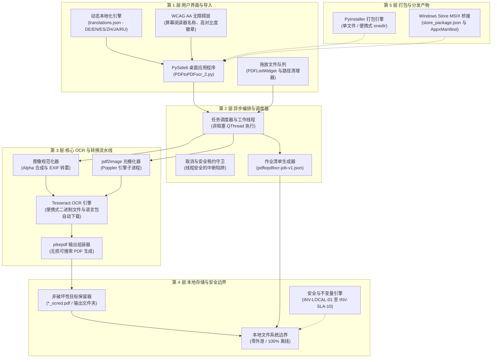
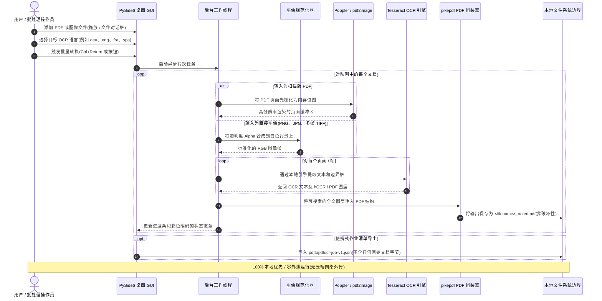

[English](README.md) | [Deutsch](README_de.md) | [Español](README_es.md) | [中文](README_zh.md) | [日本語](README_ja.md) | [Русский](README_ru.md)

*机器辅助翻译；以英文 README 为准。*

# PDFtoPDFocr - 本地优先的 PDF OCR 转换器

[](https://www.python.org/)
[](pyproject.toml)
[](LICENSE)
[](https://www.qt.io/)
[](#requirements--platform-matrix)
[](#privacy--security-model)
[](SECURITY.md)
[](#core-features)
[](tests/)
[](THIRD_PARTY_LICENSES.md)
[](THIRD_PARTY_LICENSES.txt)
[](NOTICE)
[](MARKETING-LOG.txt)
[](llms.txt)
[](https://github.com/doc-bricks)
[](https://github.com/open-bricks)
[](tests/)

借助 Tesseract 本地 OCR(光学字符识别),将扫描版 PDF 文件和原始图像转换为可搜索的 PDF。支持多格式批量处理、可选择的 OCR 语言及语言包自动下载、对原始文件的非破坏性保留、无障碍的界面人体工学设计,以及便携式 Tesseract/Poppler 集成。

机器可读的项目上下文:[`llms.txt`](llms.txt) | [德语文档](README_de.md) | [安全策略](SECURITY.md)

> [!NOTE]
> **AI 与 LLM 集成:** 本仓库包含结构化的 [`llms.txt`](llms.txt) 文件,为自主代理和开发者工具提供机器可读的上下文、架构细节、CLI/GUI 接口以及测试入口点。

> [!TIP]
> **隐私与本地优先处理:** PDF 和图像文件 100% 在您的本机上处理。文档和 OCR 文本绝不会上传到任何远程服务器或云 API(`INV-LOCAL-01`)。

---

## 🧭 快速导航

1. 📸 [视觉展示与界面概览](#visual-showcase)
2. 🏛️ [系统架构与 5 层拓扑](#system-architecture--component-workflow)
3. 🔄 [本地数据流与文档 OCR 处理生命周期](#local-data-flow--privacy-isolation)
4. 🚀 [快速入门与关键操作](#quick-start--key-operations)
5. ✨ [核心功能与性能能力](#core-features)
6. 🎯 [目标用户画像与高意图搜索意图](#target-personas--discoverability)
7. ⚖️ [10 个维度与 5 种替代方案的对比矩阵](#comparative-matrix--alternatives)
8. ⌨️ [无障碍、WCAG 人体工学与键盘快捷键](#accessibility--keyboard-shortcuts)
9. 💻 [系统要求与平台矩阵](#requirements--platform-matrix)
10. 📦 [安装与便携式设置](#installation--portable-setup)
11. 🖥️ [使用与执行指南](#usage--execution-guidelines)
12. 🧪 [自动化测试与质量验证](#tests--quality-verification)
13. 🌐 [姊妹工具与生态系统集成](#sibling-tools--ecosystem)
14. 📜 [一级 SBOM 与第三方许可证透明度](#third-party-licenses--transparency)
15. 🔒 [隐私与安全模型(不变量 INV-LOCAL-01..INV-SLA-10)](#privacy--security-model)
16. 🪟 [EXE 与分发打包(Windows Store MSIX 与便携版)](#exe--distribution-packaging)
17. 🤖 [机器可读的 LLM 上下文(llms.txt)](#machine-readable-llm-context)
18. ⚖️ [法定声明(§ 521 BGB)与许可证](#statutory-notice--license)

---

<a id="visual-showcase"></a>
<a id="visuelle-showcase-galerie"></a>
## 📸 视觉展示与界面概览

| 主界面 | 视觉资源与应用标识 |
|:---:|:---:|
| <br/><sub>**批量转换队列** — 拖放式文件导入、动态语言选择、实时的逐项状态徽章以及非阻塞的工作线程进度。</sub> | <br/><sub>**高分辨率应用标识** — 原生 Windows Store、MSIX 软件包图标集以及无障碍对比度配色。</sub> |

---

<a id="system-architecture--component-workflow"></a>
<a id="systemarchitektur--komponenten-workflow"></a>
## 🏛️ 系统架构与 5 层拓扑



<a id="four-view-architectural-topology-projection"></a>
<a id="vier-sichten-architektur-topologie-projektion"></a>
### 四视图架构拓扑投影

```
+===================================================================================================================+
|                                    PDFtoPDFocr ARCHITECTURAL TOPOLOGY (4 VIEWS)                                   |
+===================================================================================================================+
| [VIEW 1: INGESTION, DRAG-AND-DROP QUEUE & ACCESSIBILITY]                                                          |
|  * PySide6 Desktop GUI (PDFtoPDFocr_2.py) with drag-and-drop batch file queue (PDFListWidget)                      |
|  * WCAG AA Screen-reader accessibility (QAccessibleInterface), high-contrast badges & keyboard hotkeys            |
|  * Dynamic 6-Language Localization Engine (DE / EN / ES / ZH / JA / RU) via translations.json                     |
|  * Unprivileged user-mode execution [INV-UNPRIV-02] -- Strict RunAsInvoker, zero UAC elevation prompts            |
+-------------------------------------------------------------------------------------------------------------------+
                                                          |
                                                          v
+-------------------------------------------------------------------------------------------------------------------+
| [VIEW 2: ASYNC ORCHESTRATION, WORKER THREAD & DISPATCHER ENGINE]                                                  |
|  * Asynchronous non-blocking QThread worker execution for seamless UI responsiveness and batch processing        |
|  * Cancellation & Safe Lease Guard with thread-safe interruption traps & real-time progress reporting             |
|  * Portable Job Manifest Generator producing verifiable pdftopdfocr-job-v1.json [INV-MANIFEST-07]                 |
|  * Fail-Closed per-page error trapping [INV-FAILCLOSED-09] preventing document corruption                         |
+-------------------------------------------------------------------------------------------------------------------+
                                                          |
                                                          v
+-------------------------------------------------------------------------------------------------------------------+
| [VIEW 3: CORE OCR PIPELINE, POPPLER RASTERIZER & TESSERACT ENGINE]                                                |
|  * Poppler / pdf2image multi-page rasterizer with stream memory buffering [INV-BOUNDED-05]                         |
|  * Alpha-compositing image normalizer for multi-frame TIFF, PNG, and JPG scans                                    |
|  * Tesseract OCR engine (portable binary + on-demand official GitHub traineddata auto-download)                    |
|  * pikepdf lossless PDF assembler injecting searchable full-text OCR layer into non-destructive targets [INV-03] |
+-------------------------------------------------------------------------------------------------------------------+
                                                          |
                                                          v
+-------------------------------------------------------------------------------------------------------------------+
| [VIEW 4: AIR-GAP DEFENSE PERIMETER, ZERO-EGRESS & GOVERNANCE BOUNDARY]                                            |
|  * 100% Local-first & Zero-Egress Perimeter [INV-LOCAL-01] -- zero document uploads or telemetry                  |
|  * Strict subprocess isolation [INV-ISOLATION-04] keeping external binaries cleanly separated                     |
|  * Zero-Copyleft & Permissive Runtime (MIT, Apache-2.0, HPND, MPL-2.0, dynamic LGPL-3.0 linking)                   |
|  * Level 1 SBOM text companion (THIRD_PARTY_LICENSES.txt) audited with 10 runtime invariants [INV-LOCAL-01..10]   |
|  * Dual Security Response SLA [INV-SLA-10] -- 48h initial response & 5-day triage commitment                      |
+===================================================================================================================+
```

---

<a id="local-data-flow--privacy-isolation"></a>
<a id="lokaler-datenfluss--datenschutz-isolation"></a>
## 🔄 本地数据流与文档 OCR 处理生命周期



---

<a id="quick-start--key-operations"></a>
<a id="schnelleinstieg--kernabläufe"></a>
## 🚀 快速入门与关键操作

| 任务 | 界面 / 命令 | 输出 / 结果 |
|---|---|---|
| **启动桌面应用** | `python PDFtoPDFocr_2.py` 或 `START.bat` | 带有拖放文件队列的 PySide6 桌面 GUI |
| **转换扫描版 PDF** | 添加文件,选择语言,点击 "Start"(`Ctrl+Return`) | 带有全文搜索图层的非破坏性 `*_ocred.pdf` |
| **直接图像 OCR** | 拖入 JPG、PNG 或多帧 TIFF 图像 | 组装完成的可搜索 PDF 文档 |
| **合并为单个 PDF** | 在工具栏中启用 "Auto-Merge" | 合并后的多文档可搜索 PDF |
| **导出作业清单** | 点击 "Job-Export"(`Ctrl+E`) | 便携式 `pdftopdfocr-job-v1.json` 清单 |
| **运行验证套件** | `python -m pytest` | 170 多项经过验证的单元、回归、无障碍和元数据测试 |
| **便携式构建** | `python build_release.py --clean` | `dist/PDFtoPDFocr/` 中的独立可执行文件 |

---

<a id="core-features"></a>
<a id="funktionen--features"></a>
## ✨ 核心功能与性能能力

- **批量处理** — 通过文件选择器或拖放同时转换多个 PDF 和图像。
- **直接导入图像** — 无需额外工具,即可将 JPG、PNG 和多帧 TIFF 扫描件直接转换为可搜索的 PDF。
- **可选择的 OCR 语言** — 可快速选择德语、英语、法语、西班牙语以及数十种其他语言。
- **自动下载** — 缺失的 Tesseract 语言包(`.traineddata`)会按需从官方 GitHub 仓库自动下载。
- **自动合并与堆叠** — 将多个已处理的 OCR 结果合并为单个 PDF 文档。
- **便携式 Tesseract 与 Poppler** — 便携式构建(`python build_release.py`)内置 Tesseract 和 Poppler;从源码运行时,必须安装 Tesseract 和 Poppler,或将其放置在应用旁边的 `tesseract_portable/` 和 `poppler/` 中。
- **保留原始文件** — 结果以 `_ocred.pdf` 后缀保存,或保存到配置的输出文件夹;源文件保持不变。
- **作业清单导出** — 保存便携式 `pdftopdfocr-job-v1.json` 清单,其中包含作业设置、执行状态和文件元数据。
- **完整的无障碍(A11y)与人体工学** — 所有控件均提供屏幕阅读器可访问的名称和描述、使用当前语言的信息性工具提示,以及完整的键盘快捷键(`Ctrl+O`、`Ctrl+Return`、`Ctrl+E`、`F5`、`Ctrl+Shift+O`、`Del`/`Backspace`)。
- **高对比度进度显示** — 符合 WCAG 的颜色编码(`#0b6e4f` / `#b45309`),并为每个条目提供带实时状态的悬停工具提示。

---

<a id="target-personas--discoverability"></a>
<a id="zielgruppen--auffindbarkeit"></a>
## 🎯 目标用户画像与高意图搜索意图

### 目标用户画像

- **[PERSONA-01] 法律、医疗与监管合规负责人:**
  - *背景:* 处理受严格 GDPR / HIPAA 要求约束的机密合同、医疗患者档案、税务记录或法院文件。
  - *痛点:* 将机密文档上传到云端 OCR 服务商(例如 Adobe Cloud、Google Cloud Vision、Smallpdf)违反零外泄的数据隐私要求,并将敏感个人数据暴露给第三方。
  - *PDFtoPDFocr 如何解决:* 在设备上进行 100% 本地的、物理隔离式 OCR 处理(`INV-LOCAL-01`)。以无特权的用户模式运行(`INV-UNPRIV-02`)。源文件始终保持原样(`INV-NONDEST-03`)。

- **[PERSONA-02] 档案管理员、历史学家与学术研究人员:**
  - *背景:* 对大批历史藏品进行数字化,包括扫描书籍、多帧 TIFF 手稿和多语言档案。
  - *痛点:* 基于云的 OCR 服务按页收取高昂的 SaaS 订阅费,并且在处理数 GB 的批量队列或多帧 TIFF 扫描件时失败。
  - *PDFtoPDFocr 如何解决:* 对 PDF 和原始图像队列(JPG、PNG、多页 TIFF)进行不限量的本地批量转换,可选择语言模型并从 GitHub 自动下载官方 `.traineddata`,以及可选的单 PDF 合并。

- **[PERSONA-03] 注重隐私的知识工作者与桌面应用爱好者:**
  - *背景:* 在 Windows 工作站或便携式笔记本电脑上处理收据、发票和学习资料的专业人士。
  - *痛点:* 商业桌面套件(Adobe Acrobat Pro、ABBYY FineReader)需要昂贵的定期订阅、在线登录、侵入式的后台更新守护进程以及管理员权限。
  - *PDFtoPDFocr 如何解决:* 免费开源的 MIT 桌面工具,零遥测,以无特权的标准用户身份运行,提供免安装的便携式目录选项(`INV-PORTABLE-06`)以及无障碍键盘快捷键(`INV-A11Y-08`)。

- **[PERSONA-04] 自动化流水线集成人员与文档工作流工程师:**
  - *背景:* 将 OCR 步骤集成到本地文档导入系统、备份归档或桌面自动化流水线中的工程师。
  - *痛点:* 大多数面向消费者的 GUI 工具缺乏结构化的内省能力,难以验证批处理结果或将结果与下游自动化集成。
  - *PDFtoPDFocr 如何解决:* 结构化的作业清单导出(`pdftopdfocr-job-v1.json` / `INV-MANIFEST-07`)、故障关闭式的逐页错误恢复(`INV-FAILCLOSED-09`),以及通过 `llms.txt` 提供的全面 AI 上下文索引。

### 高意图搜索查询

| 语言区域 | 核心搜索查询 | 目标意图与用户画像 |
|---|---|---|
| **EN** | `local pdf ocr converter windows 10 11` | 无需云账户的本地优先、离线可搜索 PDF 创建([PERSONA-01]、[PERSONA-03]) |
| **EN** | `tesseract ocr batch desktop gui python pyside6` | 面向开发者和高级用户、带队列处理的桌面工作流([PERSONA-02]、[PERSONA-04]) |
| **EN** | `offline searchable pdf creator zero egress gdpr` | 物理隔离、保护隐私的文档合规([PERSONA-01]) |
| **EN** | `convert scanned tiff to searchable pdf desktop free` | 将多帧 TIFF 归档扫描件导入并转换为可搜索 PDF([PERSONA-02]) |
| **EN** | `portable pdf ocr tesseract without cloud` | 受管工作站上的免安装便携式工作流([PERSONA-03]、[PERSONA-04]) |
| **DE** | `gescannte pdf durchsuchbar machen lokal kostenlos` | 为扫描的发票和文档提供免费的本地文字识别([PERSONA-03]) |
| **DE** | `offline pdf ocr texterkennung windows tesseract` | 带有德语用户界面的本地 Tesseract 桌面工具([PERSONA-02]、[PERSONA-03]) |
| **DE** | `datenschutzkonforme ocr software ohne cloud dsgvo` | 面向律师事务所和诊所的 100% 符合 GDPR 的文字识别([PERSONA-01]) |
| **DE** | `tiff mehrseitig in durchsuchbare pdf umwandeln` | 面向历史扫描档案的批量处理([PERSONA-02]) |
| **DE** | `portable ocr software ohne installation windows` | 无需管理员权限的便携式运行([PERSONA-03]、[PERSONA-04]) |

---

<a id="comparative-matrix--alternatives"></a>
<a id="vergleichsmatrix--alternativen"></a>
## ⚖️ 10 个维度与 5 种替代方案的对比矩阵

| 评估维度 | 治理不变量 | PDFtoPDFocr (doc-bricks) | Adobe Acrobat Pro | ABBYY FineReader PDF | OCRmyPDF (CLI) | 云端 SaaS (Smallpdf/iLovePDF) |
|---|---|:---:|:---:|:---:|:---:|:---:|
| **零外泄隐私** | `INV-LOCAL-01` | **100% 离线(本地)** | 默认云同步 | 提供云选项 | **100% 离线(本地)** | 否(必须上传到云端) |
| **不提升权限** | `INV-UNPRIV-02` | **标准用户模式** | 管理员守护进程 / 服务 | 管理员守护进程 / 服务 | 取决于主机/Docker | 远程云主机 |
| **非破坏性安全** | `INV-NONDEST-03` | **严格的 `_ocred.pdf`** | 覆盖 / 提示 | 覆盖 / 提示 | 原地处理或新文件 | 创建云端对象 |
| **进程与 Copyleft 隔离**| `INV-ISOLATION-04`| **子进程边界** | 闭源专有 | 闭源专有 | MPL-2.0 / 子进程 | 闭源 SaaS 后端 |
| **内存有界性** | `INV-BOUNDED-05` | **有界页面流** | 沉重的后台缓存 | 沉重的后台缓存 | 大型 PDF 内存峰值 | 服务器端分配 |
| **可移植性 / 免安装** | `INV-PORTABLE-06` | **便携文件夹 / exe**| 沉重的系统安装程序 | 沉重的系统安装程序 | 需要包管理器 | 浏览器客户端 |
| **可验证的作业清单** | `INV-MANIFEST-07` | **`pdftopdfocr-job-v1.json`**| 专有应用日志 | 专有应用日志 | 终端 stdout/stderr | JSON REST 响应 |
| **屏幕阅读器与键盘无障碍**| `INV-A11Y-08` | **完整 WCAG AA 与快捷键**| 标准无障碍 | 标准无障碍 | 仅 CLI 终端无障碍 | Web UI 各不相同 |
| **故障关闭式错误捕获** | `INV-FAILCLOSED-09` | **逐页跳过错误** | 模态对话框打断 | 模态对话框打断 | CLI 非零退出码 | HTTP 5xx 错误响应 |
| **安全响应 SLA** | `INV-SLA-10` | **48 小时响应 / 5 天分诊**| 标准企业级 | 标准企业级 | GitHub 尽力而为 | 工单队列 |

---

<a id="accessibility--keyboard-shortcuts"></a>
<a id="barrierefreiheit--tastenkürzel"></a>
## ⌨️ 无障碍、WCAG 人体工学与键盘快捷键

| 操作 | 快捷键 | 说明 |
|---|---|---|
| **添加文件** | `Ctrl+O` | 打开文件选择对话框 |
| **开始 OCR** | `Ctrl+Return` | 开始批量 OCR 处理 |
| **导出作业清单** | `Ctrl+E` | 将作业状态导出为 JSON 清单 |
| **清空列表并重置** | `F5` | 重置文件列表和状态显示 |
| **选择输出文件夹** | `Ctrl+Shift+O` | 选择自定义输出目录 |
| **移除所选文件** | `Del` 或 `Backspace` | 将所选条目从队列中移除 |

---

<a id="requirements--platform-matrix"></a>
<a id="voraussetzungen--plattformmatrix"></a>
## 💻 系统要求与平台矩阵

- Python 3.10+
- Windows 10/11(主要发布目标)
- macOS / Linux(源码与冒烟测试目标)

---

<a id="installation--portable-setup"></a>
<a id="installation--portables-setup"></a>
## 📦 安装与便携式设置

```bash
pip install -r requirements.txt
```

从源码运行时,Tesseract OCR 和 Poppler 必须可用:要么位于 `PATH` 中(Tesseract 也可通过 `TESSERACT_CMD` 设置),要么以便携方式放在项目目录内(`tesseract_portable/`、`poppler/`)。缺失的语言包会自动下载。

---

<a id="usage--execution-guidelines"></a>
<a id="nutzung--ausführungsrichtlinien"></a>
## 🖥️ 使用与执行指南

```bash
python PDFtoPDFocr_2.py
```

在 Windows 上,`START.bat` 也可作为双击启动的桌面启动器。

1. 通过文件选择器或拖放添加 PDF 或图像。
2. 选择 OCR 语言(缺失的语言包会自动下载)。
3. 点击 "Start" — 完成。
4. 可选:使用 `Job-Export` 保存便携式 `pdftopdfocr-job-v1.json` 清单。

---

<a id="tests--quality-verification"></a>
<a id="tests--qualitätsprüfung"></a>
## 🧪 自动化测试与质量验证

```bash
python -m pip install -r requirements-dev.txt
python -m pytest
```

测试套件涵盖:
- **UI 无障碍与快捷键**(`tests/test_ui_accessibility.py`)
- **Tesseract 配置**(`tests/test_tesseract_config.py`)
- **作业导出格式与清单模式**(`tests/test_export_format.py`)
- **语言切换与多语言支持**(`tests/test_language_switch.py`)
- **缺陷回归与资源生命周期**(`tests/test_bug_regressions.py`)
- **应用图标与视觉资源验证**(`tests/test_app_assets.py`)
- **平台打包与发布验证**(`tests/test_build_release.py`、`tests/test_platform_package_gate.py`)
- **元数据、安全与一致性治理**(`tests/test_metadata.py`、`tests/test_security_license_contract.py`)

---

<a id="sibling-tools--ecosystem"></a>
<a id="geschwister-tools--ökosystem"></a>
## 🌐 姊妹工具与生态系统集成

PDFtoPDFocr 是 **doc-bricks** 文档实用工具家族以及更广泛的 **open-bricks** 开源桌面生态系统的一部分:

| 工具 | 生态系统 | 用途 | 仓库 |
|---|---|---|---|
| **DokuReader** | `doc-bricks` | 本地文档库、阅读工作区与跨格式查看器 | [doc-bricks/DokuReader](https://github.com/doc-bricks/DokuReader) |
| **MediaBrain** | `doc-bricks` | 本地媒体元数据检查器、EXIF 分析器与批量分类器 | [doc-bricks/MediaBrain](https://github.com/doc-bricks/MediaBrain) |
| **UniversalDocsGrabber** | `doc-bricks` | 自动化电子邮件文档提取器与 OCR 批量导入流水线 | [doc-bricks/UniversalDocsGrabber](https://github.com/doc-bricks/UniversalDocsGrabber) |
| **UniversalInvoiceMail** | `doc-bricks` | 智能发票提取、日期/金额解析与 DATEV 导出 | [doc-bricks/UniversalInvoiceMail](https://github.com/doc-bricks/UniversalInvoiceMail) |
| **UniversalMailCleaner** | `doc-bricks` | 隐私优先的邮箱清理器、新闻简报退订器与安全清除器 | [doc-bricks/UniversalMailCleaner](https://github.com/doc-bricks/UniversalMailCleaner) |
| **CleanMarkdown** | `doc-bricks` | Markdown 清理、表格格式化与文档检查器 | [doc-bricks/CleanMarkdown](https://github.com/doc-bricks/CleanMarkdown) |
| **LitZentrum** | `doc-bricks` | 学术文献管理器、BibTeX 引文绑定器与研究工作区 | [doc-bricks/LitZentrum](https://github.com/doc-bricks/LitZentrum) |
| **MailProcessor** | `doc-bricks` | 基于规则的本地邮件归档、附件过滤与分拣引擎 | [doc-bricks/MailProcessor](https://github.com/doc-bricks/MailProcessor) |
| **ProFiler** | `file-bricks` | 快速多条件文件搜索、正则过滤与批量重命名 | [file-bricks/ProFiler](https://github.com/file-bricks/ProFiler) |
| **ExplorerPro** | `file-bricks` | 带标签页、书签和十六进制预览的双窗格桌面文件管理器 | [file-bricks/ExplorerPro](https://github.com/file-bricks/ExplorerPro) |
| **DevCenter** | `dev-bricks` | 开发环境管理器、工具链编排器与项目启动器 | [dev-bricks/DevCenter](https://github.com/dev-bricks/DevCenter) |
| **CodeBox** | `dev-bricks` | 离线多语言代码试验场、代码片段整理器与沙盒 | [dev-bricks/CodeBox](https://github.com/dev-bricks/CodeBox) |
| **open-bricks** | `open-bricks` | 伞形组织与隐私优先桌面工具的精选目录 | [open-bricks](https://github.com/open-bricks) |

---

<a id="third-party-licenses--transparency"></a>
<a id="drittanbieter-lizenzen--transparenz"></a>
## 📜 一级 SBOM 与第三方许可证透明度

PDFtoPDFocr 坚持 100% 的开源透明度、经过验证的供应链卫生以及严格的 Copyleft 边界隔离:
- **零 AGPL / SSPL 污染:** 本应用不含网络 Copyleft 或限制性的商业双重许可。
- **动态链接符合 LGPL-3.0:** `PySide6`(Qt for Python)按照 LGPLv3 第 4 节进行动态链接;用户可以替换为自己的 Qt 构建。
- **子进程工具的严格进程边界:** 外部工具(`Poppler` 实用程序,如 `pdftoppm` 和 `pdfinfo`)仅通过隔离的操作系统子进程运行,参数有界并经过清理,使 GPL 代码严格隔离(`INV-ISOLATION-04`)。
- **宽松的核心运行时:** `pytesseract`(Apache-2.0)、`Pillow`(HPND)、`pdf2image`(MIT)、`pikepdf`(MPL-2.0)和 `requests`(Apache-2.0)与主要的 **MIT 许可证**完全兼容。

完整的软件清单、依赖版本下限和治理不变量,请参阅 [`THIRD_PARTY_LICENSES.md`](THIRD_PARTY_LICENSES.md) 和 [`MARKETING-LOG.txt`](MARKETING-LOG.txt)。

---

<a id="privacy--security-model"></a>
<a id="datenschutz--sicherheitsmodell"></a>
## 🔒 隐私与安全模型(不变量 INV-LOCAL-01..INV-SLA-10)

PDF 文件和图像在本地处理,绝不会被上传。网络访问严格限于:在用户请求时,从 GitHub 下载缺失的公开 Tesseract 语言数据。完整的安全与隐私不变量请参阅 [`SECURITY.md`](SECURITY.md)。

---

<a id="exe--distribution-packaging"></a>
<a id="exe--distributions-packaging"></a>
## 🪟 EXE 与分发打包(Windows Store MSIX 与便携版)

```bash
python build_release.py --clean

# or on Windows via double-click / terminal:
build_exe.bat

# or directly via PyInstaller with dependencies installed:
python -m PyInstaller --noconfirm --clean PDFtoPDFocr.spec
```

打包后的构建输出写入 `dist/PDFtoPDFocr/`。如果存在 `tesseract_portable/` 和 `poppler/`,它们会被自动打包。

---

<a id="machine-readable-llm-context"></a>
<a id="maschinenlesbarer-llm-kontext"></a>
## 🤖 机器可读的 LLM 上下文(llms.txt)

针对自主 AI 编码代理、结对编程伙伴和自动化 CI 流水线,本仓库提供了遵循现代 LLM 上下文约定的专用 [`llms.txt`](llms.txt) 索引。其中包括:
- 架构摘要与组件职责
- 测试套件命令与验证关卡
- 安全与运行时不变量(`INV-LOCAL-01` 至 `INV-SLA-10`)
- 关键文件映射与依赖矩阵

---

<a id="statutory-notice--license"></a>
<a id="contributing--license"></a>
<a id="gesetzlicher-hinweis--lizenz"></a>
<a id="mitwirken--lizenz"></a>
## ⚖️ 法定声明(§ 521 BGB)与许可证

> [!IMPORTANT]
> **无偿提供软件的责任限制(§ 521 BGB):**
> 由于本软件作为开源软件免费提供,根据《德国民法典》(Bürgerliches Gesetzbuch - BGB)第 521 条,作者和贡献者仅对故意和重大过失承担责任。本软件按"原样"提供,不附带任何明示或暗示的保证。

欢迎贡献、错误报告和拉取请求!请确保所有拉取请求在提交前通过 `pytest` 和 `ruff check .`。

本项目采用 [MIT 许可证](LICENSE)授权。
